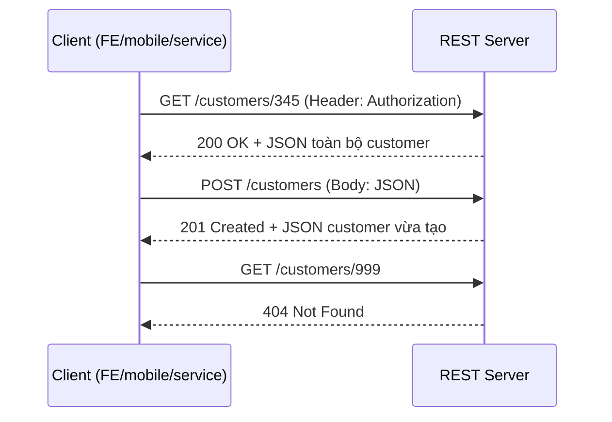
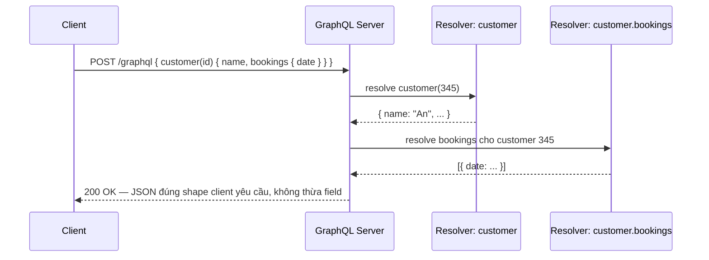
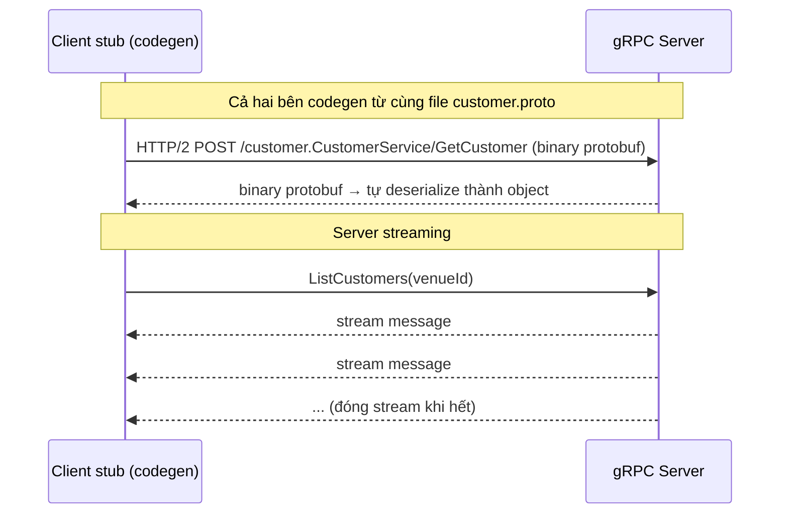
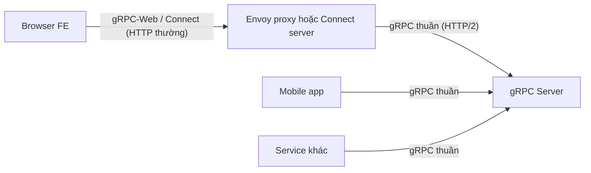
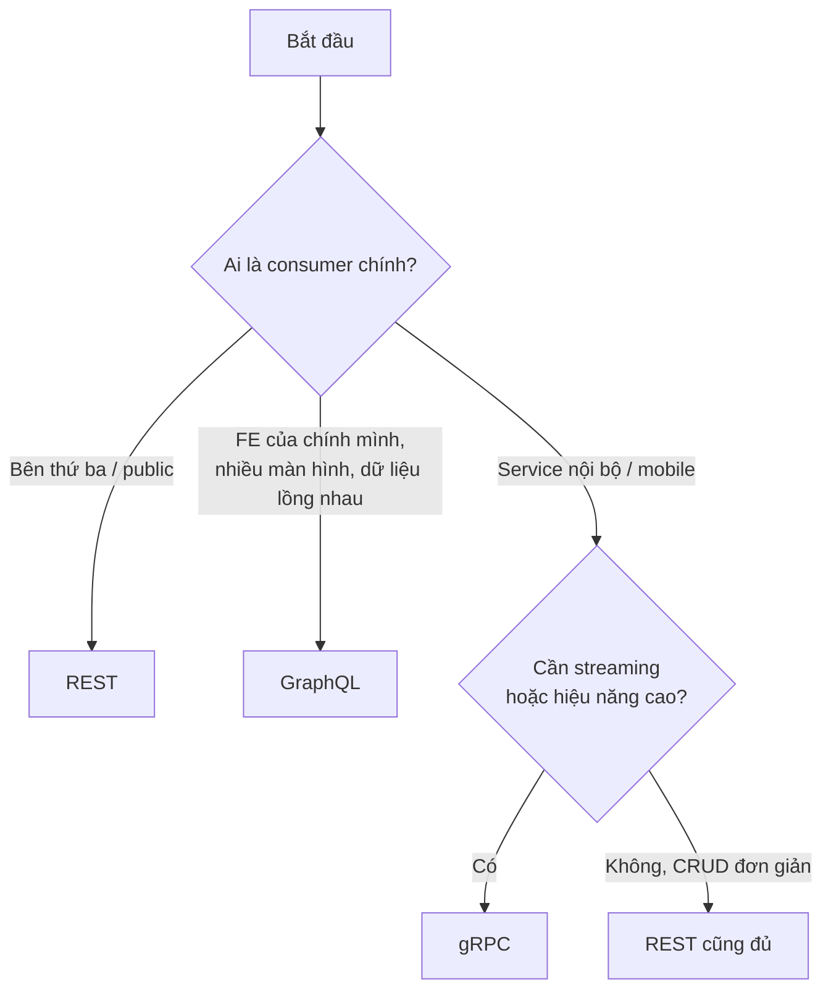

# KIẾN TRÚC API: RESTful, GraphQL, gRPC

Tài liệu tổng hợp ba kiến trúc API phổ biến: thành phần cấu tạo, luồng giao tiếp, ví dụ tối giản, chuyện gì xảy ra khi gọi, và tiêu chí lựa chọn.

---

## 1. Tổng quan nhanh

|                                    | RESTful                               | GraphQL                      | gRPC                                             |
| ---------------------------------- | ------------------------------------- | ---------------------------- | ------------------------------------------------ |
| Contract                           | Ngầm định (hoặc OpenAPI)              | Schema (SDL)                 | File `.proto`                                    |
| Endpoint                           | Nhiều URL, mỗi resource một URL       | 1 URL duy nhất (`/graphql`)  | Sinh tự động từ `.proto` (`/pkg.Service/Method`) |
| Giao thức                          | HTTP/1.1 (hoặc 2)                     | HTTP/1.1 (hoặc 2)            | HTTP/2 bắt buộc                                  |
| Định dạng dữ liệu                  | JSON (text)                           | JSON (text)                  | Protobuf (binary)                                |
| Ai quyết định shape dữ liệu trả về | Server                                | Client (qua query)           | Server (message cố định)                         |
| Streaming                          | Không (phải dùng SSE/WebSocket riêng) | Subscription (qua WebSocket) | Có sẵn 4 kiểu (unary, server, client, bidi)      |
| Browser gọi trực tiếp              | Có                                    | Có                           | Không (cần gRPC-Web/Connect/proxy)               |

---

## 2. RESTful

### 2.1. Thành phần

- **Resource** — mọi thứ được mô hình hóa thành tài nguyên, định danh bằng URL (`/venues/12/customers/345`).
- **HTTP method** — ngữ nghĩa hành động: `GET` (đọc), `POST` (tạo), `PUT/PATCH` (sửa), `DELETE` (xóa).
- **Status code** — kết quả nằm trong mã HTTP: `200`, `201`, `404`, `409`, `500`…
- **Representation** — dữ liệu trả về (thường JSON) là "bản chụp" của resource.
- **Stateless** — mỗi request tự chứa đủ ngữ cảnh (token, params); server không giữ session giữa các request.

### 2.2. Diagram giao tiếp



Mỗi resource một URL, client phải gọi nhiều lần nếu cần dữ liệu từ nhiều resource (under-fetching), hoặc nhận thừa field không cần (over-fetching).

### 2.3. Ví dụ

**Server (NestJS):**

```typescript
@Controller('customers')
export class CustomerController {
  constructor(private readonly customerService: CustomerService) {}

  @Get(':id')
  findOne(@Param('id') id: string) {
    return this.customerService.findOne(id); // trả toàn bộ object
  }

  @Post()
  create(@Body() dto: CreateCustomerDto) {
    return this.customerService.create(dto);
  }
}
```

**Client gọi:**

```typescript
const res = await fetch('https://api.example.com/customers/345', {
  headers: { Authorization: `Bearer ${token}` },
});
const customer = await res.json(); // nhận đủ mọi field, kể cả field không dùng
```

### 2.4. Khi gọi, chuyện gì xảy ra

1. Client tự dựng URL + method + body JSON theo tài liệu (hoặc OpenAPI).
2. Request đi qua HTTP thuần — mọi proxy, cache, gateway đều hiểu.
3. Server route theo URL pattern, validate, xử lý, serialize JSON trả về.
4. Không có ràng buộc compile-time giữa hai bên: server đổi field mà client không biết thì chỉ phát hiện lúc runtime.

### 2.5. Ưu / nhược điểm

**Ưu điểm:**

- Đơn giản, phổ cập nhất — mọi ngôn ngữ, framework, công cụ (curl, Postman, browser) đều dùng được ngay, không cần toolchain riêng.
- Tận dụng trọn hạ tầng HTTP: cache theo URL (CDN, ETag, `Cache-Control`), status code chuẩn, proxy/gateway nào cũng hiểu.
- Stateless nên scale ngang dễ; debug dễ vì request/response là text đọc được.
- Không khóa hai bên vào codegen — client và server tiến hóa độc lập.

**Nhược điểm:**

- Over-fetching / under-fetching: shape dữ liệu do server quyết, client hoặc nhận thừa field hoặc phải gọi nhiều request cho dữ liệu lồng nhau.
- Contract lỏng — không có ràng buộc compile-time; server đổi field thì client chỉ vỡ lúc runtime (OpenAPI giảm thiểu nhưng phải tự duy trì, dễ lệch với code thật).
- Số endpoint phình ra theo nhu cầu FE (`/customers-with-bookings`, `/customers-lite`…), mỗi biến thể là một endpoint mới phải bảo trì.
- JSON text tốn băng thông và CPU serialize hơn binary; không có streaming sẵn.

### 2.6. Dùng khi nào

- API công khai (public API) — mọi ngôn ngữ, mọi công cụ đều gọi được, `curl` là đủ để debug.
- CRUD đơn giản, mô hình dữ liệu phẳng, ít quan hệ lồng nhau.
- Cần tận dụng HTTP caching (CDN, ETag) — REST là kiến trúc duy nhất cache tự nhiên theo URL.
- Đội ngũ đa dạng, muốn ngưỡng tiếp cận thấp nhất.

---

## 3. GraphQL

### 3.1. Thành phần

- **Schema (SDL)** — contract trung tâm, định nghĩa type, field, quan hệ. Server chỉ expose đúng những gì khai báo trong schema.
- **Query / Mutation / Subscription** — ba loại operation: đọc, ghi, và nhận dữ liệu realtime.
- **Resolver** — hàm phía server chịu trách nhiệm trả dữ liệu cho từng field. Client hỏi field nào, resolver tương ứng chạy.
- **Endpoint duy nhất** — mọi operation đều `POST /graphql`; nội dung request quyết định làm gì.

### 3.2. Diagram giao tiếp



Một request lấy được dữ liệu lồng nhiều tầng; client tự chọn field nên không over-fetch, không under-fetch.

### 3.3. Ví dụ

**Schema:**

```graphql
type Customer {
  id: ID!
  name: String!
  email: String!
  bookings: [Booking!]!
}

type Booking {
  id: ID!
  date: String!
}

type Query {
  customer(id: ID!): Customer
}
```

**Resolver (NestJS):**

```typescript
@Resolver(() => Customer)
export class CustomerResolver {
  @Query(() => Customer)
  customer(@Args('id') id: string) {
    return this.customerService.findOne(id);
  }

  @ResolveField(() => [Booking])
  bookings(@Parent() customer: Customer) {
    return this.bookingService.findByCustomer(customer.id);
  }
}
```

**Client gọi:**

```typescript
const res = await fetch('https://api.example.com/graphql', {
  method: 'POST',
  headers: { 'Content-Type': 'application/json' },
  body: JSON.stringify({
    query: `{ customer(id: "345") { name bookings { date } } }`,
  }),
});
// Chỉ nhận đúng name + bookings.date, không có email hay field khác
```

### 3.4. Khi gọi, chuyện gì xảy ra

1. Client gửi **query dạng text** mô tả chính xác cây dữ liệu cần lấy.
2. Server parse query, validate với schema (sai field là lỗi ngay), rồi chạy resolver theo từng field, từ ngoài vào trong.
3. Kết quả JSON có shape trùng khớp query.
4. Rủi ro kinh điển: **N+1 query** — resolver `bookings` chạy một lần cho mỗi customer nếu không dùng DataLoader/batching.

### 3.5. Ưu / nhược điểm

**Ưu điểm:**

- Client tự chọn field — giải quyết triệt để over/under-fetching, một request lấy được cây dữ liệu lồng nhiều tầng.
- Schema là contract sống, có type: FE codegen được type TypeScript, tự động có tài liệu (introspection, GraphiQL/Playground).
- Server không phải mở endpoint mới mỗi khi FE cần shape khác — API tiến hóa bằng cách thêm field, ít khi phải version.
- Gom nhiều nguồn dữ liệu phía sau về một graph thống nhất (vai trò BFF/gateway rất mạnh).

**Nhược điểm:**

- N+1 query là bẫy mặc định — phải chủ động dùng DataLoader/batching, không thì resolver lồng nhau đánh sập DB.
- Mất HTTP caching theo URL (mọi thứ đều `POST /graphql`) — phải cache ở tầng client (Apollo/Relay) hoặc persisted query, phức tạp hơn hẳn.
- Client quyết định query nên server phải phòng thủ: giới hạn độ sâu, độ phức tạp, rate limit theo cost — một query ác ý có thể rất đắt.
- Chi phí vận hành và học cao nhất trong ba kiến trúc: resolver, schema design, error handling (lỗi trả 200 kèm mảng `errors`), monitoring theo operation thay vì URL.
- Upload file, batch mutation không tự nhiên như REST.

### 3.6. Dùng khi nào

- FE cần dữ liệu lồng nhau, nhiều màn hình khác nhau cần shape khác nhau từ cùng một nguồn — client tự chọn field thay vì server phải mở endpoint mới liên tục.
- Ứng dụng mobile cần tiết kiệm băng thông (không tải field thừa).
- Làm lớp BFF/gateway gom nhiều service phía sau về một graph thống nhất.
- **Không nên** khi API chủ yếu là hành động (command) hơn là đọc dữ liệu, hoặc khi đội ngũ chưa có kinh nghiệm xử lý N+1, độ phức tạp query, và caching (GraphQL không cache theo URL được).

---

## 4. gRPC

### 4.1. Thành phần

- **File `.proto`** — contract trung tâm: định nghĩa message (cấu trúc dữ liệu) và service (danh sách RPC method). Cả server lẫn mọi client đều codegen từ đúng file này.
- **Protobuf** — định dạng serialize binary, nhỏ và nhanh hơn JSON đáng kể; mỗi field đánh số thứ tự để tương thích khi schema tiến hóa.
- **Stub (client) / Skeleton (server)** — code được sinh tự động; client gọi RPC như gọi hàm local.
- **HTTP/2** — nền tảng bắt buộc: multiplexing nhiều call trên một kết nối, hỗ trợ streaming hai chiều.
- **4 kiểu RPC** — unary (1-1), server streaming, client streaming, bidirectional streaming.

### 4.2. Diagram giao tiếp



Với browser FE, cần thêm một lớp trung gian:



### 4.3. Ví dụ

**Contract (`customer.proto`):**

```protobuf
syntax = "proto3";
package customer;

service CustomerService {
  rpc GetCustomer (GetCustomerRequest) returns (Customer);
}

message GetCustomerRequest {
  string id = 1;
}

message Customer {
  string id = 1;
  string name = 2;
  string email = 3;
}
```

**Server (NestJS):**

```typescript
// main.ts — mở microservice gRPC
app.connectMicroservice<MicroserviceOptions>({
  transport: Transport.GRPC,
  options: {
    package: 'customer',
    protoPath: join(__dirname, 'customer.proto'),
    url: '0.0.0.0:50051',
  },
});

// controller — map method theo tên trong .proto
@Controller()
export class CustomerGrpcController {
  @GrpcMethod('CustomerService', 'GetCustomer')
  getCustomer(data: GetCustomerRequest): Customer {
    return this.customerService.findOne(data.id);
  }
}
```

**Client (một service khác):**

```typescript
@Injectable()
export class BookingService implements OnModuleInit {
  private customerService: CustomerServiceClient;

  constructor(@Inject('CUSTOMER_PACKAGE') private client: ClientGrpc) {}

  onModuleInit() {
    this.customerService = this.client.getService('CustomerService');
  }

  async enrich(booking: Booking) {
    // Gọi như hàm local — không URL, không JSON, không fetch
    const customer = await firstValueFrom(
      this.customerService.getCustomer({ id: booking.customerId }),
    );
    return { ...booking, customerName: customer.name };
  }
}
```

### 4.4. Khi gọi, chuyện gì xảy ra

1. Client gọi `customerService.getCustomer({ id })` — trông như hàm local.
2. Stub serialize object thành **binary protobuf**, gửi `POST /customer.CustomerService/GetCustomer` trên kết nối HTTP/2 có sẵn (URL sinh tự động, không ai tự gõ).
3. Server deserialize, chạy handler, trả binary protobuf về.
4. Stub deserialize thành object có type đầy đủ. Sai contract (thiếu field, sai type) phát hiện ngay lúc **compile-time**, không đợi đến runtime.
5. Lưu ý vận hành: kết nối HTTP/2 sống lâu nên L4 load balancer cân bằng kém — production cần client-side load balancing hoặc L7 proxy (Envoy, service mesh).

### 4.5. Ưu / nhược điểm

**Ưu điểm:**

- Hiệu năng cao nhất: protobuf binary nhỏ và serialize nhanh hơn JSON nhiều lần; HTTP/2 multiplexing nhiều call trên một kết nối, giảm độ trễ rõ rệt ở tần suất gọi lớn.
- Contract chặt nhất — `.proto` là nguồn sự thật duy nhất, codegen cho mọi ngôn ngữ; sai type/thiếu field phát hiện lúc compile-time, không đợi runtime.
- Streaming sẵn có cả 4 kiểu (unary, server, client, bidi) — không phải ghép thêm WebSocket/SSE.
- Hệ sinh thái built-in cho hệ phân tán: deadline/timeout, cancellation, retry, interceptor, health check, reflection.
- Field đánh số nên schema tiến hóa an toàn (thêm field mới không vỡ client cũ).

**Nhược điểm:**

- Browser không gọi thẳng được — FE phải qua gRPC-Web/Connect/Gateway, tức thêm một tầng hạ tầng phải vận hành.
- Payload binary không đọc được bằng mắt — debug cần `grpcurl`/reflection thay vì curl, ngưỡng tiếp cận cao hơn.
- Kết nối HTTP/2 sống lâu khiến L4 load balancer cân bằng kém — cần client-side LB hoặc L7 proxy (Envoy/service mesh), tức thêm độ phức tạp vận hành.
- Hai bên bị khóa vào toolchain protobuf và quy trình chia sẻ `.proto` (repo chung/package) — thay đổi contract cần kỷ luật quản lý version.
- Không có HTTP caching theo URL; không phù hợp làm public API cho bên thứ ba tùy ý tích hợp.

### 4.6. Khi dùng

- **Giao tiếp giữa các microservice nội bộ** — đây là sân nhà của gRPC: nhanh, contract chặt, codegen đa ngôn ngữ.
- Cần **streaming** hai chiều (realtime feed, sync dữ liệu lớn theo luồng).
- Hệ thống **polyglot** (Go + Node + Python…) — một file `.proto` sinh client cho mọi ngôn ngữ.
- Yêu cầu hiệu năng/độ trễ khắt khe (payload binary nhỏ hơn JSON nhiều lần).
- **Không nên** làm public API cho bên thứ ba tùy ý tích hợp (khó debug bằng curl, browser không gọi thẳng được) — trừ khi kèm gRPC-Gateway để expose thêm bản REST.

---

## 5. Chọn kiến trúc nào



Nguyên tắc thực dụng:

1. **Mặc định là REST** — đơn giản nhất, toolchain phổ biến nhất, không cần lý do để chọn.
2. **Chọn GraphQL khi vấn đề thật sự là over/under-fetching** của FE, không phải vì trào lưu — chi phí vận hành (N+1, caching, độ phức tạp query) là có thật.
3. **Chọn gRPC khi hai đầu đều là code mình kiểm soát** (service-to-service, mobile) và muốn contract chặt + hiệu năng — với browser thì chấp nhận thêm lớp gRPC-Web/Connect/Gateway.
4. Ba kiến trúc **không loại trừ nhau**: mô hình phổ biến là gRPC giữa các service nội bộ, còn lớp ngoài cùng expose REST hoặc GraphQL cho FE.
