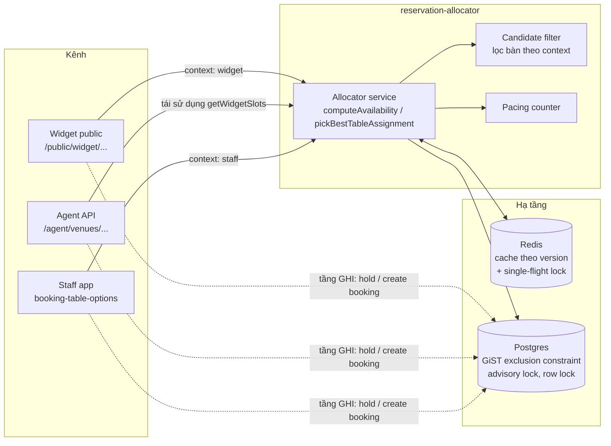
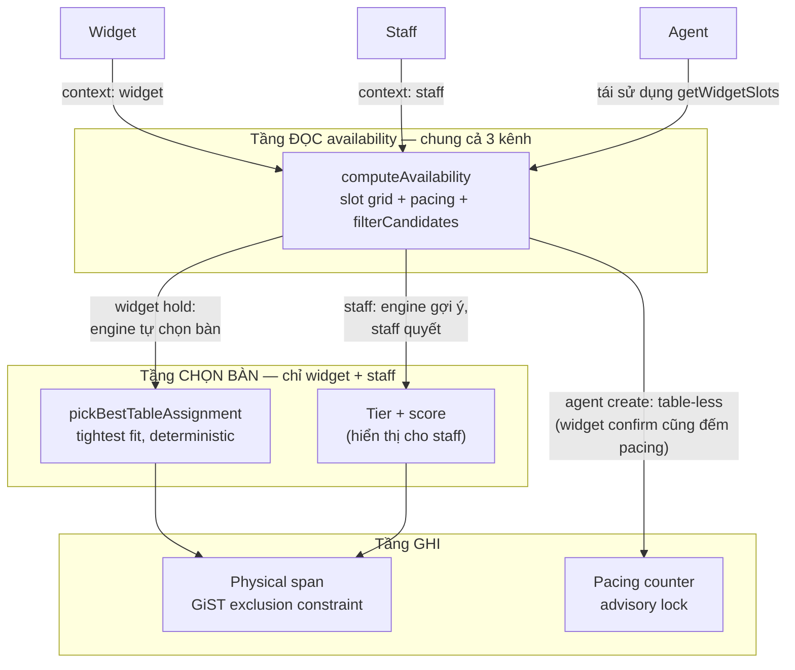
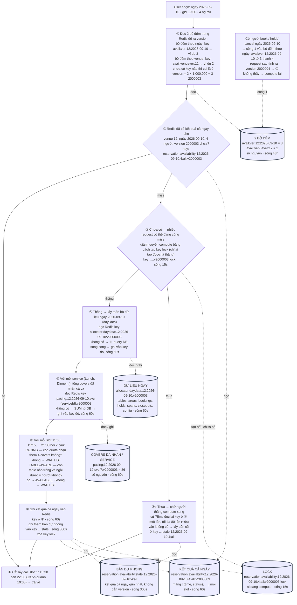
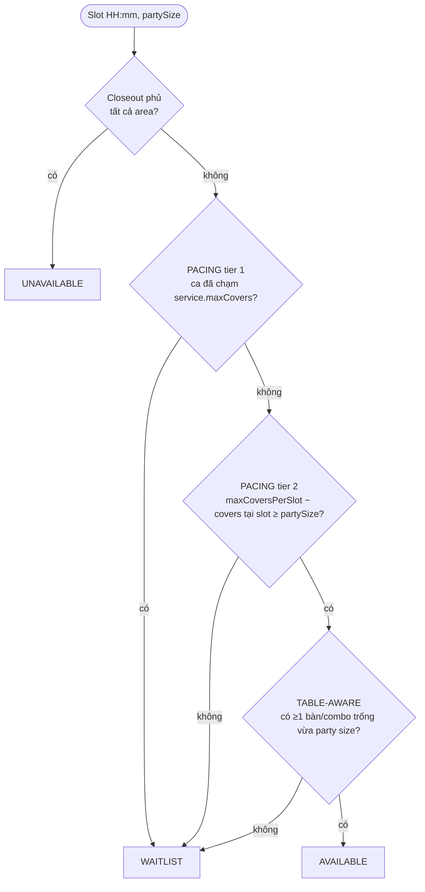
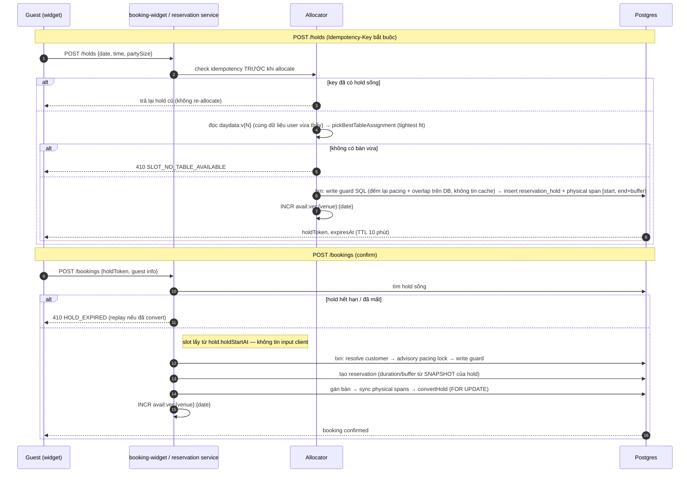

# Availability & Table Allocator Engine — Tổng quan cách hệ thống đang xử lý

Mô hình tổng thể: **một engine tính availability duy nhất** (`reservation-allocator`) phục vụ cả widget public, staff và agent API; **chống trùng booking không dựa vào application lock ở tầng đọc**, mà dựa vào **ràng buộc tại Postgres** (GiST exclusion constraint + advisory lock + row lock) ở tầng ghi. Tầng đọc chỉ cần nhanh (cache Redis theo version + single-flight), tầng ghi mới là nơi bảo đảm tính đúng.

---

## Thuật ngữ dùng trong doc

| Từ | Nghĩa |
|---|---|
| **slot** | một mốc giờ có thể đặt, ví dụ 18:00, 18:15, 18:30. Cách nhau `slotInterval` phút (mặc định 15) |
| **covers** | số khách. Party 4 người = 4 covers |
| **partySize** | số khách của nhóm đang hỏi |
| **service** | một ca phục vụ, ví dụ Lunch 11:00–14:00, Dinner 17:00–22:00. Mỗi service có `maxCovers` riêng |
| **booking** | reservation đã xác nhận, nằm trong bảng `reservations` |
| **hold** | giữ chỗ tạm trong lúc guest đang checkout. Có `expiresAt`. Chưa phải booking nhưng **được tính như booking** khi đếm |
| **span** | khoảng thời gian một table bị chiếm, dạng `[start, end)`. Mỗi booking/hold có table sẽ sinh span cho table đó |
| **turn time** | thời gian một nhóm ngồi ăn, ví dụ 90 phút |
| **buffer** | thời gian dọn bàn giữa hai nhóm, ví dụ 15 phút |
| **closeout** | khoảng thời gian venue đóng không nhận booking (nghỉ lễ, sự kiện riêng). Có thể đóng cả venue hoặc chỉ một số area |
| **dayData** | toàn bộ dữ liệu của một ngày load từ DB một lần: tables, areas, services, closeouts, bookings, holds, spans, config. Là input cho mọi tính toán |
| **projection** | **kết quả cuối** của availability cho một ngày: mảng `[{ time: "18:00", status: "AVAILABLE" }, { time: "18:15", status: "WAITLIST" }, ...]` cho **mọi slot trong ngày**. Đây là thứ được cache và được trả về cho user (sau khi filter ±3.5h) |
| **version** | một số nguyên gắn vào tên key cache. Đổi số → đổi tên key → cache cũ bị bỏ. Xem mục 2 |
| **dateVer** | bộ đếm **theo ngày**: `avail:ver:{venueId}:{date}`. Tăng 1 mỗi khi có booking/hold/cancel trong ngày đó |
| **venueVer** | bộ đếm **theo venue**: `avail:venuever:{venueId}`. Tăng 1 mỗi khi admin sửa config ảnh hưởng mọi ngày: table, area, closeout, service, table combination, promotion, venue booking config |
| **INCR** | lệnh Redis: cộng 1 vào số trong key. Key chưa có → thành 1 |
| **TTL** | thời gian sống của key trong Redis, hết thì Redis tự xoá |
| **pacing** | giới hạn **số covers** — còn quota nhận thêm khách không |
| **table-aware** | giới hạn **table vật lý** — còn table nào trống và đúng cỡ không |
| **single-flight** | nhiều request cùng cache miss → chỉ một request compute, còn lại chờ kết quả |
| **stale** | bản projection cũ, dùng làm fallback khi chờ single-flight quá lâu |
| **quota** | số covers còn được nhận thêm = giới hạn − đã nhận |

---

## 0. Bài toán & ý tưởng kiến trúc

### Bài toán

Ba kênh cùng đặt bàn trên một quỹ tài nguyên hữu hạn (bàn vật lý + sức chứa bếp), đúng giờ cao điểm:

| Kênh | Đặc điểm | Yêu cầu riêng |
|---|---|---|
| **Widget** (khách tự đặt) | Traffic cao, không tin được client, khách cần vài phút điền form/trả deposit | Đọc nhanh, giấu table id, chống race trong lúc điền form |
| **Staff** (nhân viên) | Traffic thấp, cần thấy mọi bàn kể cả đang conflict, được phép override | Thông tin đầy đủ, gợi ý bàn tốt nhất |
| **Agent** (AI qua API) | Đặt trực tiếp không qua hold, không chọn bàn | Idempotency chặt, fail-closed |

Yêu cầu chung: **đọc availability nhanh** (chịu spike) và **ghi tuyệt đối không trùng** — hai thứ mâu thuẫn nếu xử lý cùng một chỗ.

### Nguyên tắc thiết kế

1. **Tách đọc khỏi ghi.** Availability là projection — vừa trả về đã có thể cũ, nên tầng đọc chỉ cần nhanh + gần đúng (cache, chấp nhận stale vài chục giây). Tính đúng dồn hết về thời điểm commit: mọi write phải qua ràng buộc không request nào lách được. Đọc "available" rồi ghi fail (410/409) là kịch bản hợp lệ được thiết kế sẵn, không phải bug.

2. **Một engine cho mọi kênh.** Hai logic tính availability riêng = hai "sự thật" khác nhau = nguồn gốc double-booking. Vì vậy chỉ có một engine; kênh khác nhau ở **tham số lọc** (`context`), không khác thuật toán — rule mới sửa một chỗ, đúng trên mọi kênh.

3. **Hai chiều capacity độc lập.** Bếp (pacing — bao nhiêu khách bắt đầu ăn trong một khung giờ) và chỗ ngồi (bàn vật lý vừa size, trống suốt bữa) là hai tài nguyên khác bản chất. Slot chỉ available khi **cả hai** còn chỗ; pacing còn nhưng hết bàn vừa size là chuyện hàng ngày.

4. **Chống conflict tại database, không dùng distributed lock ở app.** App chạy nhiều instance; Redis lock có TTL/failover, có thể rơi lock giữa chừng. Exclusion constraint trong Postgres là bất biến: hai khoảng giờ chồng nhau trên cùng bàn không thể cùng tồn tại — atomic với INSERT, không thể quên lock, đúng trên mọi instance.

5. **Cache invalidation bằng version counter.** Availability đổi liên tục (mỗi booking/hold làm nó cũ). Thay vì SCAN+DEL key (đắt, dễ sót), key gắn số version, đổi dữ liệu chỉ cần `INCR` — O(1), key cũ tự thành rác hết hạn theo TTL. Chi tiết mục 2.

### Áp dụng cho từng kênh

- **Widget** → **hold có TTL**: biến "kiểm tra" thành "chiếm chỗ có thời hạn" — chiếm bàn thật ngay khi khách chọn slot, tự hết hạn nếu bỏ dở → đóng race condition trong lúc điền form; hold cũng là đơn vị idempotency cho retry.
- **Staff** → ghi trực tiếp không hold; conflict chặn bằng row lock + exclusion constraint; engine chỉ *gợi ý* bàn (tightest fit), nhân viên quyết định cuối.
- **Agent** → ghi trực tiếp, không gán bàn → không có span vật lý để constraint bảo vệ → serialize phần đếm-ghi pacing bằng **advisory lock** theo (venue, service, ngày). Đây là chỗ duy nhất app lock được dùng, và là lock trong Postgres chứ không phải Redis.

---

## 1. Một engine chung cho mọi kênh

Engine (module `reservation-allocator`) gồm các thành phần:

| Thành phần | Vai trò |
|---|---|
| Orchestrator (allocator service) | Load dữ liệu ngày, tính availability, chọn bàn |
| Candidate filter | Liệt kê/lọc bàn ứng viên theo context (pure function) |
| Scoring | Xếp hạng bàn cho màn hình staff |
| Setting resolver | Resolve turn time / slot interval / buffer / pacing limit theo chuỗi fallback |
| Pacing counter | Đếm covers (booking + hold đang sống) |
| Allocator cache | Cache Redis theo version |

Các kênh đều gọi vào engine này với tham số `context`:

- **Widget**: endpoint availability public → `getWidgetSlots`
- **Agent API**: tái sử dụng `getWidgetSlots` / `findNextAvailable` — không có engine riêng
- **Staff**: màn chọn bàn dùng chung `computeAvailability` với `context:'staff'`



Tầng đọc (availability) đi qua engine + cache; tầng ghi (hold/booking) của mọi kênh đều đổ về cùng các ràng buộc Postgres — đó là nơi chặn conflict.

Lưu ý phạm vi "chung": engine chung cho cả 3 kênh ở tầng **availability (đọc)**; còn logic **chọn bàn** (`pickBestTableAssignment`, tightest fit — mục 4) chỉ chung cho **2 kênh** widget + staff. Agent không tham gia tầng chọn bàn vì agent create là table-less — chỉ tiêu thụ pacing, chốt đúng bằng advisory lock (mục 6b).



- Widget: loại bàn `isInternalBookingsOnly`, area `isBookableOnline=false`, pool bàn giữ cho walk-in; đuôi ca giữ lại nguyên 1 turn time; áp `leadTimeMinutes` + `bookingWindowDays`; combo chỉ là fallback khi không có bàn đơn vừa.
- Staff: thấy tất cả bàn (kèm cờ `conflict`/`fitsParty`), đuôi ca chỉ giữ lại buffer, bỏ qua closeout `online_only`.

---

## 2. Cache Redis — cách đọc key và version

Redis là kho **key → value**: mỗi key là một chuỗi, trỏ tới một value. Trong doc, chỗ nào viết `{venueId}`, `{date}`… là chỗ **điền số thật vào**. Ví dụ xuyên suốt từ đây: venue **12**, ngày **2026-09-10**, **4** người.

### 2a. Hai bộ đếm

```
avail:ver:12:2026-09-10   →   "3"
└─────── key ──────────┘      └value┘

  avail:ver   : tiền tố cố định, nghĩa là "bộ đếm availability theo ngày"
  12          : venueId
  2026-09-10  : ngày
  "3"         : value — một số, lưu dạng chuỗi. Nghĩa: ngày này đã đổi dữ liệu 3 lần
```

```
avail:venuever:12   →   "2"
  avail:venuever : tiền tố, nghĩa là "bộ đếm availability theo venue"
  12             : venueId
  "2"            : venue này đã đổi config 2 lần
```

### 2b. Version — tính ra, không lưu

**Version không được lưu thành một key riêng.** Nó là số **tính ra** từ hai bộ đếm trên, ngay lúc request đến:

```
version = venueVer × 1000000 + dateVer
        = 2       × 1000000 + 3
        = 2000003
```

Đây là **phép nhân và phép cộng số học** chạy trong code TypeScript, không phải nối chuỗi, và **không liên quan gì đến Redis** — Redis chỉ cung cấp hai số `2` và `3`, phần tính toán xảy ra trong app. `2000003` là số hai triệu lẻ ba, một số nguyên bình thường.

(Trong code, hằng số này viết là `1_000_000` — đó là cú pháp TypeScript cho phép chèn `_` vào số để dễ đọc. Redis không có cách viết đó.)

Vì sao nhân với 1 triệu rồi cộng, thay vì cộng thẳng `2 + 3 = 5`? Vì cộng thẳng sẽ **trùng**: `venueVer=2, dateVer=3` và `venueVer=1, dateVer=4` đều ra 5 → hai trạng thái khác nhau nhưng cùng tên key → cache sai. Nhân với 1 triệu là để hai số **nằm ở hai vùng chữ số khác nhau**, không bao giờ đè lên nhau:

```
venueVer = 2, dateVer = 3        →  2000003
                                    ↑     ↑
                            venueVer     dateVer
                          (hàng triệu) (hàng đơn vị)
```

Đọc ngược lại: nhìn số `2000003` thì biết venue đã đổi config 2 lần, ngày đã đổi dữ liệu 3 lần.

**1 triệu có đủ không?** Bộ đếm theo ngày được gia hạn TTL 48h **sau mỗi lần cộng**, nên nó chỉ mất khi 48 giờ liên tục không ai đụng vào ngày đó — trong thực tế nó có thể sống và tích lũy suốt 90 ngày của booking window. Mỗi lần cộng tương ứng một booking tạo/sửa/huỷ, một hold tạo/release, hoặc một lần dời bàn. Venue lớn nhất cỡ 300–500 booking/ngày, cộng hold và cancel → khoảng vài nghìn lần cộng cho một ngày trong cả vòng đời. Cách 1 triệu vài trăm lần. Nếu có vượt, hai trạng thái trùng version phải xảy ra cách nhau dưới 60 giây (TTL của key cache) mới đọc nhầm được — không xảy ra trong thực tế.

Số `2000003` này **không được ghi vào Redis ở đâu cả**. Nó chỉ xuất hiện duy nhất một chỗ: **trong tên key cache**, dưới dạng `v2000003`.

### 2c. INCR — cộng 1 vào bộ đếm

`INCR` nhận vào **tên một key**, đọc số đang lưu trong đó, cộng 1, ghi lại. Không có gì gọi là "INCR version" — version không được lưu, không INCR được. Thứ bị INCR là **một trong hai bộ đếm**:

```
Trước:  avail:ver:12:2026-09-10  →  "3"
Chạy:   INCR avail:ver:12:2026-09-10
Sau:    avail:ver:12:2026-09-10  →  "4"
```

Nếu key chưa tồn tại, Redis coi giá trị cũ là 0 và ghi `"1"`. Lệnh này là **atomic**: hai request cùng INCR một lúc thì kết quả chắc chắn là +2, không bị mất một lần.

Hai chỗ trong code gọi INCR:

| Sự kiện | Lệnh | Version đổi thế nào |
|---|---|---|
| Book / hold / cancel / move / seat từ waitlist trong ngày 2026-09-10 | `INCR avail:ver:12:2026-09-10` → 3 thành 4 | `2 × 1000000 + 4 = 2000004` — chỉ ngày này đổi |
| Admin sửa table / area / closeout / service / combination / promotion / config của venue 12 | `INCR avail:venuever:12` → 2 thành 3 | `3 × 1000000 + 3 = 3000003` — **mọi ngày** của venue 12 đều đổi, vì ngày nào cũng đọc chung `avail:venuever:12` |

Nếu chỉ có bộ đếm theo ngày, admin sửa service sẽ phải INCR 90 key cho 90 ngày trong booking window. Nên có thêm một bộ đếm theo venue, INCR một lần là mọi ngày đổi version.

### 2d. Key cache — version nằm ở đuôi tên key

Sau khi tính ra, version được **ghép vào đuôi tên key cache** dưới dạng chữ `v` + số. Bước ghép này mới là nối chuỗi:

```
reservation:availability : 12 : 2026-09-10 : 4 : all : v2000003   →   "[{\"time\":\"18:00\",\"status\":\"AVAILABLE\"}, ...]"
└─────── tiền tố ───────┘ venue    ngày    party svc   version         └──────────── value: JSON mảng kết quả cả ngày ────────────┘
```

- `reservation:availability` — tiền tố cố định, nghĩa là "kết quả availability"
- `12` — venueId
- `2026-09-10` — ngày
- `4` — partySize
- `all` — không lọc theo service (luôn là `all` ở luồng widget)
- `v2000003` — version tại lúc ghi
- value — chuỗi JSON của mảng `[{ time, status, hasPromotion, turnTimeMinutes }, ...]`

Khi có người book ngày đó, hệ thống chỉ chạy **cộng 1 vào `avail:ver:12:2026-09-10`** → `"3"` thành `"4"`. Request sau tính ra version `2000004`, đi tìm key `...:v2000004` → không có → compute lại. Key `...:v2000003` không ai đụng, 60s sau tự hết hạn.

### 2e. Ví dụ theo thời gian

```
t=0   Chưa ai hỏi ngày 2026-09-10. Redis không có key avail:ver:12:2026-09-10.

t=1   Guest A hỏi availability ngày 2026-09-10, 4 người.
      GET avail:ver:12:2026-09-10        → null → coi là 0
      → version = 0
      GET reservation:availability:12:2026-09-10:4:all:v0   → không có
      → compute cả ngày → SET reservation:availability:12:2026-09-10:4:all:v0

t=2   Guest B hỏi cùng ngày, cùng 4 người.
      GET avail:ver:12:2026-09-10        → null → 0
      GET ...:v0                          → CÓ → trả về ngay, không compute

t=3   Guest A book 19:00 thành công.
      INCR avail:ver:12:2026-09-10       → key chưa có → thành "1"
      (Không xoá key ...:v0. Nó vẫn nằm đó.)

t=4   Guest C hỏi cùng ngày, 4 người.
      GET avail:ver:12:2026-09-10        → "1"
      → version = 1
      GET ...:v1                          → không có → compute lại → SET ...:v1
      (Key ...:v0 không ai tra nữa, 60s sau tự expire.)
```

### 2f. Toàn bộ key Redis của engine

| Key | Value | TTL | Hết hiệu lực khi |
|---|---|---|---|
| `avail:ver:{venueId}:{date}` | số — bộ đếm theo ngày | 48h, gia hạn mỗi lần INCR | không — chỉ tăng |
| `avail:venuever:{venueId}` | số — bộ đếm theo venue | 48h, gia hạn mỗi lần INCR | không — chỉ tăng |
| `reservation:availability:{venueId}:{date}:{party}:all:v{N}` | JSON projection cả ngày | 60s | version tăng → key mới, key cũ tự expire |
| `allocator:daydata:{venueId}:{date}:v{N}` | JSON dayData | 60s | version tăng |
| `pacing:{venueId}:{date}:svc:{serviceId}:v{N}` | số — tổng covers đã nhận của một service trong ngày | 60s | version tăng |
| `reservation:areas:{venueId}:{date}:{time}:{party}:v{N}` | JSON availability theo area | 60s | version tăng |
| `reservation:availability:stale:{venueId}:{date}:{party}:all` | JSON projection gần nhất — **không có đuôi version** | 300s | — fallback khi chờ single-flight quá lâu |
| `reservation:availability:...:v{N}:lock` | chuỗi UUID — token của request đang compute | 15s | request đó compute xong thì DEL |

---

## 3. Availability được tính như thế nào

Ví dụ xuyên suốt: venue **12**, user chọn ngày **2026-09-10**, giờ **19:00**, **4** người.

Quy ước: hình trụ = key Redis. Mũi tên **đứt** = đọc / ghi Redis. Mũi tên **liền** = luồng xử lý.



**Ý chính:** hệ thống **không compute riêng time user chọn**. Nó compute **cả ngày** một lần, cache lại, rồi cắt ra phần quanh time user chọn. User bấm sang time khác trong cùng date → không compute lại, chỉ filter lại. Cache key vì thế có partySize nhưng **không có time**.

### 3a. Từng step làm gì

| Step | Làm gì | Đọc / ghi Redis |
|---|---|---|
| ① | Đọc 2 bộ đếm (theo ngày và theo venue), ghép thành 1 số gọi là version. Ví dụ ngày = 3, venue = 2 → version = 2000003. Bộ đếm nào chưa có thì coi là 0 | đọc `avail:ver:12:2026-09-10` và `avail:venuever:12` |
| ② | Tra xem Redis đã có kết quả cả ngày cho (venue, ngày, số người, version) chưa. Có → nhảy tới ⑧, không đụng DB | đọc `reservation:availability:12:2026-09-10:4:all:v2000003` |
| ③ | Chưa có → nhiều request có thể đang cùng miss. Giành quyền compute bằng cách tạo key lock; chỉ request tạo được là thắng. Thua → cứ 75ms đọc lại key ở ② một lần, tối đa 80 lần (~6s); có thì dùng, không có thì lấy bản dự phòng rồi trả về | tạo `...:v2000003:lock` sống 15s · thua thì đọc `...:stale:12:2026-09-10:4:all` |
| ④ | Thắng → lấy toàn bộ dữ liệu của ngày (dayData): config, services, tables, areas, table combinations, closeouts, bookings, spans, holds. Chưa có trong Redis → 11 query DB chạy song song → ghi vào Redis | đọc / ghi `allocator:daydata:12:2026-09-10:v2000003` sống 60s |
| ⑤ | Với mỗi service trong ngày: tổng covers đã nhận cả ca (booking + hold). Chưa có trong Redis → SUM từ DB → ghi vào Redis | đọc / ghi `pacing:12:2026-09-10:svc:7:v2000003` sống 60s |
| ⑥ | Sinh slot grid cho từng service (danh sách giờ có thể đặt — chi tiết 3b). Với mỗi slot: hỏi Pacing rồi Table-aware → ra status AVAILABLE / WAITLIST / UNAVAILABLE (chi tiết 3c) | — |
| ⑦ | Ghi kết quả cả ngày vào Redis. Ghi thêm một bản dự phòng không gắn version. Xoá key lock | ghi key ở ② sống 60s · ghi `...:stale:...` sống 300s · xoá `...:lock` |
| ⑧ | Cắt lấy các slot trong ±3.5h quanh giờ user chọn (19:00 → 15:30 đến 22:30) → trả về | — |

Response widget chỉ là `{ time, status, hasPromotion, turnTimeMinutes }` — **không bao giờ lộ table id** ra public.

`findNextAvailable` (tìm ngày gần nhất còn chỗ) chạy lại đúng luồng trên cho từng ngày: tối đa 14 ngày, batch 4 ngày song song, budget 8s — mỗi ngày đều hưởng cache riêng của ngày đó.

### 3b. Slot grid — danh sách giờ của một ngày lấy từ đâu

Slot grid là **danh sách các giờ có thể đặt** trong ngày, sinh ra từ config của service, **chưa liên quan gì đến pacing hay bàn**. Đây là input của step ⑥: mỗi giờ trong grid sẽ được hỏi Pacing rồi Table-aware.

Mỗi service sinh grid riêng. Ví dụ ngày 2026-09-10 (thứ Năm) có Lunch 11:00–14:00 và Dinner 17:00–22:00 → hai grid, sau đó gộp lại theo giờ thành một danh sách.

**Input** — lấy từ `reservation_service` và `reservation_venue_booking_config` trong dayData:

| Tham số | Lấy ở đâu | Ví dụ Dinner |
|---|---|---|
| `startTime`, `endTime` | service | 17:00, 22:00 |
| `daysOfWeek` | service | [1,2,3,4,5,6,0] |
| `lastBookingTime` | service, có thể null | 21:00 |
| `slotInterval` | area config → service → venue config → 15 | 15 phút |
| `turnTime` | party rule → area config → service → venue `defaultDuration` → 90 | 90 phút |
| `buffer` | service → venue config → 15 | 15 phút |
| `leadTimeMinutes`, `bookingWindowDays` | venue config | 120 phút, 90 ngày |

**Cách sinh**, cho một service:

```
1. Service có chạy ngày này không?
   daysOfWeek phải chứa thứ của ngày đang hỏi. Không → grid rỗng.

2. Slot cuối cùng được đặt là mấy giờ?
   Widget:  latestStart = endTime − turnTime       → 22:00 − 90' = 20:30
            (giữ trọn một bữa trước giờ đóng: khách 20:30 ăn xong đúng 22:00)
            nếu service có lastBookingTime → lấy min(lastBookingTime, 20:30)
   Staff:   latestStart = endTime − buffer         → 22:00 − 15' = 21:45
            (staff xếp tay, được chạy quá giờ đóng, chỉ chừa buffer)

3. Nhảy từ startTime tới latestStart theo slotInterval:
   Widget:  17:00, 17:15, 17:30, ... 20:15, 20:30    → 15 slot
   Staff:   17:00, 17:15, 17:30, ... 21:30, 21:45    → 20 slot

4. Bỏ giờ không tồn tại do đổi giờ DST (spring-forward xoá một tiếng).
   Phải BỎ, không được dịch — dịch sẽ trùng label với slot thật một tiếng sau,
   covers ở pacing tier 2 bị cộng dồn vào một slot.

5. Chỉ widget — bỏ slot ngoài khung được đặt online:
   bỏ slot < now + leadTimeMinutes     (hỏi lúc 15:30 hôm nay → bỏ mọi slot trước 17:30)
   bỏ slot > now + bookingWindowDays   (quá 90 ngày → ngày đó không có slot nào)
```

**Kết quả**: mảng `[{ serviceId, time }]`, ví dụ `[{7, "17:00"}, {7, "17:15"}, ... {7, "20:30"}]`.

**Service qua đêm** (`startTime > endTime`, ví dụ Bar 20:00–02:00): coi `endTime` là 26:00, sinh grid tới 26:00 − turnTime rồi đổi lại thành 00:xx, 01:xx. Phần đuôi sau nửa đêm được tính là **của đêm hôm trước** — check `daysOfWeek` bằng thứ của ngày bắt đầu, không phải ngày kết thúc.

**Hai service chồng giờ** (Dinner 17:00–22:00 và Bar 20:00–02:00 cùng có slot 20:00): grid sinh riêng, step ⑥ chấm status riêng cho từng cặp (service, slot), rồi gộp lại một dòng cho giờ 20:00 — status tốt nhất thắng (AVAILABLE > WAITLIST > UNAVAILABLE), `turnTimeMinutes` lấy theo service có `displayOrder` nhỏ hơn (đó cũng là service sẽ được gán khi tạo hold).

Đây là lý do **widget luôn thấy ít slot hơn staff** cho cùng một service, và **slot cuối của widget lệch theo turn time**: party 2 người turnTime 90' thấy tới 20:30, party 8 người có rule turnTime 150' chỉ thấy tới 19:30.

**Grid có cache riêng không?** Không. Grid chỉ phụ thuộc config (đã nằm trong dayData) và `now`, tính lại rất rẻ, nên mỗi lần compute (step ④–⑦) là sinh lại. Kết quả của nó nằm gián tiếp trong projection `reservation:availability:...:v{N}`. Hệ quả: một hold vào ngày 2026-09-10 làm version của ngày đó đổi → request sau compute lại toàn bộ, **kể cả sinh lại grid dù grid không đổi**. Sửa table / area / closeout / service làm version venue đổi → mọi ngày compute lại. Không có invalidate "một phần" — version đổi là toàn bộ cache của phạm vi đó bị bỏ.

### 3c. Step ⑥ chi tiết — trạng thái một slot

Thứ tự kiểm tra, dừng ở điểm đầu tiên fail:



**UNAVAILABLE** chỉ khi có closeout **close all areas** phủ slot đó. Ba bước còn lại fail đều ra **WAITLIST**.

#### PACING — còn quota nhận thêm covers không?

Đếm **covers** (số khách), không nhìn table. Hai tier:

- **Tier 1 — session:** tổng covers đã nhận của service đó (bookings + holds) + partySize `>` `service.maxCovers` → WAITLIST cho **mọi slot** của service. Số này lấy từ key `pacing:...:svc:{id}:v{N}` (step ⑤).
- **Tier 2 — per slot:** tổng covers **bắt đầu đúng slot đó** (bookings + holds) + partySize `>` `maxCoversPerSlot` → WAITLIST cho **slot đó**. Số này gom in-memory từ dayData, không có key riêng.

Chỉ đếm slot **bắt đầu**. Booking 19:00 với turn time 2 tiếng không tiêu quota của slot 19:30. Hold (đang checkout) tính như booking.

#### TABLE-AWARE — còn table nào fit không?

Chỉ chạy khi Pacing pass. Gọi `filterCandidates` (pure function, cùng hàm mà hold/staff dùng để liệt kê bàn) với `context:'widget'` — slot AVAILABLE khi hàm trả về ≥1 candidate. Một bàn là candidate khi thoả **cả bốn**:

1. **Được phép bán online:** không phải `isInternalBookingsOnly`, area có `isBookableOnline`, không nằm trong pool giữ cho walk-in (N% bàn đầu theo `displayOrder`, N = `walkInTableReservePercent`).
2. **Vừa size:** `minCover ≤ partySize ≤ maxCover` — bàn quá to cũng bị loại, không chỉ bàn quá nhỏ.
3. **Không bị closeout:** closeout per-area đang active tại slot được quy ra danh sách table id bị đóng (staff bỏ qua scope `online_only`, widget thì không).
4. **Trống suốt cửa sổ ngồi ăn:** cửa sổ slot = `[start, start + turnTime + buffer)` theo timezone venue; bàn bị coi là bận nếu cửa sổ này chồng lên **bất kỳ physical span nào** — cả span của booking lẫn span của **hold đang sống** (hold chặn bàn ngay từ tầng đọc, không chỉ tầng ghi).

**Combo chỉ là fallback:** khi không còn bàn đơn nào vừa, engine mới xét combo — combo đạt khi `partySize ≤ partyCovers`, **mọi** bàn thành viên đều trống + không closeout + được phép bán online. Staff thì luôn thấy cả combo lẫn bàn conflict (khác biệt lọc, không khác thuật toán).

Chi phí: toàn bộ spans/tables/closeouts đã nằm trong dayData (step ④) — check per-slot chỉ là so khoảng thời gian in-memory, không thêm query nào, nên table-aware không làm tầng đọc chậm đi đáng kể.

> Table-aware là nâng cấp quan trọng: availability **không còn pacing-only**. Trước đây slot "available" vẫn có thể 410 ở bước hold vì không có bàn vật lý vừa — giờ check bàn được kéo lên ngay tầng availability.

---

## 4. Chọn bàn tự động — tightest fit

`pickBestTableAssignment` — dùng cho widget hold, check availability theo area, và widget modify:

- Lọc ứng viên vừa party và đang trống → chọn theo: **gap `maxCovers − partySize` nhỏ nhất** → bàn đơn thắng combo → id nhỏ nhất (hoàn toàn deterministic).
- Staff xếp option theo **tier** trước (được gợi ý → trống & vừa size → trống → conflict → không vừa); trong cùng tier dùng **cùng rule tightest-fit** với widget, option tốt nhất được đánh dấu `isSuggested`. Điểm score (perfect fit +100, utilisation ≥0.75 +50, không kề booking khác +30, đúng area +20, combo −50, internal −30) chủ yếu để hiển thị — chỉ tham gia làm tiebreak khi hai option có gap bằng nhau.

---

## 5. Flow hold → confirm (widget)



Hold chiếm chỗ theo **hai chiều**: partySize được cộng vào cả hai bộ đếm pacing, và span vật lý chặn bàn qua exclusion constraint. Hold hết hạn được cron 30s/lần dọn (`pruneExpiredHolds`), và khi insert đụng constraint với hold đã hết hạn nhưng chưa prune thì sweep rồi retry một lần.

Vì cache có thể stale tới 60s, "thấy AVAILABLE nhưng hold bị reject" là hành vi bình thường theo thiết kế.

Agent API tạo booking trực tiếp **không qua hold, không gán bàn** (`createReservationAgent`, table-less).

---

## 6. Chống trùng booking giữa các kênh (điểm mấu chốt)


Bốn tầng bảo vệ. Constraint/lock chặn xung đột giữa **hai request khác nhau**; idempotency chặn kịch bản còn lại — **cùng một request bị gửi lại** (mạng chập chờn, double-click, FE retry):

**a) GiST exclusion constraint (nguồn chân lý cuối cùng)**

- `reservation_hold_physical_span` và `reservation_table_physical_span`: `EXCLUDE USING gist (venue_id WITH =, restaurant_table_id WITH =, span WITH &&)`.
- Hai request bất kỳ (widget/staff/agent, kể cả 2 instance API khác nhau) ghi span chồng giờ lên cùng bàn → Postgres từ chối request đến sau. Đây là lý do không cần Redis lock cho việc giữ bàn.

**b) Advisory lock cho pacing (booking không gán bàn)**

- `acquirePacingSlotLock`: `pg_advisory_xact_lock(hashtext('pacing-service-day:{venueId}:{serviceId}:{date}'))`, `lock_timeout 2s` → 503 `SLOT_CONTENTION_RETRY`.
- Chỉ widget confirm và agent create dùng — vì hai path này có thể ghi mà không có span vật lý để constraint bảo vệ, nên phải serialize phần đọc-đếm-ghi pacing.
- **Gap đã biết (ghi trong code)**: staff create không gán bàn KHÔNG lấy lock này — 2 staff create đồng thời có thể cùng ăn số covers cuối cùng.

**c) Write guard + row lock**

- `assertReservationWriteGuards`: 1 câu SQL duy nhất trả về service_covers / slot_covers / held_covers / các cờ overlap → fail theo thứ tự capacity → slot → overlap. Hold đang sống được cộng vào check **per-slot** (không cộng vào service cap ở tầng ghi; tầng đọc thì đếm hold vào cả hai).
- `lockPhysicalTableRows`: `SELECT ... FOR UPDATE` các bàn (combo lock theo id tăng dần để tránh deadlock) — đóng cửa sổ TOCTOU của check overlap.
- `assertNoActiveHoldConflict`: staff không được ghi đè lên hold của guest đang sống (`TABLE_ON_HOLD_BY_GUEST`).

**d) Idempotency — chặn trùng do retry (widget là nơi quan trọng nhất)**

- **Widget hold**: header `Idempotency-Key` bắt buộc, check **trước khi allocate** — retry trả lại đúng hold cũ, không chiếm thêm bàn (nếu re-allocate, bàn đang giữ có thể là bàn vừa duy nhất → tự 410 chính mình). Race giữa 2 retry song song được chặn bằng unique index `(venue_id, idempotency_key)`: bên thua nhận hold của bên thắng.
- **Widget confirm**: `holdToken` chính là khoá idempotency tự nhiên — 2 confirm cùng token serialize bằng `FOR UPDATE` trên hold row; request đến sau replay booking đã convert thay vì tạo booking thứ hai.
- **Staff/agent write**: Redis `reservation:idem:{venueId}:{route}:{key}` (TTL 48h, đang xử lý → 409, agent create fail-closed 503 khi Redis chết).

---

## 7. Closeout — hai mode

- `blocks_new_bookings` (mặc định): chỉ chặn slot có **giờ bắt đầu** rơi vào cửa sổ closeout — booking đang ăn dở được phép chạy lấn vào.
- `blocks_occupancy`: chặn nếu **toàn bộ cửa sổ ngồi ăn** `[start, start+duration)` chồng lên closeout.
- Scope `online_only` chỉ chặn widget, staff bỏ qua. Có endpoint preview impact cho operator so sánh hai mode.
