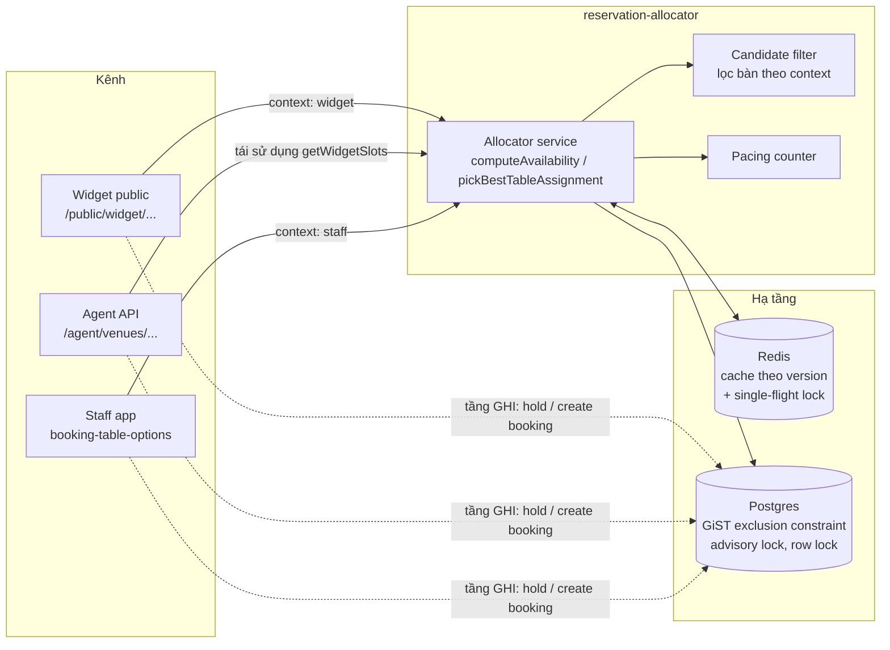
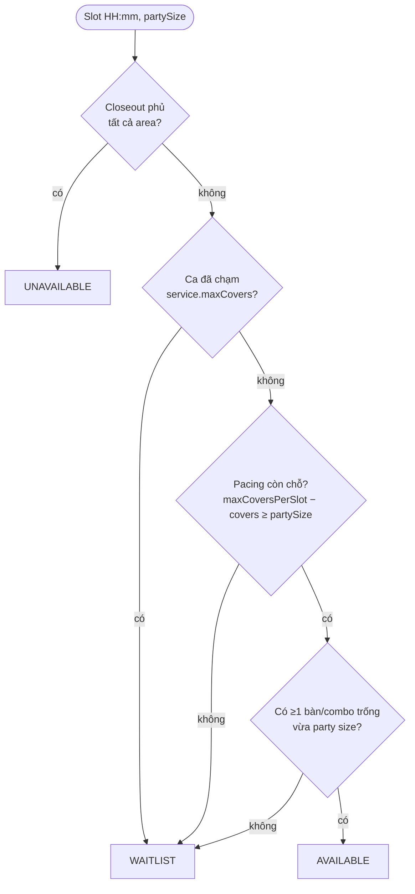
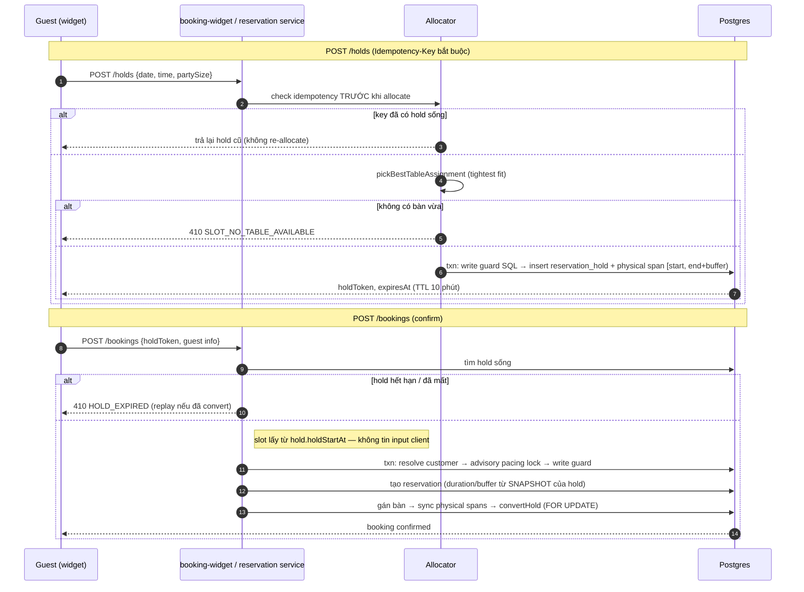
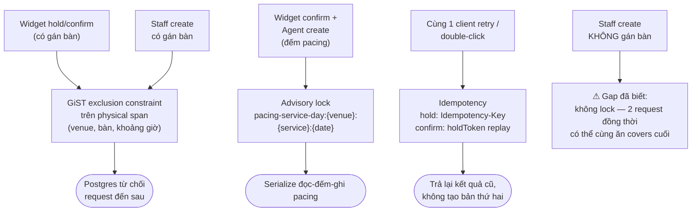

# Availability & Table Allocator Engine — Tổng quan cách hệ thống đang xử lý

Mô hình tổng thể: **một engine tính availability duy nhất** (`reservation-allocator`) phục vụ cả widget public, staff và agent API; **chống trùng booking không dựa vào application lock ở tầng đọc**, mà dựa vào **ràng buộc tại Postgres** (GiST exclusion constraint + advisory lock + row lock) ở tầng ghi. Tầng đọc chỉ cần nhanh (cache + single-flight), tầng ghi mới là nơi bảo đảm tính đúng.

---

## 0. Bài toán & ý tưởng kiến trúc

### Bài toán

Ba kênh cùng đặt bàn trên một quỹ tài nguyên hữu hạn (bàn vật lý + sức chứa bếp), đúng giờ cao điểm:

| Kênh | Đặc điểm | Yêu cầu riêng |
|---|---|---|
| **Widget** (khách tự đặt) | Traffic cao, không tin được client, khách cần vài phút điền form/trả deposit | Đọc nhanh, giấu table id, chống race trong lúc điền form |
| **Staff** (nhân viên) | Traffic thấp, cần thấy mọi bàn kể cả đang conflict, được phép override | Thông tin đầy đủ, gợi ý bàn tốt nhất |
| **Agent** (AI qua API) | Đặt trực tiếp không qua hold, không chọn bàn | Idempotency chặt, fail-closed |

Yêu cầu chung: **đọc availability nhanh** (chịu spike) và **ghi tuyệt đối không trùng** — hai thứ mâu thuẫn nếu xử lý cùng một chỗ.

### Nguyên tắc thiết kế

1. **Tách đọc khỏi ghi.** Availability là projection — vừa trả về đã có thể cũ, nên tầng đọc chỉ cần nhanh + gần đúng (cache, chấp nhận stale vài chục giây). Tính đúng dồn hết về thời điểm commit: mọi write phải qua ràng buộc không request nào lách được. Đọc "available" rồi ghi fail (410/409) là kịch bản hợp lệ được thiết kế sẵn, không phải bug.

2. **Một engine cho mọi kênh.** Hai logic tính availability riêng = hai "sự thật" khác nhau = nguồn gốc double-booking. Vì vậy chỉ có một engine; kênh khác nhau ở **tham số lọc** (`context`), không khác thuật toán — rule mới sửa một chỗ, đúng trên mọi kênh.

3. **Hai chiều capacity độc lập.** Bếp (pacing — bao nhiêu khách bắt đầu ăn trong một khung giờ) và chỗ ngồi (bàn vật lý vừa size, trống suốt bữa) là hai tài nguyên khác bản chất. Slot chỉ available khi **cả hai** còn chỗ; pacing còn nhưng hết bàn vừa size là chuyện hàng ngày.

4. **Chống conflict tại database, không dùng distributed lock ở app.** App chạy nhiều instance; Redis lock có TTL/failover, có thể rơi lock giữa chừng. Exclusion constraint trong Postgres là bất biến: hai khoảng giờ chồng nhau trên cùng bàn không thể cùng tồn tại — atomic với INSERT, không thể quên lock, đúng trên mọi instance.

5. **Cache invalidation bằng version counter.** Availability đổi liên tục (mỗi booking/hold làm nó cũ). Thay vì SCAN+DEL key (đắt, dễ sót), key gắn số version, đổi dữ liệu chỉ cần `INCR` — O(1), key cũ tự thành rác hết hạn theo TTL.

### Áp dụng cho từng kênh

- **Widget** → **hold có TTL**: biến "kiểm tra" thành "chiếm chỗ có thời hạn" — chiếm bàn thật ngay khi khách chọn slot, tự hết hạn nếu bỏ dở → đóng race condition trong lúc điền form; hold cũng là đơn vị idempotency cho retry.
- **Staff** → ghi trực tiếp không hold; conflict chặn bằng row lock + exclusion constraint; engine chỉ *gợi ý* bàn (tightest fit), nhân viên quyết định cuối.
- **Agent** → ghi trực tiếp, không gán bàn → không có span vật lý để constraint bảo vệ → serialize phần đếm-ghi pacing bằng **advisory lock** theo (venue, service, ngày). Đây là chỗ duy nhất app lock được dùng, và là lock trong Postgres chứ không phải Redis.

---

## 1. Một engine chung cho mọi kênh

Engine (module `reservation-allocator`) gồm các thành phần:

| Thành phần | Vai trò |
|---|---|
| Orchestrator (allocator service) | Load dữ liệu ngày, tính availability, chọn bàn |
| Candidate filter | Liệt kê/lọc bàn ứng viên theo context (pure function) |
| Scoring | Xếp hạng bàn cho màn hình staff |
| Setting resolver | Resolve turn time / slot interval / buffer / pacing limit theo chuỗi fallback |
| Pacing counter | Đếm covers (booking + hold đang sống) |
| Allocator cache | Cache Redis theo version |

Các kênh đều gọi vào engine này với tham số `context`:

- **Widget**: endpoint availability public → `getWidgetSlots`
- **Agent API**: tái sử dụng `getWidgetSlots` / `findNextAvailable` — không có engine riêng
- **Staff**: màn chọn bàn dùng chung `computeAvailability` với `context:'staff'`

Tầng đọc (availability) đi qua engine + cache; tầng ghi (hold/booking) của mọi kênh đều đổ về cùng các ràng buộc Postgres — đó là nơi chặn conflict.

Khác biệt giữa widget và staff chỉ nằm ở **rule lọc**, không phải thuật toán:

- Widget: loại bàn `isInternalBookingsOnly`, area `isBookableOnline=false`, pool bàn giữ cho walk-in; đuôi ca giữ lại nguyên 1 turn time; áp `leadTimeMinutes` + `bookingWindowDays`; combo chỉ là fallback khi không có bàn đơn vừa.
- Staff: thấy tất cả bàn (kèm cờ `conflict`/`fitsParty`), đuôi ca chỉ giữ lại buffer, bỏ qua closeout `online_only`.

## 2. Availability được tính như thế nào

Cho một ngày, engine chạy: load dữ liệu ngày (1 lần fan-out query: services, areas, tables, combos, closeouts, bookings, physical spans, hold spans) → sinh **slot grid** → chấm trạng thái từng slot.

**Slot grid**: theo giờ mở ca của service, bước nhảy = slot interval (fallback: area config → service → venue → 15'), có xử lý ca qua đêm và `lastBookingTime`.

**Trạng thái một slot widget**, theo thứ tự:

1. Closeout phủ **tất cả area** → `UNAVAILABLE`
2. Ca đã chạm `service.maxCovers` (session cap) → `WAITLIST`
3. Pacing: `maxCoversPerSlot − coversĐãĐặt ≥ partySize`? (covers = booking + hold đang sống tại đúng slot đó)
4. **Table-aware**: pacing còn chỗ **và** thực sự tồn tại ≥1 bàn/combo trống vừa party size → `AVAILABLE`; nếu pacing còn nhưng không bàn nào vừa → `WAITLIST`

> Điểm 4 là nâng cấp quan trọng: availability **không còn pacing-only**. Trước đây slot "available" vẫn có thể 410 ở bước hold vì không có bàn vật lý vừa — giờ check bàn được kéo lên ngay tầng availability.

Response widget chỉ là `{ time, status, hasPromotion }` — **không bao giờ lộ table id** ra public.

## 3. Chọn bàn tự động — tightest fit

`pickBestTableAssignment` — dùng cho widget hold, check availability theo area, và widget modify:

- Lọc ứng viên vừa party và đang trống → chọn theo: **gap `maxCovers − partySize` nhỏ nhất** → bàn đơn thắng combo → id nhỏ nhất (hoàn toàn deterministic).
- Staff xếp option theo **tier** trước (được gợi ý → trống & vừa size → trống → conflict → không vừa); trong cùng tier dùng **cùng rule tightest-fit** với widget, option tốt nhất được đánh dấu `isSuggested`. Điểm score (perfect fit +100, utilisation ≥0.75 +50, không kề booking khác +30, đúng area +20, combo −50, internal −30) chủ yếu để hiển thị — chỉ tham gia làm tiebreak khi hai option có gap bằng nhau.

## 4. Flow hold → confirm (widget)

Hold chiếm chỗ theo **hai chiều**: partySize được cộng vào cả hai bộ đếm pacing, và span vật lý chặn bàn qua exclusion constraint. Hold hết hạn được cron 30s/lần dọn (`pruneExpiredHolds`), và khi insert đụng constraint với hold đã hết hạn nhưng chưa prune thì sweep rồi retry một lần.

Agent API tạo booking trực tiếp **không qua hold, không gán bàn** (`createReservationAgent`, table-less).

## 5. Chống trùng booking giữa các kênh (điểm mấu chốt)

Bốn tầng bảo vệ. Constraint/lock chặn xung đột giữa **hai request khác nhau**; idempotency chặn kịch bản còn lại — **cùng một request bị gửi lại** (mạng chập chờn, double-click, FE retry):

**a) GiST exclusion constraint (nguồn chân lý cuối cùng)**

- `reservation_hold_physical_span` và `reservation_table_physical_span`: `EXCLUDE USING gist (venue_id WITH =, restaurant_table_id WITH =, span WITH &&)`.
- Hai request bất kỳ (widget/staff/agent, kể cả 2 instance API khác nhau) ghi span chồng giờ lên cùng bàn → Postgres từ chối request đến sau. Đây là lý do không cần Redis lock cho việc giữ bàn.

**b) Advisory lock cho pacing (booking không gán bàn)**

- `acquirePacingSlotLock`: `pg_advisory_xact_lock(hashtext('pacing-service-day:{venueId}:{serviceId}:{date}'))`, `lock_timeout 2s` → 503 `SLOT_CONTENTION_RETRY`.
- Chỉ widget confirm và agent create dùng — vì hai path này có thể ghi mà không có span vật lý để constraint bảo vệ, nên phải serialize phần đọc-đếm-ghi pacing.
- **Gap đã biết (ghi trong code)**: staff create không gán bàn KHÔNG lấy lock này — 2 staff create đồng thời có thể cùng ăn số covers cuối cùng.

**c) Write guard + row lock**

- `assertReservationWriteGuards`: 1 câu SQL duy nhất trả về service_covers / slot_covers / held_covers / các cờ overlap → fail theo thứ tự capacity → slot → overlap. Hold đang sống được cộng vào check **per-slot** (không cộng vào service cap ở tầng ghi; tầng đọc thì đếm hold vào cả hai).
- `lockPhysicalTableRows`: `SELECT ... FOR UPDATE` các bàn (combo lock theo id tăng dần để tránh deadlock) — đóng cửa sổ TOCTOU của check overlap.
- `assertNoActiveHoldConflict`: staff không được ghi đè lên hold của guest đang sống (`TABLE_ON_HOLD_BY_GUEST`).

**d) Idempotency — chặn trùng do retry (widget là nơi quan trọng nhất)**

- **Widget hold**: header `Idempotency-Key` bắt buộc, check **trước khi allocate** — retry trả lại đúng hold cũ, không chiếm thêm bàn (nếu re-allocate, bàn đang giữ có thể là bàn vừa duy nhất → tự 410 chính mình). Race giữa 2 retry song song được chặn bằng unique index `(venue_id, idempotency_key)`: bên thua nhận hold của bên thắng.
- **Widget confirm**: `holdToken` chính là khoá idempotency tự nhiên — 2 confirm cùng token serialize bằng `FOR UPDATE` trên hold row; request đến sau replay booking đã convert thay vì tạo booking thứ hai.
- **Staff/agent write**: Redis `reservation:idem:{venueId}:{route}:{key}` (TTL 48h, đang xử lý → 409, agent create fail-closed 503 khi Redis chết).

## 6. Hiệu năng tầng đọc

- **Cache Redis theo version**: projection availability cả ngày, day data, areas, extras — TTL 60s, key gắn `v{version}` với `version = venueVer × 1e6 + dateVer`. Invalidate = `INCR` counter (O(1), không SCAN): mọi writer booking/hold/span gọi `invalidateForDate`, admin sửa config/bàn/area/closeout gọi `invalidateForVenue`.
- **Single-flight**: chỉ 1 request compute (Redis lock `SET NX EX 15s`), các request khác poll cache ~6s, hết kiên nhẫn thì dùng bản **stale** (TTL 300s) thay vì compute trùng — chống thundering herd.
- `findNextAvailable`: scan tối đa 14 ngày, batch 4 ngày song song, budget 8s.
- Flow modify bypass cache cho đúng ngày đang sửa (phải trừ covers của chính booking đó).

## 7. Closeout — hai mode

- `blocks_new_bookings` (mặc định): chỉ chặn slot có **giờ bắt đầu** rơi vào cửa sổ closeout — booking đang ăn dở được phép chạy lấn vào.
- `blocks_occupancy`: chặn nếu **toàn bộ cửa sổ ngồi ăn** `[start, start+duration)` chồng lên closeout.
- Scope `online_only` chỉ chặn widget, staff bỏ qua. Có endpoint preview impact cho operator so sánh hai mode.
