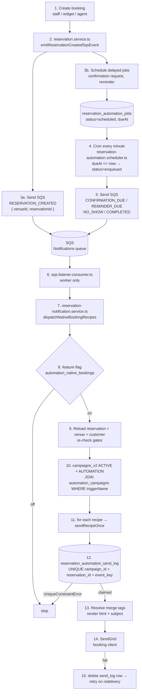

# Booking Automation Flow

## 1. Automation campaign là gì

```
campaigns_v2                          automation_campaigns
├─ venueId                            ├─ triggerName        reservation.created | booking.made | ...
├─ type      = 'automation'           ├─ conditionConfig    JSONB { whenToSend, conditions, nextDayAt }
├─ status    = 'active'               ├─ customTimingValue  2
├─ channel   = 'email'                ├─ customTimingUnit   hours | days | weeks | months
├─ content   { html, emailSubject }   ├─ customTimingDirection before | after
└─ automationConfigId ────────────────┘  automationPurpose   'transactional' (system-provisioned)
```

| Trigger (native) | Key | Default timing | Enabled |
|---|---|---|---|
| Booking created | `reservation.created` | immediate | yes |
| Booking modified | `reservation.modified` | immediate | yes |
| Booking cancelled | `reservation.cancelled` | immediate | yes |
| Confirmation request | `reservation.confirmation_due` | 24h before | yes |
| Reminder | `reservation.reminder_due` | 2h before | no |
| No-show | `reservation.no_show` | next day 09:00 | no |
| Post-visit | `reservation.completed` | 3h after | yes |
| Waitlist added / table available | `reservation.waitlist.*` | immediate | no |

Recipes: `src/constants/reservation-automation-recipes.constant.ts`
Enums: `src/constants/enums/campaign.enum.ts`

## 2. Luồng native nollie Bookings



Thứ tự:

| # | Bước | Ghi chú |
|---|---|---|
| 1-2 | API tạo booking, gọi `emitReservationCreatedSqsEvent` | fire-and-forget, không block response |
| 3a | Bắn SQS `RESERVATION_CREATED` | trigger gửi ngay: `reservation.created` |
| 3b | Ghi `reservation_automation_jobs` | trigger có delay: `confirmation_due`, `reminder_due`; `no_show` và `completed` ghi khi status booking đổi |
| 4-5 | Cron mỗi phút quét job đến hạn, bắn SQS | chỉ với trigger có delay |
| 6-7 | Worker nhận SQS, route theo `type` sang service | |
| 8-9 | Check flag + gate lại tại thời điểm gửi | |
| 10-11 | Match campaign theo `venueId` + `triggerName` | |
| 12 | Claim idempotency | trùng → bỏ qua |
| 13-14 | Render + gửi SendGrid | |
| 15 | Fail → release claim | SQS redeliver sẽ retry |
