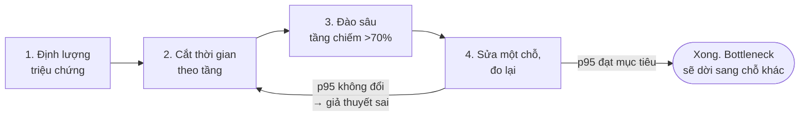
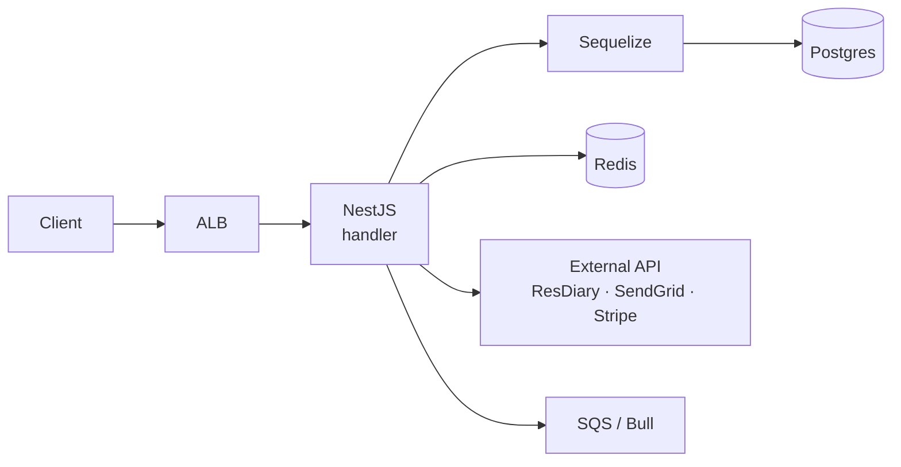
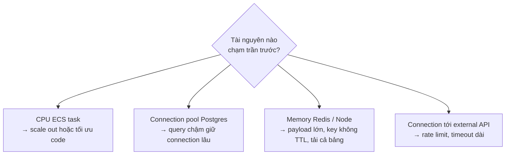

# Xác định bottleneck — quy trình và bài toán mẫu

## 0. Bottleneck là gì?

**Bottleneck là mắt xích yếu nhất đang giới hạn tốc độ của cả chuỗi.** Hình ảnh gốc là cổ chai: nước chảy chậm không phải vì nước nhiều, mà vì có một đoạn hẹp hơn các đoạn còn lại. Hệ thống chỉ nhanh bằng đúng đoạn hẹp đó — tăng CPU, thêm task, nâng DB đều vô ích nếu đoạn hẹp nằm ở chỗ khác.

Đây là thuật ngữ chung, không chỉ riêng trường hợp quá tải lưu lượng:

| Loại | Bản chất | Ví dụ |
|---|---|---|
| **Quá tải lưu lượng** | Đầu vào vượt sức xử lý | Redis đầy khi webhook đổ về ồ ạt |
| **Query / thuật toán kém** | Lưu lượng bình thường, mỗi đơn vị việc tốn quá nhiều | `Seq Scan` trên bảng lớn |
| **Số lần gọi thừa** | Từng việc nhanh nhưng làm quá nhiều lần | N+1 query |
| **Tài nguyên dùng chung** | Một việc chiếm hết, việc khác nghẹt | Job nặng chạy chung process với API |
| **Chờ tuần tự** | Việc độc lập nhưng xếp hàng chờ nhau | `await` nối tiếp thay vì `Promise.all` |
| **Phụ thuộc bên ngoài** | Mình nhanh nhưng đợi bên kia | External API timeout giữ connection |

Phần còn lại của tài liệu trả lời: **khi một chức năng hay cả hệ thống chậm, làm sao tìm đúng chỗ gây chậm trước khi sửa bất cứ thứ gì.**

Nguyên tắc duy nhất cần nhớ khi đi tìm: **đo trước, đoán sau.** Bottleneck tại một thời điểm chỉ có một, và gần như không nằm ở chỗ ta nghĩ.

---

## 1. Quy trình bốn bước

### Bước 1 — Định lượng triệu chứng

Trước khi mở code, phải có đủ 5 con số. Thiếu một số là chưa bắt đầu được.

| Cần biết | Ví dụ đủ tốt | Ví dụ chưa dùng được |
|---|---|---|
| Request nào | `GET /customer?search=` | "trang khách hàng" |
| Chậm bao nhiêu | p95 = 6,2s, p99 = 11s | "rất chậm" |
| Ở đâu | venue 800k customer, region UK | "một vài venue" |
| Khi nào | 18h–20h giờ venue, thứ 6 | "thỉnh thoảng" |
| Mục tiêu | p95 < 3s | "nhanh hơn" |

Nguồn số trong stack hiện tại: CloudWatch (ECS, ALB), RDS Performance Insights, log structured có `venueId`.

> Nhìn **p95 / p99**, không nhìn trung bình. Trung bình che mất chính những request đang làm nhà hàng khổ trong giờ phục vụ.

### Bước 2 — Cắt thời gian theo tầng

Một request đi qua chuỗi tầng dưới. Mỗi tầng phải trả lời được "tôi ăn bao nhiêu ms".

| Tầng | Đo bằng gì |
|---|---|
| Tổng request | ALB `TargetResponseTime`; interceptor log duration kèm `venueId` |
| Code Node.js | `console.time` tạm quanh từng đoạn; `node --cpu-prof` khi cần sâu |
| Postgres | Performance Insights → top SQL theo load; `EXPLAIN (ANALYZE, BUFFERS)` từng query nghi ngờ |
| Redis | `SLOWLOG GET 20`; memory %; tỉ lệ cache hit |
| External API | duration và timeout ghi trong `IntegrationLog` |
| Queue | độ sâu queue; tuổi message cũ nhất; thời gian xử lý mỗi job |

**Quy tắc dừng:** tầng nào chiếm trên 70% tổng thời gian là bottleneck. Các tầng còn lại bỏ qua cho đến khi sửa xong tầng đó.

### Bước 3 — Đào sâu tầng vừa tìm được

**Nếu là Postgres** (trường hợp phổ biến nhất ở dự án này), đọc `EXPLAIN ANALYZE` theo thứ tự:

| Dấu hiệu | Nghĩa là |
|---|---|
| `Seq Scan` trên bảng lớn | Thiếu index, hoặc index có nhưng cột dẫn đầu không khớp filter |
| `rows=1000` ước lượng nhưng `actual rows=900000` | Statistics lệch → planner chọn sai kế hoạch; chạy `ANALYZE` bảng |
| `Nested Loop` với `loops=50000` | Join lặp quá nhiều lần; thiếu index ở phía trong |
| `Sort Method: external merge Disk` | Sort tràn `work_mem`, ghi ra đĩa |
| `Buffers: shared read` lớn | Dữ liệu không nằm trong cache, đọc đĩa thật |

**Nếu là code**, ba dấu hiệu quen thuộc:

- **N+1 query:** bật Sequelize logging, đếm số query trong một request. Trên 20 query cho một danh sách là N+1.
- **`await` tuần tự** cho các việc độc lập thay vì `Promise.all`.
- **Tải cả bảng lên bộ nhớ** rồi lọc bằng JavaScript thay vì lọc trong SQL.

**Nếu là hệ thống**, tìm tài nguyên chạm trần trước:

### Bước 4 — Sửa một chỗ, đo lại, lặp

- Sửa **đúng một thứ**, đo lại **cùng chỉ số** ở Bước 1.
- p95 không đổi → giả thuyết sai, quay lại Bước 2. Không sửa tiếp thứ khác chồng lên.
- p95 đạt mục tiêu → ghi số trước/sau vào doc (xem `docs/db-performance-technical-debt.md` làm mẫu).
- Sau khi sửa, bottleneck **dời sang chỗ khác**. Đó là bình thường, không phải thất bại.

---

## 2. Hai bẫy hay gặp

| Bẫy | Vì sao sai | Làm đúng |
|---|---|---|
| Tối ưu chỗ dễ thấy thay vì chỗ đo được | Viết lại vòng lặp nhanh 10× vô nghĩa khi nó chiếm 2% thời gian | Chỉ sửa tầng chiếm >70% ở Bước 2 |
| Đo trên local với 500 customer rồi kết luận cho venue 1M | Planner Postgres chọn kế hoạch khác nhau tùy kích cỡ bảng; local luôn `Seq Scan` vì bảng nhỏ | Đo trên staging với dữ liệu gần production, hoặc Performance Insights của production |

---

## 3. Bài toán mẫu

Mỗi bài đi đúng bốn bước. Số liệu lấy từ sự cố thật trong repo.

### 3.1. Activity log chậm — thiếu index

| Bước | Kết quả |
|---|---|
| 1. Triệu chứng | `GET /activity-logs` p95 ≈ 700ms ở venue lớn |
| 2. Cắt tầng | Performance Insights: một query chiếm gần toàn bộ thời gian |
| 3. Đào sâu | `EXPLAIN ANALYZE` → `Seq Scan on activity_logs`, filter `venue_id` + sort `created_at DESC`. Index cũ có nhưng cột dẫn đầu không phải `venue_id` |
| 4. Sửa | `CREATE INDEX CONCURRENTLY (venue_id, created_at DESC, id DESC)` → **658ms → 9,3ms** |

**Bài học:** index mà cột dẫn đầu không khớp filter thì không phải index. Tham chiếu: DB-PERF-05.

### 3.2. Redis đầy 99,9% memory — limiter của Bull

| Bước | Kết quả |
|---|---|
| 1. Triệu chứng | Toàn bộ API trả 503 lúc SendGrid webhook đổ về ồ ạt; không riêng một endpoint |
| 2. Cắt tầng | ECS CPU bình thường, Postgres bình thường, **Redis memory 99,9%** |
| 3. Đào sâu | `email_events_queue` của Bull dùng limiter chạy Lua trong Redis; ở volume lũ, job tồn đọng chiếm hết memory và Lua script deadlock cả instance Redis dùng chung |
| 4. Sửa | Chuyển `process-email-event` sang SQS dedicated queue với rate limiter in-process; Bull chỉ giữ job ít volume |

**Bài học:** bottleneck của một queue có thể hạ cả hệ thống nếu nó dùng chung tài nguyên (Redis) với session, cache, socket. Tham chiếu: DB-PERF-18, NOL-2155.

### 3.3. Worker OOM — AI round chạy trên API task

| Bước | Kết quả |
|---|---|
| 1. Triệu chứng | API task restart đột ngột vào một giờ cố định mỗi tuần |
| 2. Cắt tầng | CloudWatch: memory Node tăng dốc rồi container bị kill; Postgres và Redis bình thường |
| 3. Đào sâu | `@Cron` quét detector toàn bộ venue rồi gọi LLM **ngay trên API task**, giữ kết quả trong bộ nhớ |
| 4. Sửa | Cron chỉ **enqueue** `venueId` lên SQS; round chạy trên worker task tách riêng |

**Bài học:** việc nặng theo lịch không được chạy chung process với đường phục vụ request. Tham chiếu: NOL-1170, NOL-1916.

### 3.4. Customer search `%term%` — Seq Scan không tránh được bằng B-tree

| Bước | Kết quả |
|---|---|
| 1. Triệu chứng | `GET /customer?search=` chậm ở venue AU trên 500k customer, UK thì không |
| 2. Cắt tầng | Một query `ILIKE '%term%'` OR trên 5 cột chiếm toàn bộ thời gian |
| 3. Đào sâu | `%term%` không dùng được B-tree (chỉ tra được khi biết đầu chuỗi) → `Seq Scan`. UK không chậm vì đã dùng blind-index `*_tokens` + GIN |
| 4. Sửa | `CREATE EXTENSION pg_trgm` + GIN index `gin_trgm_ops` trên `full_name`, `primary_email`, `primary_phone` |

**Bài học:** cùng một chức năng có thể có bottleneck khác nhau giữa hai region vì đường dữ liệu khác nhau. So sánh region nhanh là một cách cắt tầng.

### 3.5. Danh sách trả về 20 dòng nhưng chạy 2 giây — N+1

| Bước | Kết quả |
|---|---|
| 1. Triệu chứng | Endpoint danh sách 20 phần tử, p95 2s, không phụ thuộc kích cỡ venue |
| 2. Cắt tầng | Không có query nào chậm trong Performance Insights; nhưng **số query mỗi request rất lớn** |
| 3. Đào sâu | Bật Sequelize logging: 1 query lấy danh sách + 20 query lấy quan hệ cho từng dòng + 20 query đếm. Mỗi query 40ms × 41 = ~1,6s |
| 4. Sửa | `include` quan hệ trong một query, hoặc gom `WHERE id IN (...)` một lần rồi map trong code |

**Bài học:** Performance Insights xếp theo query *chậm*, nên N+1 (nhiều query nhanh) ẩn khỏi top list. Phải đếm số query, không chỉ nhìn thời gian từng query.

---

## 4. Tóm tắt một dòng cho mỗi bước

1. **Định lượng:** request nào, p95 bao nhiêu, ở venue nào, lúc nào, mục tiêu là gì.
2. **Cắt tầng:** ALB → Node → Postgres / Redis / External / Queue, tầng nào ăn trên 70%.
3. **Đào sâu:** `EXPLAIN ANALYZE` cho DB, đếm query cho N+1, tài nguyên chạm trần cho hệ thống.
4. **Sửa một chỗ, đo lại:** không đổi thì giả thuyết sai; đạt thì ghi số trước/sau.
