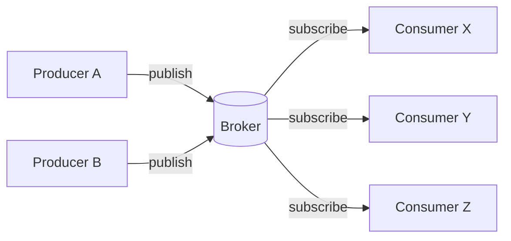
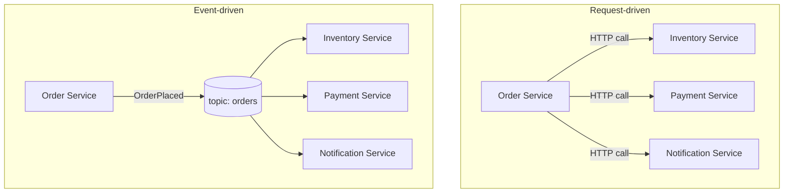
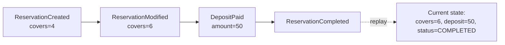
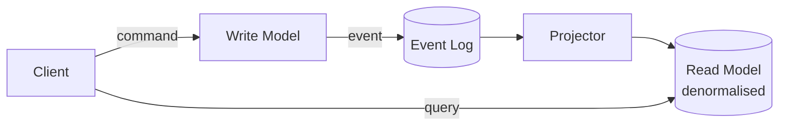
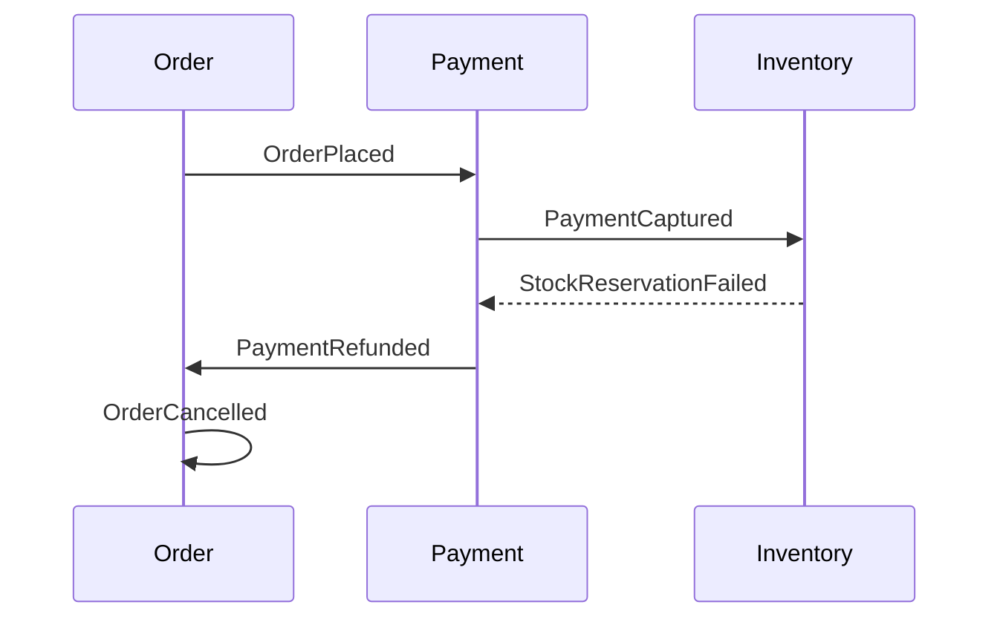
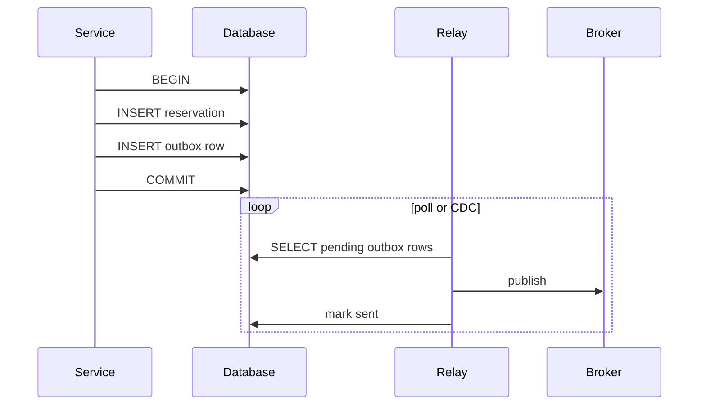
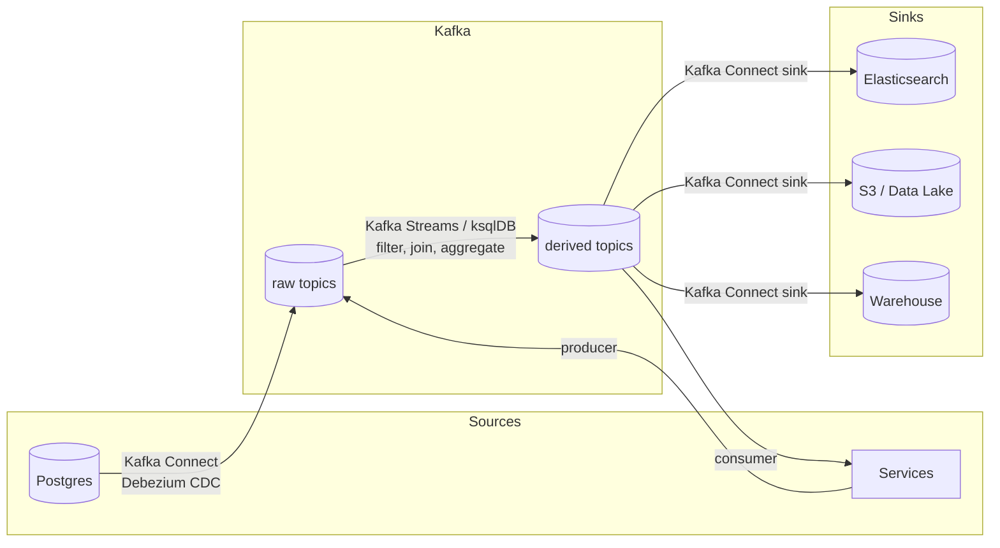
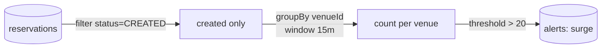

# Event-Driven Architecture và Kafka Streaming

Tài liệu này tóm tắt lý thuyết chuẩn về kiến trúc hướng sự kiện (Event-Driven Architecture, viết tắt EDA), các mẫu thiết kế đi kèm, và vị trí của Kafka trong mô hình đó. Phần cuối đối chiếu với hiện trạng của nollie-api.

Phần nội bộ Kafka (broker, controller, replication, segment, rebalance, delivery semantics) được trình bày đầy đủ trong [KAFKA-ARCHITECTURE.md](./KAFKA-ARCHITECTURE.md). Tài liệu này không lặp lại, chỉ nhắc đúng những điểm cần để hiểu các mẫu.

---

## 1. Khái niệm nền tảng

### 1.1 Sự kiện là gì

Một **sự kiện (event)** là bản ghi bất biến về một việc **đã xảy ra** trong hệ thống, được đặt tên ở thì quá khứ: `OrderPlaced`, `PaymentCaptured`, `ReservationCancelled`. Sự kiện khác với **lệnh (command)** ở ba điểm:

| | Command | Event |
|---|---|---|
| Ý nghĩa | Yêu cầu làm một việc | Thông báo một việc đã xảy ra |
| Người nhận | Đúng một handler | Không hoặc nhiều consumer |
| Có thể từ chối | Có | Không, sự thật đã xảy ra |
| Ví dụ | `CreateReservation` | `ReservationCreated` |

### 1.2 Ba vai trò

- **Producer**: phát sự kiện, không biết và không quan tâm ai sẽ đọc.
- **Broker**: lưu trữ và phân phối sự kiện (Kafka, RabbitMQ, SQS, SNS, Pulsar).
- **Consumer**: đăng ký nhận sự kiện và phản ứng. Có thể tự trở thành producer của sự kiện tiếp theo.



Giá trị cốt lõi của EDA là **tách rời theo thời gian và theo không gian**: producer và consumer không cần chạy cùng lúc, không cần biết địa chỉ nhau, và có thể thêm consumer mới mà không sửa producer.

### 1.3 Request-driven so với event-driven



Trong mô hình request-driven, Order Service phải biết cả ba service hạ nguồn, chờ chúng trả lời, và thất bại nếu một trong ba sập. Trong mô hình event-driven, Order Service chỉ ghi một sự kiện; việc ai tiêu thụ và xử lý thế nào nằm ngoài trách nhiệm của nó.

---

## 2. Các mẫu kiến trúc chuẩn

### 2.1 Event Notification

Sự kiện chỉ mang **định danh** và loại thay đổi. Consumer cần chi tiết thì gọi ngược lại nguồn.

```json
{ "type": "CustomerUpdated", "customerId": 4821, "venueId": 17 }
```

Ưu điểm: payload nhỏ, không lộ schema nội bộ. Nhược điểm: consumer phụ thuộc runtime vào producer để lấy dữ liệu, tạo ra "coupling ngầm" qua API.

### 2.2 Event-Carried State Transfer

Sự kiện mang **toàn bộ trạng thái** cần thiết. Consumer giữ bản sao cục bộ và không cần gọi ngược.

```json
{ "type": "CustomerUpdated", "customerId": 4821, "email": "...", "phone": "...", "tags": [] }
```

Ưu điểm: consumer tự trị hoàn toàn, chịu được khi producer sập. Nhược điểm: dữ liệu trùng lặp, phải quản lý schema và eventual consistency.

### 2.3 Event Sourcing

Trạng thái hiện tại **không được lưu trực tiếp**. Thay vào đó, hệ thống lưu chuỗi sự kiện và tính lại trạng thái bằng cách replay.



Lợi ích: lịch sử đầy đủ, audit miễn phí, có thể tái tạo trạng thái tại bất kỳ thời điểm. Chi phí: truy vấn phức tạp, cần snapshot để replay không quá chậm, thay đổi schema sự kiện cũ rất khó.

### 2.4 CQRS

Command Query Responsibility Segregation: tách **mô hình ghi** khỏi **mô hình đọc**. Thường đi cùng event sourcing nhưng không bắt buộc.



Read model được tối ưu cho từng màn hình, có thể là bảng phẳng, Elasticsearch, hoặc Redis. Giá phải trả là độ trễ giữa lúc ghi và lúc read model cập nhật.

### 2.5 Saga

Giao dịch phân tán qua nhiều service, không dùng two-phase commit. Mỗi bước phát sự kiện, bước sau lắng nghe; nếu thất bại, chạy **compensating action** để hoàn tác.



Hai biến thể:

- **Choreography**: các service tự phản ứng với sự kiện của nhau, không có điều phối trung tâm. Đơn giản khi ít bước, khó theo dõi khi nhiều bước.
- **Orchestration**: một orchestrator ra lệnh từng bước và xử lý thất bại. Dễ quan sát, nhưng orchestrator trở thành điểm tập trung logic.

### 2.6 Transactional Outbox

Vấn đề kinh điển: ghi DB rồi publish event là **hai thao tác không atomic**. Nếu DB commit xong nhưng broker lỗi, sự kiện bị mất; nếu publish xong mà DB rollback, sự kiện là sai.

Giải pháp: ghi sự kiện vào bảng `outbox` **trong cùng transaction** với dữ liệu nghiệp vụ, rồi một tiến trình riêng đọc outbox và forward sang broker.



Relay có thể là cron polling hoặc Change Data Capture (Debezium đọc WAL của Postgres). CDC có độ trễ thấp hơn và không tạo tải truy vấn lên bảng outbox.

### 2.7 Idempotent Consumer

Vì broker chỉ đảm bảo at-least-once trong đa số cấu hình, consumer **phải chịu được sự kiện lặp**. Cách chuẩn: lưu `eventId` đã xử lý và bỏ qua nếu gặp lại, hoặc thiết kế thao tác sao cho chạy nhiều lần cho cùng kết quả (upsert theo khoá tự nhiên).

---

## 3. Message Queue so với Event Stream

EDA cần một nơi chứa sự kiện. Có hai loại nơi chứa với ngữ nghĩa khác hẳn nhau, và đây là điểm phân biệt SQS/RabbitMQ với Kafka.

| Tiêu chí | Message Queue (SQS, RabbitMQ) | Event Stream (Kafka, Pulsar) |
|---|---|---|
| Sau khi đọc | Message bị xoá | Sự kiện vẫn nằm trong log đến khi hết retention |
| Nhiều consumer độc lập | Cần fan-out thủ công (SNS + nhiều queue) | Mỗi consumer group đọc độc lập cùng một topic |
| Replay lịch sử | Không | Có, đặt lại offset |
| Thứ tự | Không đảm bảo (trừ FIFO queue) | Đảm bảo trong một partition, cùng key thì cùng partition |
| Mô hình | Phân phối công việc | Nhật ký sự thật có thể phát lại |
| Phù hợp | Job xử lý nền, task queue | Event sourcing, streaming analytics, tích hợp nhiều hệ thống |

Queue trả lời câu hỏi "việc này ai làm". Log trả lời câu hỏi "điều gì đã xảy ra, theo thứ tự nào". Ẩn dụ hòm thư so với sổ nhật ký và bảng so sánh vận hành nằm ở §1 và §5 của [KAFKA-ARCHITECTURE.md](./KAFKA-ARCHITECTURE.md).

Ba điểm của Kafka mà các mẫu ở mục 2 dựa vào:

- **Log không xoá sau đọc**, nên event sourcing và CQRS có nguồn để replay và dựng lại read model.
- **Offset theo consumer group**, nên thêm consumer mới cho cùng luồng không đụng đến consumer cũ.
- **Cùng key thì cùng partition**, nên chọn key theo aggregate ID hoặc tenant ID là cách giữ thứ tự cho saga và state transfer.

---

## 4. Kafka ở lớp ứng dụng: schema, hệ sinh thái, stream processing

### 4.1 Schema và tương thích

Sự kiện là **hợp đồng công khai**. Thay đổi payload sai cách sẽ làm consumer cũ đọc lỗi. Thực hành chuẩn:

- Dùng **Schema Registry** với Avro, Protobuf hoặc JSON Schema.
- Bật kiểm tra tương thích `BACKWARD` (consumer mới đọc được sự kiện cũ) hoặc `FULL`.
- Chỉ **thêm field có default**, không xoá, không đổi kiểu, không đổi nghĩa. Muốn phá vỡ hợp đồng thì tạo topic phiên bản mới, ví dụ `reservations.v2`.

### 4.2 Hệ sinh thái



- **Kafka Connect**: framework khai báo để đưa dữ liệu vào và ra Kafka mà không viết code. Debezium là source connector đọc WAL của Postgres để phát sự kiện thay đổi từng row.
- **Kafka Streams**: thư viện Java nhúng trong ứng dụng để xử lý stream có trạng thái: windowing, join giữa hai stream, aggregate theo key. Lưu state cục bộ bằng RocksDB, đồng bộ về Kafka qua changelog topic.
- **ksqlDB**: lớp SQL trên Kafka Streams, viết `CREATE STREAM ... AS SELECT` thay cho code.

### 4.3 Stream processing: stateless và stateful

Stream processing là tính toán **liên tục** trên dòng sự kiện đang chảy, thay cho batch định kỳ.

- **Stateless**: `map`, `filter`, `branch`. Mỗi sự kiện xử lý độc lập.
- **Stateful**: `count`, `aggregate`, `join`, `windowedBy`. Cần lưu trạng thái trung gian. Ví dụ: "số booking mỗi venue trong cửa sổ 15 phút trượt".



Windowing có ba dạng chính: **tumbling** (không chồng, cố định), **hopping** (chồng nhau, trượt theo bước), **session** (đóng khi im lặng quá gap). Chọn sai dạng window cho ra kết quả sai về nghĩa dù code đúng.

Exactly-once của Kafka chỉ bảo đảm trong chuỗi Kafka-to-Kafka (consume, transform, produce trong Kafka Streams). Khi consumer ghi vào Postgres hay gọi API bên ngoài, ứng dụng vẫn phải tự lo idempotency theo mẫu 2.7.

---

## 5. Thiết kế sự kiện: quy tắc thực hành

1. **Đặt tên ở thì quá khứ, theo nghiệp vụ**, không theo bảng: `ReservationCancelled`, không phải `ReservationRowUpdated`.
2. **Envelope chuẩn** cho mọi sự kiện: `eventId` (UUID), `type`, `version`, `occurredAt`, `producer`, `correlationId`, `causationId`, `payload`.
3. **Key theo đơn vị thứ tự**: aggregate ID hoặc tenant ID.
4. **Một topic một loại aggregate**, không trộn `customers` với `reservations` vào một topic.
5. **Không đặt lệnh trong sự kiện**: `SendEmail` là command; sự kiện đúng là `ReservationConfirmed`, và consumer email tự quyết gửi hay không.
6. **Dead-letter topic** cho sự kiện không xử lý được sau N lần retry, kèm alert. Không để một sự kiện hỏng chặn cả partition.
7. **Poison pill**: một bản ghi lỗi deserialise sẽ làm consumer crash-loop vì mỗi lần khởi động lại đọc đúng offset đó. Cần error handler bỏ qua và ghi DLT.
8. **Quan sát được**: propagate `correlationId` qua mọi hop để truy vết một request xuyên nhiều service; theo dõi **consumer lag** là chỉ số sức khoẻ số một.

---

## 6. Khi nào không nên dùng EDA

Chi phí vận hành Kafka so với managed queue đã có ở §5 của [KAFKA-ARCHITECTURE.md](./KAFKA-ARCHITECTURE.md). Ở mức kiến trúc, có thêm ba lý do để không chọn EDA:

- Luồng cần **phản hồi đồng bộ ngay lập tức** cho người dùng: kiểm tra chỗ trống, tính giá. Sự kiện không thay được request-response ở đây.
- Nghiệp vụ đòi **strong consistency** xuyên nhiều aggregate: EDA mặc định là eventual consistency, phải nói rõ với product rằng màn hình có thể trễ vài giây.
- Đội chưa có kỷ luật về **schema versioning và idempotency**. EDA khi thiếu hai thứ này biến thành hệ thống không ai debug được.

---

## 7. Đối chiếu với nollie-api

| Khái niệm chuẩn | Hiện trạng nollie-api | Nhận xét |
|---|---|---|
| Broker | SQS (2 queue) cho reservation, brief, registry; BullMQ trên Redis (30 queue) cho phần còn lại | Queue semantics, không có log để replay |
| Event notification | `EVENT_EMITTER.RESERVATION_*` payload chỉ chứa ID | Đúng pattern 2.1 |
| Event-carried state | Không dùng | Consumer đọc lại DB theo ID |
| Event sourcing | Không. Bảng `reservation_event` là audit trail, không phải nguồn tái tạo trạng thái | Trạng thái vẫn ở bảng nghiệp vụ |
| CQRS | Không có read model tách riêng | Cache Redis cho availability là tối ưu đọc, không phải projection từ event |
| Saga | Không. Luồng deposit, POS outbound xử lý tuần tự trong worker, thất bại thì retry | Chưa có compensating action có chủ đích |
| Outbox | Có, chỉ ở venue-registry, relay bằng cron 30 giây | Đúng pattern 2.6 nhưng phạm vi hẹp |
| Idempotent consumer | Webhook log theo webhook id; send-log unique claim cho brief | Có ở biên webhook, chưa hệ thống hoá ở SQS consumer |
| Consumer group độc lập | Không. Một consumer đọc một queue rồi `switch` theo `type` | Muốn thêm consumer mới cho cùng sự kiện phải sửa consumer hiện có |
| Thứ tự theo key | SQS standard không đảm bảo thứ tự | Sự kiện modify có thể tới trước create |
| Schema registry | Không, payload là JSON tự do với hằng `type` | Chưa có kiểm tra tương thích |
| Streaming analytics | Không | Số liệu tổng hợp tính bằng query SQL theo yêu cầu |

Kết luận: nollie-api là **monolith request-driven với lớp job bất đồng bộ dùng cơ chế sự kiện**. Phần reservation áp dụng đúng nhiều nguyên tắc EDA ở mức thiết kế (tên sự kiện quá khứ, payload chỉ ID, outbox cho ghi ngoài), nhưng hạ tầng bên dưới là queue xoá-sau-đọc, không có log để replay, không có consumer group độc lập. Nếu tương lai cần thêm nhiều consumer cho cùng luồng sự kiện reservation (analytics, đối tác, data warehouse) hoặc cần replay lịch sử, đó là lúc cân nhắc chuyển topic `reservations` sang Kafka hoặc Kinesis. Trước ngưỡng đó, SQS vẫn là lựa chọn đúng về chi phí vận hành.

---

## Nguồn tham khảo

- Martin Fowler, [What do you mean by "Event-Driven"?](https://martinfowler.com/articles/201701-event-driven.html) (2017): phân loại Event Notification, Event-Carried State Transfer, Event Sourcing, CQRS ở mục 2.
- Chris Richardson, [microservices.io](https://microservices.io/patterns/): Saga, Transactional Outbox, Idempotent Consumer.
- Ben Stopford, [Designing Event-Driven Systems](https://www.confluent.io/designing-event-driven-systems/) (O'Reilly, 2018): log làm nguồn sự thật chung, Event Collaboration, Single Writer Principle.
- Martin Kleppmann, Designing Data-Intensive Applications (O'Reilly, 2017), chương 11 Stream Processing.
- [Apache Kafka Documentation](https://kafka.apache.org/documentation/) và [Kafka Streams Developer Guide](https://kafka.apache.org/documentation/streams/).
