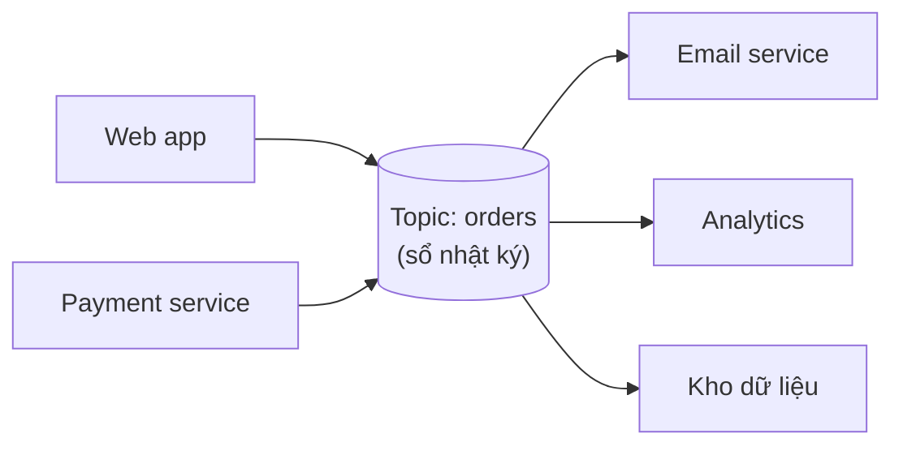
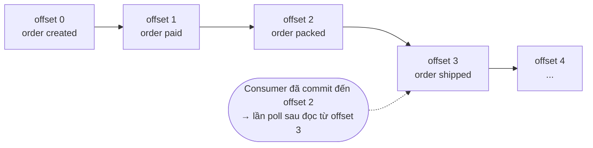
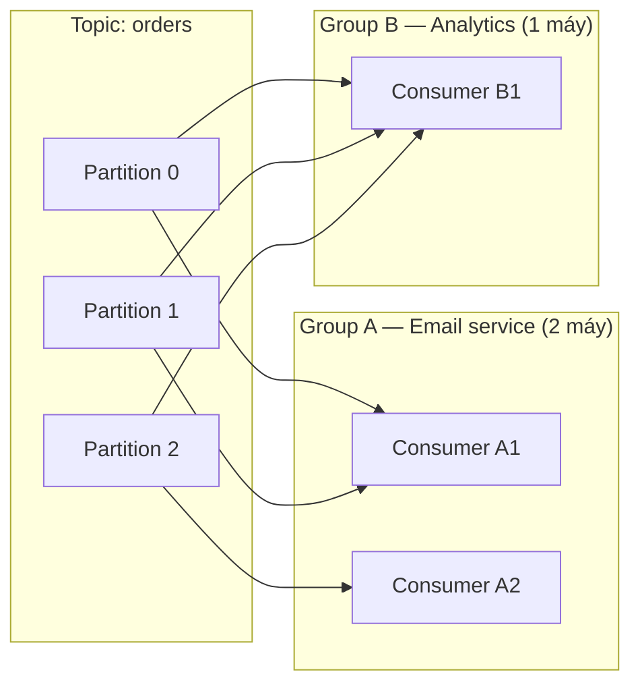
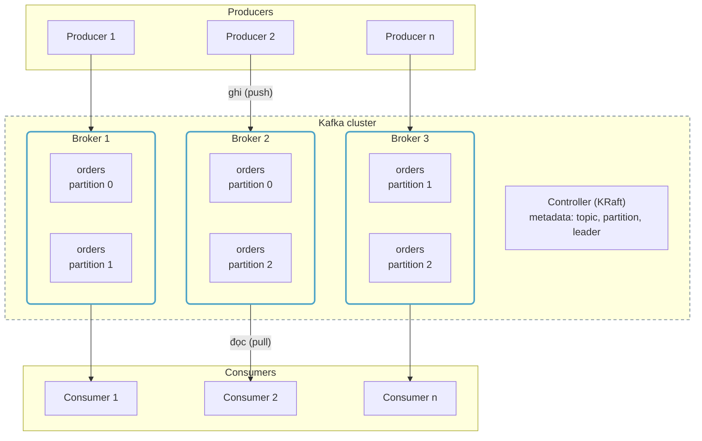
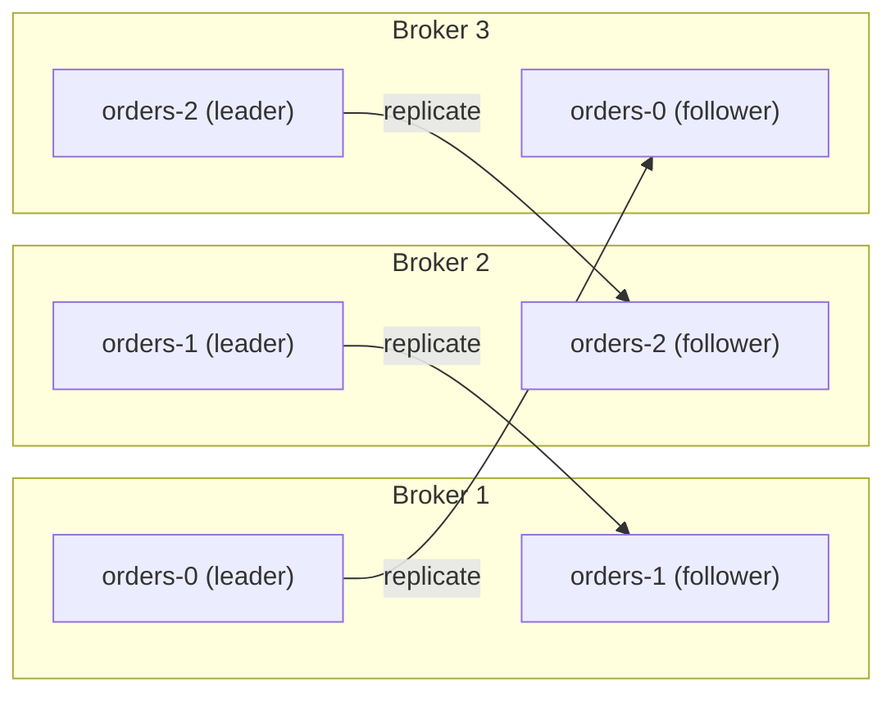
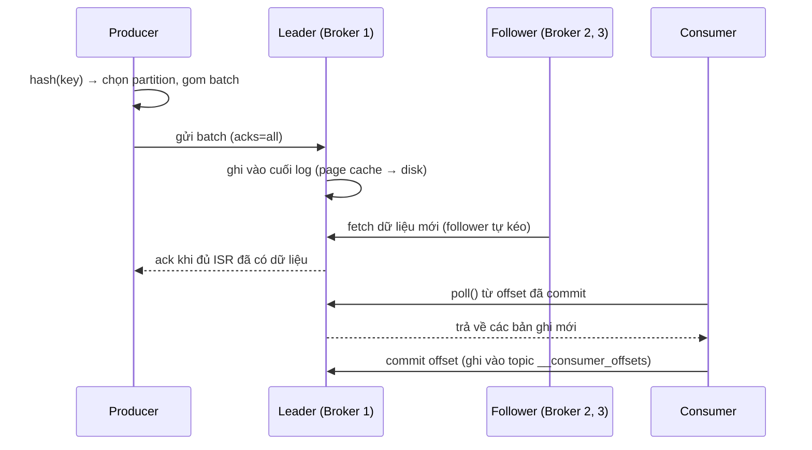
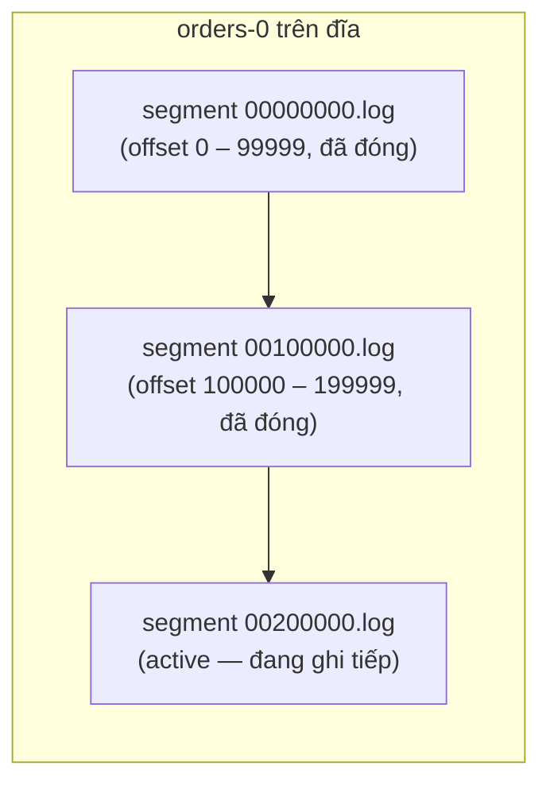
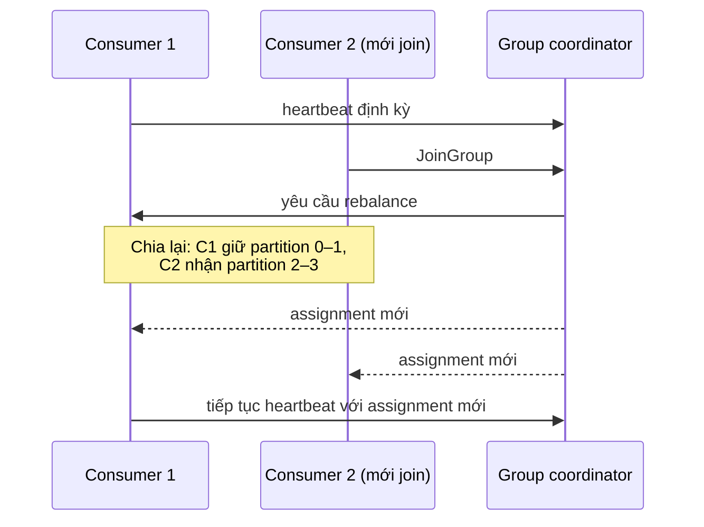

# Apache Kafka — từ khái niệm đến kiến trúc

Tài liệu này trả lời bốn câu hỏi theo thứ tự: Kafka **là gì**, được **cấu trúc** từ những khái niệm nào, **kiến trúc bên trong** vận hành ra sao, và **dùng cho việc gì** (kèm khi nào không nên dùng).

---

## 1. Kafka là gì?

**Kafka là một cuốn sổ nhật ký sự kiện (event log) phân tán.** Mọi sự kiện xảy ra trong hệ thống — một đơn hàng được tạo, một khoản thanh toán thành công — được ghi nối tiếp vào cuối sổ, theo đúng thứ tự, và **không bị xoá đi sau khi có người đọc**. Ai muốn biết chuyện gì đã xảy ra thì tự mở sổ ra đọc, và tự nhớ mình đã đọc đến dòng nào.

Đây là khác biệt căn bản so với message queue truyền thống (SQS, RabbitMQ):

- **Queue giống hòm thư:** message được lấy ra, xử lý xong thì biến mất. Một việc — một người làm.
- **Kafka giống sổ ghi chép:** sự kiện nằm lại trong sổ (theo thời hạn lưu cấu hình sẵn, ví dụ 7 ngày). Nhiều hệ thống cùng đọc một sự kiện, mỗi bên cho mục đích riêng, và có thể đọc lại từ đầu nếu cần.

> **Nắm ý chính:** producer *ghi* sự kiện vào topic, Kafka *giữ* sự kiện lại theo thứ tự, consumer *tự đọc* theo nhịp của mình. Ba vai trò này không cần biết đến nhau — đó là giá trị lớn nhất của Kafka.

---

## 2. Sáu khái niệm cốt lõi

Nắm được sáu khái niệm này là nắm được Kafka:

| Khái niệm | Là gì |
|---|---|
| **Event (record)** | Một sự kiện đã xảy ra, gồm `key`, `value`, timestamp. Bất biến — ghi rồi không sửa. |
| **Topic** | Một "cuốn sổ" theo chủ đề: `orders`, `payments`, `user-activity`. |
| **Partition** | Mỗi topic chia thành nhiều phần để ghi/đọc song song. Thứ tự chỉ đảm bảo *trong một partition*; sự kiện cùng `key` luôn rơi vào cùng partition. |
| **Offset** | Số thứ tự của sự kiện trong partition (0, 1, 2, …). Consumer dùng offset làm "bookmark" — xử lý đến đâu, commit đến đó. |
| **Consumer group** | Nhóm consumer chia nhau các partition để xử lý song song; các group khác nhau đọc cùng topic hoàn toàn độc lập. |
| **Broker / Cluster** | Broker là một máy chủ Kafka; cluster là tập hợp nhiều broker, có sao chép dữ liệu lẫn nhau để chịu lỗi. |

### Partition và offset — nhìn tận mắt

Một partition đơn giản là một dãy ô đánh số, chỉ ghi thêm vào cuối:

Sự kiện đã đọc **vẫn nằm nguyên trong sổ** — consumer khác (hoặc chính consumer đó, sau khi sửa bug) có thể quay lại đọc từ offset cũ.

### Consumer group — chia việc và nhân bản luồng đọc

Trong Group A, ba partition chia cho hai consumer — thêm máy là thêm sức xử lý. Group B một mình đọc cả ba partition. Hai group không ảnh hưởng gì đến nhau.

---

## 3. Kiến trúc bên trong

### 3.1. Bức tranh tổng thể

Một hệ thống Kafka gồm ba lớp:

- **Client** — producer (ghi) và consumer (đọc), là code chạy trong ứng dụng của bạn.
- **Cluster** — nhiều broker cùng chia nhau lưu trữ và phục vụ dữ liệu.
- **Tầng điều phối** — một nhóm nhỏ broker đóng vai trò **controller** (giao thức KRaft), quyết định partition nào nằm ở đâu, ai là leader, broker nào sống/chết.

*(Mũi tên vẽ 1-1 cho gọn sơ đồ — thực tế producer nào cũng có thể ghi vào broker giữ partition tương ứng, consumer nào cũng có thể đọc từ broker bất kỳ.)*

Mỗi broker giữ một phần các partition; cùng một partition xuất hiện trên hai broker vì có bản sao (replication — chi tiết ở mục 3.3). Controller không nằm trên đường đi của dữ liệu — nó chỉ giữ metadata và điều phối.

> **Ghi chú lịch sử:** trước đây việc điều phối do một cụm ZooKeeper bên ngoài đảm nhiệm. Giao thức **KRaft** (Kafka Raft) được công nhận production-ready từ Kafka 3.3 (KIP-833), và từ **Kafka 4.0 (03/2025) ZooKeeper bị gỡ bỏ hoàn toàn — KRaft là chế độ duy nhất**. Node controller có thể là máy riêng hoặc kiêm luôn vai trò broker (cấu hình `process.roles`). Tài liệu này mô tả theo KRaft.

### 3.2. Partition trải ra trên cluster như thế nào

Các partition của cùng một topic được **rải đều lên các broker khác nhau** — đây là cách Kafka scale: thêm partition và thêm broker là thêm băng thông ghi/đọc song song. Producer quyết định sự kiện rơi vào partition nào bằng `hash(key) % số_partition`.

### 3.3. Replication — leader và follower

Mỗi partition được sao chép thành nhiều bản (replication factor, thường là 3) đặt trên các broker khác nhau:

- **Leader** — bản duy nhất nhận ghi và (mặc định) phục vụ đọc cho partition đó. Từ Kafka 2.4 có thể cho phép consumer đọc từ follower gần nhất theo rack (KIP-392) để tiết kiệm băng thông liên vùng.
- **Follower** — các bản sao, liên tục kéo dữ liệu mới từ leader về.
- **ISR (in-sync replicas)** — tập các bản sao đang bắt kịp leader. Chỉ replica trong ISR mới đủ tư cách lên làm leader khi leader chết.

Khi một broker chết, controller phát hiện (mất heartbeat) và **bầu một follower trong ISR lên làm leader** cho các partition bị ảnh hưởng. Client tự động cập nhật metadata và chuyển sang leader mới — ứng dụng không phải làm gì.

Mức an toàn khi ghi do producer chọn qua tham số `acks`:

| `acks` | Ý nghĩa | Đánh đổi |
|---|---|---|
| `0` | Gửi rồi quên, không chờ xác nhận | Nhanh nhất, có thể mất dữ liệu |
| `1` | Leader ghi xong là xác nhận | Mất dữ liệu nếu leader chết trước khi follower kịp sao chép |
| `all` | Chờ đủ ISR ghi xong (kết hợp `min.insync.replicas`) | An toàn nhất, chậm hơn — **là mặc định từ Kafka 3.0** (KIP-679, đi kèm `enable.idempotence=true`) |

### 3.4. Đường đi của một bản ghi (write path / read path)

Mấy điểm đáng chú ý trong thiết kế này:

- **Producer gom batch** — nhiều bản ghi gửi chung một lần, nén cả batch. Đây là lý do chính Kafka đạt thông lượng rất cao.
- **Follower tự kéo (pull)**, leader không đẩy — đơn giản hoá leader, follower chạy theo nhịp riêng.
- **Consumer cũng pull** — consumer chậm không làm nghẽn broker, chỉ tụt lại phía sau (*consumer lag* — chỉ số giám sát quan trọng nhất khi vận hành).
- **Offset của consumer được lưu ngay trong Kafka**, ở topic nội bộ `__consumer_offsets` — không cần kho lưu ngoài.

### 3.5. Lưu trữ trên đĩa — segment và retention

Mỗi partition trên đĩa không phải một file khổng lồ mà là một dãy **segment**:

- Chỉ segment cuối (**active segment**) nhận ghi; các segment cũ ở trạng thái chỉ-đọc.
- **Retention** hoạt động bằng cách xoá nguyên segment cũ khi quá hạn (`retention.ms`, ví dụ 7 ngày) hoặc quá dung lượng (`retention.bytes`) — rẻ hơn nhiều so với xoá từng bản ghi.
- Chế độ thay thế: **log compaction** — thay vì xoá theo thời gian, giữ lại **bản ghi mới nhất của mỗi key**. Dùng cho topic kiểu "trạng thái hiện tại" (`__consumer_offsets` chính là compacted topic).
- Kafka ghi/đọc tuần tự và tận dụng page cache của hệ điều hành + zero-copy (`sendfile`) — vì vậy dù lưu trên đĩa, tốc độ vẫn tiệm cận băng thông mạng.

### 3.6. Group coordinator và rebalance

Việc chia partition cho các consumer trong một group do **group coordinator** (một broker được chỉ định cho mỗi group) quản lý. Khi thành viên group thay đổi (thêm máy, một máy chết, deploy lại), coordinator kích hoạt **rebalance** — chia lại partition:

Điểm cần biết khi vận hành: rebalance kiểu cổ điển khiến **cả group tạm dừng xử lý** trong lúc chia lại (stop-the-world). Kafka 4.0 đưa vào chính thức **giao thức consumer group thế hệ mới (KIP-848)**: broker tự quản lý việc phân chia partition và rebalance diễn ra tăng dần — consumer mới nhận partition ngay, không bắt cả group dừng lại; phía client bật bằng `group.protocol=consumer`. Với protocol cũ, deploy rolling nhiều consumer liên tục vẫn là nguyên nhân phổ biến nhất gây lag đột biến.

### 3.7. Ngữ nghĩa giao nhận (delivery semantics)

| Mức | Cách đạt được | Hệ quả |
|---|---|---|
| At-most-once | Commit offset **trước** khi xử lý | Có thể mất sự kiện, không bao giờ trùng |
| At-least-once *(mặc định thực tế)* | Xử lý xong **rồi mới** commit offset | Có thể trùng khi crash giữa chừng → xử lý phải **idempotent** |
| Exactly-once | Idempotent producer (mặc định bật từ Kafka 3.0) + transactions (`transactional.id`) | Chi phí cấu hình và hiệu năng cao hơn; chủ yếu dùng trong chuỗi Kafka → Kafka (Kafka Streams) |

Thực tế phổ biến nhất: chạy at-least-once và làm consumer idempotent (kiểm tra đã-xử-lý theo key/id trước khi ghi hệ quả).

---

## 4. Kafka dùng để làm gì?

**Kết nối các service mà không ràng buộc chúng.** Service A phát sự kiện "đơn hàng đã thanh toán" mà không cần biết ai sẽ nghe. Hôm nay có email service nghe; tháng sau thêm loyalty service — chỉ việc subscribe vào topic, không sửa một dòng nào ở service A.

**Thu thập dữ liệu hành vi và log tập trung.** Mọi click, page view, log từ hàng trăm máy đổ về một chỗ với thông lượng rất lớn (Kafka sinh ra ở LinkedIn chính cho bài toán này), rồi chảy tiếp vào kho dữ liệu, hệ thống giám sát, hay mô hình ML.

**Xử lý luồng thời gian thực (stream processing).** Tính toán liên tục trên dòng sự kiện đang chảy: doanh thu 5 phút gần nhất, phát hiện giao dịch bất thường, dashboard trực tiếp — thay vì chạy báo cáo theo lô mỗi đêm.

**Event sourcing — lịch sử là nguồn sự thật.** Thay vì chỉ lưu trạng thái cuối cùng ("đơn hàng: đã giao"), lưu toàn bộ chuỗi sự kiện dẫn đến trạng thái đó. Cần audit, cần dựng lại dữ liệu — tất cả nằm sẵn trong log.

---

## 5. Khi nào *không* cần Kafka?

Kafka mạnh, nhưng là một hệ thống phải vận hành 24/7 (cluster, partition, retention, giám sát). Nếu bài toán chỉ là **hàng đợi công việc** — mỗi job làm đúng một lần, xong là thôi — thì một queue đơn giản như SQS phù hợp hơn hẳn:

| | Queue (SQS) | Kafka |
|---|---|---|
| Mô hình | Hòm thư — đọc xong là xoá | Sổ nhật ký — đọc xong vẫn còn |
| Bài toán | Job chạy nền: gửi email, sync dữ liệu, xử lý webhook | Dòng sự kiện nhiều bên cùng nghe, replay, phân tích thời gian thực |
| Số bên đọc | Một nhóm worker cho một queue | Nhiều consumer group độc lập trên cùng topic |
| Đọc lại lịch sử | Không — message đã xử lý là mất | Có — quay offset về quá khứ |
| Retry / DLQ | Có sẵn, gần như không phải làm gì | Tự thiết kế (retry topic, DLQ topic) |
| Vận hành | Managed hoàn toàn, trả tiền theo lượng dùng | Cluster chạy thường trực, cần người hiểu để tune |

> **Quy tắc chọn nhanh:** câu hỏi cần trả lời là *"sự kiện này có bao nhiêu bên cần nghe, và có cần nghe lại không?"* Một bên, nghe một lần — dùng queue. Nhiều bên độc lập, hoặc cần replay lịch sử, hoặc thông lượng rất lớn — lúc đó Kafka mới đáng giá phần vận hành bỏ ra.

---

## 6. Tóm tắt

- Kafka = **sổ nhật ký sự kiện phân tán**: ghi nối tiếp, giữ lại theo thời hạn, nhiều bên cùng đọc độc lập.
- Sáu khái niệm cốt lõi: **event → topic → partition → offset → consumer group → broker**. Thứ tự chỉ đảm bảo trong một partition; cùng key thì cùng partition.
- Kiến trúc: **cluster nhiều broker + controller KRaft**; mỗi partition có **leader + follower (ISR)**; lưu trữ là **append-only log chia segment**; consumer **pull theo offset**, group coordinator chia partition và rebalance.
- Đảm bảo giao nhận mặc định là **at-least-once** — thiết kế consumer idempotent là quy tắc sống còn.
- Dùng cho **dòng sự kiện** (nhiều bên nghe, replay, real-time); không dùng thay **hàng đợi công việc** — việc đó queue đơn giản làm tốt hơn với chi phí vận hành gần bằng không.

---

## Nguồn tham khảo

- [Apache Kafka Documentation](https://kafka.apache.org/documentation/) — tài liệu chính thức (design, replication, log, consumer group)
- [Apache Kafka 4.0.0 Release Announcement](https://kafka.apache.org/blog/2025/03/18/apache-kafka-4.0.0-release-announcement/) — gỡ ZooKeeper, KRaft-only, KIP-848 GA
- [KIP-679](https://cwiki.apache.org/confluence/display/KAFKA/KIP-679:+Producer+will+enable+the+strongest+delivery+guarantee+by+default) — producer mặc định `acks=all` + idempotence từ Kafka 3.0
- [KIP-848](https://cwiki.apache.org/confluence/display/KAFKA/KIP-848:+The+Next+Generation+of+the+Consumer+Rebalance+Protocol) — giao thức consumer rebalance thế hệ mới
- [KIP-392](https://cwiki.apache.org/confluence/display/KAFKA/KIP-392:+Allow+consumers+to+fetch+from+closest+replica) — cho phép consumer đọc từ replica gần nhất
