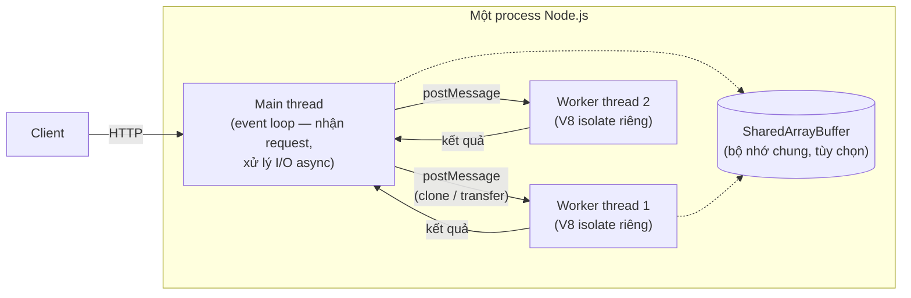
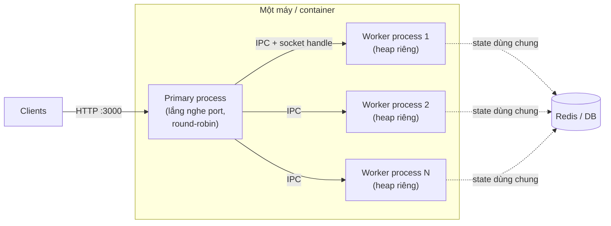
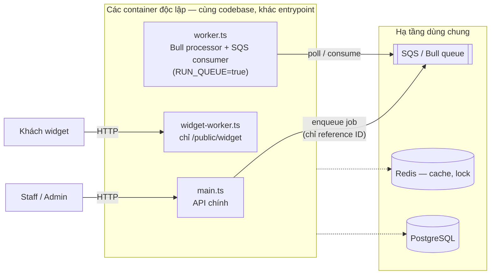

# Các mô hình song song hóa trong Node.js — worker_threads, cluster, đa process

> Nguồn: tài liệu chính thức Node.js — [worker_threads](https://nodejs.org/api/worker_threads.html) và [cluster](https://nodejs.org/api/cluster.html). Các trích dẫn tiếng Anh trong tài liệu này được lấy nguyên văn từ hai trang trên.

---

## 1. Mô hình tư duy tối giản

Node.js chạy JavaScript trên **một luồng duy nhất** (event loop). Khi một tác vụ **tính toán nặng (CPU-bound)** chiếm luồng này, toàn bộ request khác bị chặn. Có hai cách thoát khỏi giới hạn đó:

- **`worker_threads`** — tạo thêm **luồng** bên trong _cùng một process_ để chạy tính toán song song.
- **`cluster`** — tạo thêm **process** (fork) _cùng lắng nghe một port_ để chia tải request.
- **Đa process độc lập** (mô hình của dự án này) — chạy **nhiều process khác nhau về vai trò** (API, queue worker, widget), phối hợp qua hệ thống bên ngoài (queue, Redis, DB) thay vì qua IPC.

`worker_threads` giải bài toán _"một request tính toán quá lâu"_; `cluster` giải bài toán _"quá nhiều request cho một CPU core"_; đa process độc lập giải bài toán _"các loại workload khác nhau không được phép ảnh hưởng lẫn nhau"_. Đây là ba bài toán khác nhau.

---

## 2. Worker Threads

### 2.1. Bản chất

Mỗi worker là một luồng chạy **V8 isolate và event loop riêng**, nằm trong cùng process với luồng chính. Tài liệu chính thức nêu rõ phạm vi sử dụng:

> "Workers (threads) are useful for performing CPU-intensive JavaScript operations. **They do not help much with I/O-intensive work.** The Node.js built-in asynchronous I/O operations are more efficient than Workers can be."

Nghĩa là: worker thread **chỉ có giá trị với tác vụ CPU-bound**. Với I/O (query DB, gọi HTTP, đọc file), cơ chế async sẵn có của Node.js đã hiệu quả hơn — đưa I/O vào worker chỉ tốn thêm chi phí.

### 2.2. Chia sẻ dữ liệu

Khác với `cluster`/`child_process`, worker thread **có thể chia sẻ bộ nhớ**:

| Cơ chế                   | Hành vi                                                                        |
| ------------------------ | ------------------------------------------------------------------------------ |
| `postMessage` (mặc định) | Dữ liệu được **clone** theo structured clone algorithm — mỗi bên một bản sao   |
| Transfer `ArrayBuffer`   | **Chuyển quyền sở hữu** buffer sang worker, không copy; bên gửi mất quyền dùng |
| `SharedArrayBuffer`      | **Bộ nhớ chung thật sự**, cả hai luồng đọc/ghi đồng thời                       |

Giao tiếp hai chiều qua `parentPort` / `worker.postMessage()` / `MessageChannel`.

### 2.3. Chi phí khởi tạo — luôn dùng pool

Tạo worker tốn kém (khởi tạo V8 isolate mới). Tài liệu chính thức khuyến cáo:

> "In practice, use a pool of Workers for these kinds of tasks. Otherwise, the overhead of creating Workers would likely exceed their benefit."

Tức là không tạo worker mới cho mỗi tác vụ nhỏ — duy trì một pool tái sử dụng (ví dụ thư viện `piscina`).

### 2.4. Ví dụ

**Dạng thô — API gốc của module** (minh họa cơ chế, không dùng cho tác vụ lặp lại vì vi phạm khuyến cáo pool ở 2.3):

```typescript
// availability.worker.ts — file này chạy trong luồng riêng
import { parentPort, workerData } from 'node:worker_threads';
import { computeAvailability } from './compute-availability';

// workerData là bản clone của dữ liệu main thread gửi sang
const result = computeAvailability(workerData.dayData);
parentPort!.postMessage(result);
```

```typescript
// main thread — bọc worker thành một Promise
import { Worker } from 'node:worker_threads';

function computeInWorker(dayData: DayData): Promise<AvailabilityResult> {
  return new Promise((resolve, reject) => {
    const worker = new Worker(require.resolve('./availability.worker.js'), {
      workerData: { dayData },
    });
    worker.once('message', resolve);
    worker.once('error', reject);
    worker.once('exit', (code) => {
      if (code !== 0) reject(new Error(`Worker exited with code ${code}`));
    });
  });
}
```

**Dạng thực dụng — worker pool với `piscina`** (đây là dạng nên dùng nếu dự án triển khai thật, áp vào đúng ứng viên ở mục 7.2):

```typescript
// availability.worker.ts — piscina quy ước gọi hàm export default
import { computeAvailability } from './compute-availability';

export default function compute(dayData: DayData): AvailabilityResult {
  return computeAvailability(dayData);
}
```

```typescript
// pool tạo một lần lúc khởi động, tái sử dụng cho mọi request
import Piscina from 'piscina';

const pool = new Piscina({
  filename: path.join(__dirname, 'availability.worker.js'),
  maxThreads: 2,
});

// findNextAvailable: 14 ngày trở thành song song thật,
// thay vì tuần tự trên event loop như Promise.all với hàm sync hiện tại
const results = await Promise.all(
  days.map((day) => pool.run(dayDataByDate[day])),
);
```

Lưu ý khi dùng với TypeScript/NestJS: `filename` phải trỏ tới file **`.js` đã compile trong `dist/`**, không phải file `.ts` — cần chú ý khi cấu trúc build thay đổi. Dữ liệu vào/ra worker phải là plain JSON (structured clone không mang theo method, prototype, Sequelize instance).

### 2.5. Sơ đồ



---

## 3. Cluster

### 3.1. Bản chất

> "The cluster module allows easy creation of child processes that **all share server ports**."

Các worker của cluster là **process độc lập**, tạo bằng `child_process.fork()`, giao tiếp với primary qua IPC. Mỗi process có heap và V8 riêng hoàn toàn — **không có bộ nhớ chung**.

### 3.2. Phân phối kết nối

- **Round-robin** (mặc định trên mọi nền tảng trừ Windows): primary process lắng nghe port, nhận kết nối rồi chia đều cho các worker, "with some built-in smarts to avoid overloading a worker process."
- **Shared socket** (mặc định trên Windows): primary tạo socket rồi đưa cho worker tự accept. Tài liệu ghi nhận cách này phân phối rất lệch trong thực tế: "Loads have been observed where over 70% of all connections ended up in just two processes, out of a total of eight."

### 3.3. Hệ quả thiết kế

Vì không có bộ nhớ chung, tài liệu cảnh báo:

> "It is therefore important to design an application such that it does not rely too heavily on in-memory data objects for things like sessions and login."

Session, cache, state phải nằm ngoài process (Redis, DB) — điều nollie-api vốn đã tuân thủ.

### 3.4. Ví dụ

Phỏng theo ví dụ trong tài liệu chính thức — một file duy nhất, chạy cả vai primary lẫn worker:

```typescript
import cluster from 'node:cluster';
import http from 'node:http';
import { availableParallelism } from 'node:os';

if (cluster.isPrimary) {
  // fork một worker cho mỗi core; primary không xử lý request
  for (let i = 0; i < availableParallelism(); i++) {
    cluster.fork();
  }
  // worker chết thì hồi sinh — primary kiêm vai trò giám sát
  cluster.on('exit', (worker) => {
    console.log(`worker ${worker.process.pid} died, forking a new one`);
    cluster.fork();
  });
} else {
  // mọi worker cùng gọi listen(3000) — thực chất primary giữ port
  // và phân phối kết nối round-robin cho các worker
  http
    .createServer((req, res) => res.end(`handled by ${process.pid}`))
    .listen(3000);
}
```

Với NestJS, nhánh `else` chính là chỗ gọi `bootstrap()` (toàn bộ `app.listen(...)` hiện tại của `main.ts`). Về mặt kỹ thuật hoàn toàn áp được vào dự án — lý do không dùng không phải "không thể" mà là **không cần**: container chỉ được cấp ít vCPU và orchestrator đã scale bằng số bản sao container (mục 6), nên fork thêm process bên trong container chỉ nhân bộ nhớ lên vô ích.

### 3.5. Sơ đồ



---

## 4. Đa process độc lập (multi-process theo vai trò)

### 4.1. Bản chất

Đây không phải một module của Node.js mà là một **mô hình kiến trúc**: build cùng một codebase thành nhiều **entrypoint khác nhau**, mỗi entrypoint chạy thành một process (thường là một container) riêng, đảm nhiệm một loại workload riêng. Không có primary process quản lý, không dùng IPC, không chia port — mọi phối hợp đi qua **hệ thống bên ngoài**: queue (SQS/Bull), Redis, database. Routing HTTP (nếu có nhiều process cùng nhận request) do hạ tầng đảm nhiệm (load balancer, port riêng), không phải do Node.js.

Điểm khác biệt cốt lõi so với `cluster`: cluster chạy **N bản sao giống hệt nhau** của cùng một app để chia đều _cùng một loại_ tải (scale **đồng nhất**); đa process độc lập chạy **các process khác nhau về vai trò** để cách ly _các loại_ tải khỏi nhau (cách ly **dị nhất** — bulkhead pattern). Một job gửi campaign nặng đến đâu cũng không thể chặn request của khách đặt bàn, vì chúng không chung event loop, không chung heap, không chung process.

So với `worker_threads`: cách ly tuyệt đối hơn (crash, memory leak, GC pause của process này không chạm process kia), scale và cấp phát tài nguyên **độc lập từng vai trò** (worker có thể 1 bản, API 4 bản), deploy/restart riêng. Đổi lại, không thể trả kết quả tính toán về trong cùng một request một cách rẻ — giao tiếp qua queue là bất đồng bộ, độ trễ tính bằng trăm ms trở lên, nên chỉ hợp với việc **không cần trả lời ngay**.

### 4.2. Sơ đồ — topology thực tế của nollie-api



Ba entrypoint: `src/main.ts` (API chính), `src/worker.ts` (xử lý queue), `src/widget-worker.ts` (tách riêng traffic widget công khai sau epic scale NOL-1900..1904). Quy tắc "payload queue chỉ chứa reference ID" trong development rules chính là hệ quả trực tiếp của mô hình này: dữ liệu lớn không đi qua kênh giao tiếp giữa các process, process nhận tự đọc lại từ DB.

---

## 5. So sánh trực tiếp

| Tiêu chí                  | `worker_threads`                             | `cluster`                                      | Đa process độc lập                                         |
| ------------------------- | -------------------------------------------- | ---------------------------------------------- | ---------------------------------------------------------- |
| Đơn vị song song          | Luồng trong cùng process                     | Bản sao process giống nhau (fork)              | Process khác vai trò, entrypoint riêng                     |
| Bài toán giải quyết       | Tác vụ **CPU-bound** chặn event loop         | **Scale throughput HTTP** theo số core một máy | **Cách ly workload** khác loại; scale độc lập từng vai trò |
| Bộ nhớ                    | Chia sẻ được (`SharedArrayBuffer`, transfer) | Cách ly, chỉ IPC                               | Cách ly tuyệt đối; state chung qua Redis/DB/queue          |
| Giao tiếp                 | `postMessage` (đồng bộ về độ trễ, µs–ms)     | IPC với primary                                | Queue/Redis/DB — bất đồng bộ, độ trễ cao hơn               |
| Trả kết quả trong request | Được — mục đích chính                        | Được (mỗi process tự xử lý request của mình)   | Không phù hợp — chỉ cho việc xử lý nền                     |
| Chi phí tạo               | Nhẹ hơn process, vẫn phải dùng pool          | Nặng (fork cả process), tạo lúc khởi động      | Nặng nhất (container), nhưng cố định lúc deploy            |
| Cách ly lỗi               | Yếu nhất — crash có thể kéo theo process     | Một worker chết, process khác sống             | Mạnh nhất — crash/leak/GC không lan, restart riêng         |
| Chia port HTTP            | Không                                        | Có — mục đích chính của module                 | Không — routing do hạ tầng (LB, port riêng)                |
| Ai quản lý vòng đời       | Code của bạn (pool)                          | Primary process                                | Orchestrator (ECS/K8s/Docker)                              |

Tài liệu cluster chốt ranh giới lựa chọn:

> "When **process isolation is not needed**, use the `worker_threads` module instead, which allows running multiple application threads within a single Node.js instance."

## 6. Khi nào dùng cái nào

**Dùng `worker_threads` khi:**

- Có tác vụ JavaScript thuần tính toán chạy dài (parse/serialize dữ liệu rất lớn, nén, mã hoá khối lượng lớn, xử lý ảnh bằng JS, thuật toán tổ hợp) đang chặn event loop.
- Cần chia sẻ dữ liệu lớn giữa các đơn vị song song mà không muốn copy (SharedArrayBuffer).

**Dùng `cluster` khi:**

- Một process Node.js không dùng hết CPU của máy nhiều core và cần tăng throughput HTTP **trên chính máy đó**.
- Cần cách ly lỗi giữa các đơn vị xử lý request.

**Dùng đa process độc lập khi:**

- Tác vụ nặng nhưng **không cần trả lời trong request** → đẩy vào queue cho process worker riêng xử lý (mô hình SQS worker hiện tại của dự án).
- Cần cách ly một loại traffic/workload khỏi phần còn lại (như tách `widget-worker` khỏi API chính), hoặc cần scale/cấp tài nguyên từng vai trò một cách độc lập.

**Không dùng cái nào cả khi:**

- Tác vụ chậm vì **I/O** (DB, HTTP ngoài) → async/await sẵn có đã tối ưu.
- Đã chạy trên orchestrator (ECS/Kubernetes) với nhiều task/container: mỗi container thường được cấp ít vCPU và orchestrator tự scale số bản sao — vai trò của `cluster` bị trùng lặp với hạ tầng. Đây là lý do phổ biến khiến các service container hóa không dùng `cluster`.

---

## 7. Đối chiếu với nollie-api

### 7.1. Hiện trạng

Codebase không dùng `worker_threads` lẫn `cluster` (không có `piscina`/`workerpool`). Việc song song hóa hiện được giải quyết ở **tầng process và hạ tầng**, không phải tầng luồng:

- `src/main.ts` — API chính, một process đơn luồng.
- `src/worker.ts` — process riêng chạy Bull processor + SQS consumer (gate bằng `RUN_QUEUE=true`).
- `src/widget-worker.ts` — process HTTP riêng chỉ phục vụ `/public/widget` (kết quả của epic scale NOL-1900..1904 — đây chính là "process isolation" mà lẽ ra `cluster` đảm nhiệm, nhưng tách hẳn process theo mục đích).
- Deploy bằng Docker container đơn (`--memory=512m`, không PM2). Với mô hình container hóa này, `cluster` gần như không có chỗ đứng — scale ngang bằng số container là việc của hạ tầng.

Nói cách khác, dự án đã chọn mô hình **đa process độc lập** (mục 4) làm trục song song hóa chính.

### 7.2. Ứng viên duy nhất thật sự đáng cân nhắc worker_threads

**Tính toán availability của allocator** — `computeAvailability` ([reservation-allocator.service.ts:1154-1377](src/modules/reservation-allocator/reservation-allocator.service.ts#L1154-L1377)) và `filterCandidates` ([candidate-filter.helper.ts:274-439](src/modules/reservation-allocator/candidate-filter.helper.ts#L274-L439)).

- Đây là khối **CPU thuần, không I/O bên trong vòng lặp**: mỗi ngày duyệt service × slot × bàn × booking span, đầu vào là JSON thuần (`dayData`), đầu ra JSON thuần — đúng "hình dạng" lý tưởng cho worker (clone rẻ, không dính Sequelize instance).
- Điểm khuếch đại: `findNextAvailable` ([reservation-allocator.service.ts:475-569](src/modules/reservation-allocator/reservation-allocator.service.ts#L475-L569)) quét tối đa 14 ngày với budget 8 giây; các ngày chạy qua `Promise.all` nhưng vì mỗi ngày là CPU đồng bộ nên **thực tế chạy tuần tự trên event loop** — worker pool theo đơn vị "một ngày" sẽ biến vòng quét này thành song song thật.
- **Tuy nhiên, chưa nên làm ngay.** Vòng lặp hiện có các khoản lãng phí bất biến bị tính lại mỗi slot: rebuild `tableIdsByArea` mỗi slot ([candidate-filter.helper.ts:116-121](src/modules/reservation-allocator/candidate-filter.helper.ts#L116-L121)), parse `moment.tz` mỗi slot ([candidate-filter.helper.ts:44-50](src/modules/reservation-allocator/candidate-filter.helper.ts#L44-L50), [reservation-allocator.service.ts:354-356](src/modules/reservation-allocator/reservation-allocator.service.ts#L354-L356)), tạo 2 `Date` mỗi span mỗi slot. Hoist các bất biến này ước tính giảm 5–10 lần chi phí — có thể xóa luôn nhu cầu dùng worker. Thứ tự đúng: **tối ưu thuật toán → profile lại → mới cân nhắc worker pool**.

### 7.3. Các chỗ trông giống nhưng KHÔNG phải ứng viên

| Logic                                                                                                                                                                                                                                 | Vì sao không dùng worker_threads                                                                                                                                                        |
| ------------------------------------------------------------------------------------------------------------------------------------------------------------------------------------------------------------------------------------- | --------------------------------------------------------------------------------------------------------------------------------------------------------------------------------------- |
| Export CSV/PDF audit log ([activity-logs.service.ts:816-1000](src/modules/activity-logs/activity-logs.service.ts#L816-L1000), pdfkit/ExcelJS đồng bộ, không giới hạn số dòng, chạy trên request HTTP)                                 | Đúng là CPU chặn event loop, nhưng lời giải đúng là **đẩy sang Bull/SQS worker sẵn có** rồi trả URL S3 (plumbing upload S3 đã có sẵn ở cuối hàm CSV) — queue thắng worker thread ở đây  |
| Giải mã PII hàng loạt (`processIncludeDecryption` trong [base.repository.ts:177-256](src/database/base.repository.ts#L177-L256), batch 5000 customer khi gửi campaign)                                                                | Sai hình dạng: phải serialize Sequelize instance qua ranh giới thread, chi phí structured clone lớn hơn chi phí AES; sửa bằng cách chặn walk khi query `raw:true`/không có field mã hóa |
| `JSON.parse` blob day-data cache ([allocator-cache.service.ts:175-191](src/modules/reservation-allocator/cache/allocator-cache.service.ts#L175-L191))                                                                                 | Parse trong worker rồi clone kết quả về = tốn tương đương; lời giải là thu nhỏ payload hoặc LRU in-process cho object đã parse                                                          |
| Xử lý ảnh `sharp`                                                                                                                                                                                                                     | libvips đã chạy trên **libuv threadpool**, vốn đã ngoài event loop; lever đúng là `UV_THREADPOOL_SIZE`                                                                                  |
| Venue brief, POS sync, CSV import                                                                                                                                                                                                     | I/O-bound (DB/LLM/HTTP) — theo docs chính thức, worker "do not help much with I/O-intensive work"                                                                                       |
| `generateUnsubscribeLink` mỗi recipient dùng crypto-js pure-JS ([campaign-v2.service.ts:3932-3939](src/modules/campaign-v2/campaign-v2.service.ts#L3932-L3939), [common.helper.ts:82-85](src/utils/helpers/common.helper.ts#L82-L85)) | Chậm vì dùng thư viện pure-JS có KDF mỗi lần gọi; thay bằng `crypto.createCipheriv`/HMAC với key cache là đủ, không cần luồng                                                           |

### 7.4. Kết luận cho dự án

- **`cluster`: không cần** — vai trò của nó đã bị hạ tầng container + tách process theo mục đích (`main` / `worker` / `widget-worker`) thay thế.
- **`worker_threads`: chỉ một ứng viên xứng đáng** là kernel tính availability của allocator, và cũng chỉ sau khi đã hoist các bất biến trong vòng lặp mà vẫn chưa đạt SLA <2s. Nếu làm, dùng worker **pool** (khuyến cáo chính thức), đơn vị công việc là một ngày `computeAvailability`.

_Phát hiện phụ trong lúc rà soát (không liên quan worker, đáng tách ticket riêng): sort dùng giải mã ngay trong comparator tại [activity-logs.service.ts:440-446](src/modules/activity-logs/activity-logs.service.ts#L440-L446) (O(n log n) lần AES thay vì O(n)); và `customerRepo.find({ where: { venueId } })` không giới hạn khi import CSV tại [customer.service.ts:8243](src/modules/customers/customer.service.ts#L8243), `:8998`, `:9181` — giải mã toàn bảng customer trên request HTTP._

---

## Nguồn tham khảo

- Node.js official docs — Worker threads: https://nodejs.org/api/worker_threads.html
- Node.js official docs — Cluster: https://nodejs.org/api/cluster.html
- Node.js Learn — "Don't block the event loop": https://nodejs.org/en/learn/asynchronous-work/dont-block-the-event-loop
