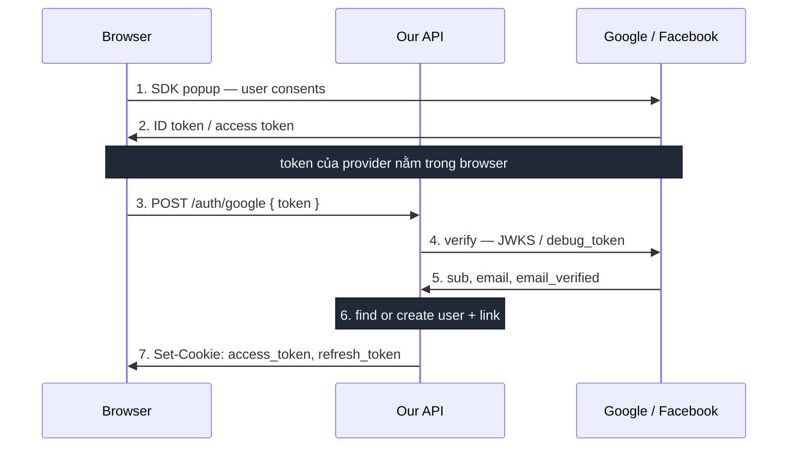
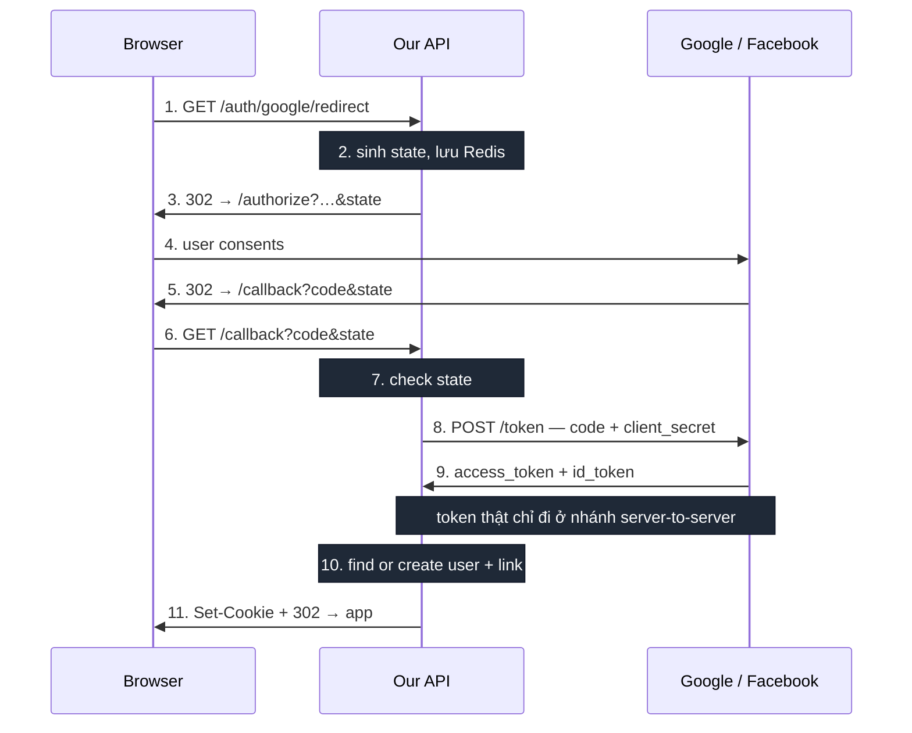
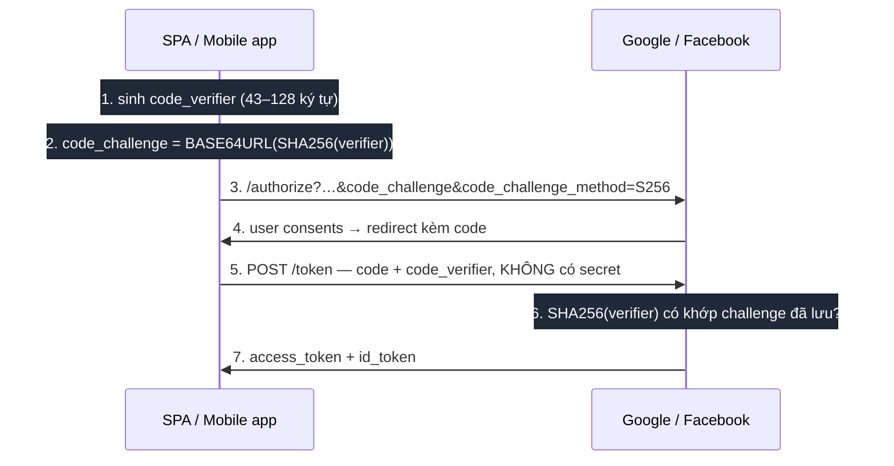

# Đăng nhập OAuth với Google và Facebook

Tài liệu giải thích ba luồng đăng nhập — token flow, authorization code, và authorization code + PKCE — cách từng luồng hoạt động, rồi so sánh ưu nhược điểm.

---

## Bối cảnh: 3 bên và bài toán cần giải

Mọi luồng đăng nhập mạng xã hội đều có đúng 3 bên:

| Bên                            | Vai trò                                                                 |
| ------------------------------ | ----------------------------------------------------------------------- |
| **Browser**                    | Nơi user bấm nút và nơi user thực sự đồng ý cấp quyền                   |
| **Backend của mình**           | Nơi cần biết chắc "người này là ai" để tạo session                      |
| **Provider** (Google/Facebook) | Bên duy nhất biết user là ai, và bên duy nhất có thể chứng thực điều đó |

Bài toán: **backend cần một bằng chứng danh tính đáng tin từ provider**, rồi từ đó tạo session của riêng mình (ở project này là cookie `access_token` / `refresh_token`).

Điểm cốt lõi cần nắm: backend **không được tin** thông tin do browser tự khai. Browser nằm trong tay user, ai cũng sửa được request. Nên bằng chứng phải là thứ mà backend tự xác minh được với provider.

Hai luồng dưới đây khác nhau ở đúng một chỗ: **bằng chứng đó đi tới backend bằng đường nào.**

---

## 1. Token flow

### Ý tưởng

Provider phát token trực tiếp cho **browser**. Browser gửi token đó lên backend. Backend mang token đi hỏi provider "token này có thật không, có phải phát cho app của tôi không".

Bằng chứng ở đây là **token của provider**, và nó đi xuyên qua browser.

### Luồng



### Giải thích từng bước

1. User bấm nút. SDK của provider (Google Identity Services / Facebook JS SDK) mở popup.
2. User đồng ý. Provider trả token về cho JS trong browser:
   - **Google** trả `id_token` — một JWT có chữ ký, chứa sẵn `sub`, `email`, `email_verified`
   - **Facebook** trả `access_token` — một chuỗi đục, không đọc được nội dung, phải hỏi lại Facebook
3. Browser POST token lên backend.
4. Backend xác minh. Hai provider khác nhau hẳn ở bước này:
   - **Google**: verify chữ ký JWT bằng public key của Google (thư viện cache key nên gần như không cần gọi mạng), đồng thời check `aud` đúng `client_id` của mình
   - **Facebook**: gọi `GET /debug_token` để hỏi token có hợp lệ không, rồi `GET /me` để lấy profile
5. Provider trả về danh tính.
6. Backend tìm hoặc tạo user, gắn liên kết provider.
7. Backend set cookie session của mình.

### Chỗ dễ sai nhất

Ở bước 4, nếu chỉ kiểm "token này có hợp lệ với provider không" mà **không** kiểm "token này có phát cho app của tôi không" thì hổng nghiêm trọng: kẻ tấn công lấy token từ một app Google/Facebook bất kỳ mà họ kiểm soát rồi gửi lên, và login được vào hệ thống của bạn.

- Google: phải check `aud` == `client_id` của mình
- Facebook: phải check `debug_token` trả về `app_id` == app id của mình

Đây là lý do backend luôn phải tự verify, kể cả khi token trông "hợp lệ".

### Một điểm hay bị hiểu nhầm

Luồng này **không phải** _implicit grant_ — loại đã bị OAuth 2.1 khai tử. Google Identity Services trả ID token và Facebook JS SDK trả access token đều là luồng chính thức được hai bên khuyến nghị cho mục đích **xác thực** (biết user là ai). Implicit grant là chuyện khác: nó trả _access token để gọi API_ qua URL fragment, và đó mới là thứ bị loại bỏ.

---

## 2. Authorization code flow

### Ý tưởng

Provider **không** phát token cho browser. Nó chỉ phát một `code` dùng một lần. Backend mang `code` đó cùng `client_secret` đi đổi lấy token, trong một request server-to-server mà browser không tham gia.

Bằng chứng ở đây vẫn là token, nhưng token **chưa bao giờ đi qua browser**.

### Luồng



### Giải thích từng bước

1. User bấm một link thường (không cần JS, không cần SDK) trỏ về backend.
2. Backend sinh `state` — một chuỗi random — và lưu server-side kèm TTL ngắn.
3. Backend redirect browser sang trang `/authorize` của provider, đính kèm `client_id`, `redirect_uri`, `scope`, `state`.
4. User thấy trang đồng ý **của chính Google/Facebook**, trên domain của họ.
5. Provider redirect browser về `redirect_uri` đã khai báo trước, đính kèm `code` và `state`.
6. Browser tự động gọi vào endpoint callback của backend.
7. Backend so `state` nhận được với cái đã lưu. Không khớp thì dừng.
8. Backend gọi thẳng token endpoint của provider, gửi `code` + `client_id` + `client_secret` + `redirect_uri`. **Đây là request server-to-server, browser không thấy gì.**
9. Provider trả `access_token` và `id_token`. Nếu xin `access_type=offline` (Google) thì có thêm `refresh_token`.
10. Backend tìm hoặc tạo user, gắn liên kết provider — **giống hệt bước 6 của luồng 1**.
11. Backend set cookie rồi redirect về frontend.

### Ba cơ chế bảo vệ cần hiểu

**`client_secret`** chứng minh "tôi đúng là app đó". Chỉ backend biết secret này, nên chỉ backend đổi được `code` lấy token. Đây là lý do luồng này an toàn mà không cần thêm gì.

**`state`** chống CSRF. Không có nó, kẻ tấn công dụ được victim gọi callback với `code` của _kẻ tấn công_, làm victim vô tình đăng nhập vào tài khoản của kẻ tấn công. `state` phải sinh server-side, lưu server-side, dùng một lần, có TTL.

**`redirect_uri`** phải khai báo chính xác từ trước ở console provider. Provider chỉ redirect về đúng URL đã đăng ký, nên kẻ tấn công không đổi hướng `code` sang server của họ được.

Luồng trên là **authorization_code thường** — bảo mật dựa vào `client_secret`. Còn biến thể dùng PKCE là mục tiếp theo.

---

## 3. Authorization code + PKCE

### Ý tưởng

PKCE (Proof Key for Code Exchange, đọc là "pixy") giải bài toán: **làm sao dùng authorization code flow khi không thể giữ `client_secret` bí mật?**

Đó là tình huống của **public client** — SPA, mobile app, desktop app. Code nằm trong tay user, ai cũng mở DevTools hoặc decompile được, nên nhúng secret vào là coi như công khai.

PKCE thay `client_secret` — một bí mật **cố định, dùng mãi** — bằng một cặp bí mật **sinh mới mỗi lần đăng nhập**:

- `code_verifier` — chuỗi random 43–128 ký tự, app giữ trong memory
- `code_challenge` — `BASE64URL(SHA256(code_verifier))`, gửi công khai lúc đầu

### Luồng



### Giải thích từng bước

1–2. App sinh `code_verifier` random, hash ra `code_challenge`. Verifier **không bao giờ** gửi ở bước này. 3. Redirect sang provider, đính kèm `code_challenge` và `code_challenge_method=S256`. Provider lưu challenge lại, gắn với request này. 4. User đồng ý, provider redirect về kèm `code`. 5. App đổi `code`, lần này gửi `code_verifier` **gốc** — thứ chưa từng xuất hiện trên đường truyền trước đó. Trong mô hình public client thuần thì không gửi secret; riêng client loại "Desktop app" của Google vẫn có secret và vẫn gửi kèm. 6. Provider tự hash verifier và so với challenge đã lưu. Khớp thì mới cấp token. 7. Token được cấp.

### Vì sao nó thay được `client_secret`

Kẻ tấn công chặn được `code` ở bước 4 (qua log, qua deep link bị đăng ký trùng trên mobile, qua referrer) vẫn **không đổi được token**, vì không có `code_verifier` — nó chưa bao giờ rời khỏi app.

Điểm khác biệt cốt lõi so với `client_secret`: secret bị lộ một lần là lộ vĩnh viễn. Verifier chỉ dùng cho **một** lần login, lộ cũng vô dụng.

`code_challenge_method` có 2 giá trị: `S256` (hash) và `plain` (challenge = verifier). Chỉ dùng `S256`; `plain` chỉ dành cho nền tảng không hash được, và nó vô nghĩa vì verifier bị lộ ngay ở bước 3.

### Hỗ trợ thực tế ở Google và Facebook

**Cả hai đều hỗ trợ PKCE.** Nhưng cách họ định vị nó khác nhau:

|                             | Google                                                                                                                                                                                                                     | Facebook                                                                                                                              |
| --------------------------- | -------------------------------------------------------------------------------------------------------------------------------------------------------------------------------------------------------------------------- | ------------------------------------------------------------------------------------------------------------------------------------- |
| Hỗ trợ                      | Có — [discovery document](https://accounts.google.com/.well-known/openid-configuration) khai `code_challenge_methods_supported: ["plain", "S256"]`                                                                         | Có — qua [OIDC Code Flow with PKCE](https://developers.facebook.com/documentation/facebook-login/guides/advanced/oidc-token)          |
| Document ở đâu              | Trang [iOS & Desktop Apps](https://developers.google.com/identity/protocols/oauth2/native-app). Trang [Web Server Apps](https://developers.google.com/identity/protocols/oauth2/web-server) **không** liệt kê tham số PKCE | Trang OIDC riêng, không có trong [Manual Login Flow](https://developers.facebook.com/docs/facebook-login/guides/advanced/manual-flow) |
| Quan hệ với `client_secret` | Cộng thêm — dùng được **cùng** secret (defense in depth)                                                                                                                                                                   | **Hoặc cái này hoặc cái kia** — tài liệu ghi rõ: gửi `client_secret` **hoặc** `code_verifier`; bỏ secret thì verifier thành bắt buộc  |

Điểm cần nhớ: với Facebook, PKCE là **phương án thay thế** cho `client_secret`, đúng tinh thần gốc của PKCE. Với Google thì có thể chồng cả hai.

**PKCE không bị giới hạn cho SPA/mobile.** Cả hai provider đều nhận nó ở luồng authorization_code bất kể loại client. Sở dĩ nó _trông_ như chỉ dành cho SPA/mobile là vì hai bên đều đặt tài liệu PKCE ở trang riêng cho các loại app đó — nơi PKCE **bắt buộc**. Còn web app có backend thì PKCE là **tuỳ chọn**, không phải bị cấm.

> Một chỗ chưa xác minh: Google khai hỗ trợ PKCE ở **cấp authorization server** qua discovery document. Việc OAuth client loại "Web application" có nhận `code_challenge` hay không thì Google không document. Thực tế các thư viện phổ biến (Auth.js, Spring Security) vẫn gửi PKCE cho web client và chạy được, nhưng nếu định dựa vào thì nên test thật một lần.

### Khi nào project này cần tới nó

Hiện tại **không cần**. Backend giữ được `client_secret`, tức là confidential client, nên authorization_code thường đã đủ.

PKCE trở thành cần thiết khi:

- Làm **mobile app** gọi trực tiếp provider, không qua backend
- Làm **SPA thuần** không có backend nào giữ secret
- Muốn siết thêm một lớp cho luồng backend hiện có (chỉ Google cho chồng)

---

## So sánh

### Token flow

**Ưu điểm**

- Không redirect. UX nhanh, SPA không mất state, không nhấp nháy chuyển trang.
- Ít code backend hơn. Không cần endpoint redirect/callback, không cần lưu `state`.
- Không phải tự làm chống CSRF — SDK của provider lo phần đó.
- Với Google thì không cần `client_secret` chút nào.

**Nhược điểm**

- **Phụ thuộc SDK bên thứ ba trong browser.** `connect.facebook.net` nằm trong hầu hết blocklist của ad blocker. Bị chặn thì SDK không load, nút Facebook **im lặng không làm gì**, không có error nào để bắt. Đây là nhược điểm thực tế nhất, gặp thường xuyên.
- **Token provider đi qua browser.** Nếu site có lỗ XSS thì token đó nằm trong tầm với của script độc.
- **Không có refresh token của provider.** Google chỉ trả `id_token` — đó là bằng chứng danh tính, không phải access token, nên không gọi được API Google nào cả. Facebook thì đỡ hơn: token ngắn hạn đổi được sang [long-lived token ~60 ngày](https://developers.facebook.com/docs/facebook-login/guides/access-tokens/get-long-lived) qua `grant_type=fb_exchange_token` ở server (cần app secret) — nhưng vẫn không phải refresh token, hết 60 ngày là phải cho user đăng nhập lại.
- **Backend buộc phải tự verify `aud`/`app_id`.** Bỏ sót là hổng nghiêm trọng, và không có gì nhắc bạn.
- Thêm JS bên thứ ba: CSP phải lỏng hơn, có thêm bề mặt tracking.

### Authorization code flow

**Ưu điểm**

- **Token provider không bao giờ vào browser.** XSS cũng không lấy được.
- **`client_secret` xác thực việc đổi token**, nên app khác không mạo danh được.
- **Có refresh token** với `access_type=offline` — mở đường cho việc gọi API provider về sau.
- **Không cần SDK nào trong browser.** Ad blocker không chặn được, CSP siết chặt được, không load gì từ Google/Meta lúc vào trang.
- Là chuẩn chung, dùng lại được cho mobile/native app.

**Nhược điểm**

- **Redirect toàn trang, hai vòng.** SPA mất state, phải tự lưu trước khi redirect rồi phục hồi sau.
- **Tự quản `state`** — thêm chỗ để làm sai, và làm sai thì thành lỗ bảo mật chứ không phải bug hiển thị.
- Thêm 2 endpoint mỗi provider.
- Cần `client_secret` cho cả Google (luồng kia thì không).
- `redirect_uri` phải khai báo chính xác cho **từng** môi trường. Preview deploy với domain động sẽ khá mệt.

### Authorization code + PKCE

**Ưu điểm**

- **Không cần giữ `client_secret`** — dùng được ở nơi không có chỗ nào an toàn để giữ secret.
- **Bí mật sinh mới mỗi lần login.** Lộ một lần không ảnh hưởng lần sau, khác hẳn secret cố định.
- Chặn được kịch bản `code` bị chặn giữa đường.
- Là luồng duy nhất dùng được cho **mobile/SPA không backend**.
- OAuth 2.1 khuyến nghị mặc định cho public client.

**Nhược điểm**

- **Không giải quyết được vấn đề của project này.** Backend đã giữ được secret nên PKCE không thêm gì đáng kể.
- Thêm việc phải làm đúng: sinh verifier đủ ngẫu nhiên, giữ nó qua vòng redirect, hash đúng `S256`.
- Với Facebook phải chuyển sang luồng OIDC riêng, không dùng được trang Manual Login Flow.
- Tài liệu ở cả hai provider đều nằm lệch khỏi trang chính, dễ tìm sai.

### Bảng đối chiếu

|                              | Token flow                                                                            | Authorization code            | Auth code + PKCE                   |
| ---------------------------- | ------------------------------------------------------------------------------------- | ----------------------------- | ---------------------------------- |
| Token provider trong browser | Có                                                                                    | Không — chỉ `code` dùng 1 lần | Có (app chính là client)           |
| Client secret                | Google: không cần. Facebook: dùng cho `debug_token`                                   | Bắt buộc cả hai               | Không cần                          |
| Bí mật dùng để đổi token     | —                                                                                     | `client_secret` cố định       | `code_verifier` mỗi lần login      |
| SDK provider trong browser   | Bắt buộc                                                                              | Không cần                     | Không cần                          |
| Redirect                     | Không, dùng popup                                                                     | Full-page, 2 vòng             | Full-page, 2 vòng                  |
| Chống CSRF                   | SDK tự xử lý                                                                          | Tự làm: `state`               | Tự làm: `state`                    |
| Refresh token của provider   | Không. Google: không có access token nào. Facebook: đổi được sang long-lived ~60 ngày | Có, với `access_type=offline` | Có                                 |
| **Cần thiết** cho            | Web có backend                                                                        | Web có backend                | SPA / mobile không giữ được secret |
| Bị ad blocker chặn           | Có thể, và chặn im lặng                                                               | Không                         |
| Endpoint backend cần thêm    | 0                                                                                     | +2 mỗi provider               |

### Chọn cái nào

Chọn **token flow** khi chỉ cần đăng nhập, muốn UX popup gọn, và không có nhu cầu gọi API provider về sau.

Chọn **authorization code** khi có bất kỳ điều nào sau:

- Cần gọi API provider thay mặt user về sau (cần refresh token)
- Không muốn nhúng JS bên thứ ba, hoặc cần CSP chặt
- Lo chuyện ad blocker chặn Facebook SDK

Chọn **authorization code + PKCE** khi **không có backend nào giữ được secret** — mobile app hoặc SPA thuần gọi trực tiếp provider. Câu hỏi quyết định không phải "cái nào an toàn hơn" mà là "có chỗ nào an toàn để giữ `client_secret` không". Có thì dùng secret, không thì dùng PKCE.

Điểm đáng lưu ý: **các luồng không loại trừ nhau.** Phần xử lý sau khi có danh tính giống nhau hoàn toàn, nên thêm luồng thứ hai về sau không phải viết lại từ đầu — ví dụ web dùng authorization code, mobile dùng PKCE, cùng chung một backend.

> Project này hiện đang dùng **token flow**. Chi tiết contract cho frontend nằm ở [frontend-social-login-integration.md](./frontend-social-login-integration.md).

---

## Setup nếu triển khai authorization code

### Google

- _Clients → web client → Authorized redirect URIs_: thêm `http://localhost:3000/api/auth/google/callback` và bản production.
- Client secret giờ **bắt buộc** trong env backend.

```
authorize  https://accounts.google.com/o/oauth2/v2/auth
token      https://oauth2.googleapis.com/token
```

### Facebook

- _Trường hợp sử dụng → Tùy chỉnh → Cài đặt → URI chuyển hướng OAuth hợp lệ_: thêm callback URL.
- App secret đã có. Toggle "Đăng nhập bằng SDK JavaScript" không cần nữa.

```
dialog  https://www.facebook.com/v26.0/dialog/oauth
token   https://graph.facebook.com/v26.0/oauth/access_token
```

> `v26.0` lấy từ URL dialog quan sát được (`facebook.com/v26.0/dialog/oauth`) — đó là version SDK bên FE đang dùng. Vẫn nên đối chiếu _Cài đặt → Nâng cao → Nâng cấp phiên bản API_ để đặt `FACEBOOK_GRAPH_VERSION` cho đúng.

### Backend

Hai endpoint mỗi provider:

```
GET /api/auth/google/redirect
  sinh state random
  lưu Redis, TTL ngắn
  302 tới authorize URL

GET /api/auth/google/callback?code&state
  verify state với Redis, xoá ngay sau khi dùng
  POST token endpoint kèm code + client_id + client_secret + redirect_uri
  verify id_token trả về
  → linkAndIssueTokens(...)     // không đổi
  302 về frontend
```

Toàn bộ phần dưới **dùng lại nguyên vẹn**: bảng `user_social_accounts`, logic find-or-create, nhánh email + OTP cho provider không trả email verified, và xử lý cookie.

### Frontend

Đơn giản hơn — SDK, callback, và bước POST token đều biến mất:

```html
<a href="/api/auth/google/redirect">Sign in with Google</a>
```

Hai màn email + OTP **vẫn phải giữ**: đổi luồng không làm Facebook trả email nếu app chưa qua App Review. Chỉ khác là API sẽ mang state đó qua redirect về app thay vì trả trong JSON response.
