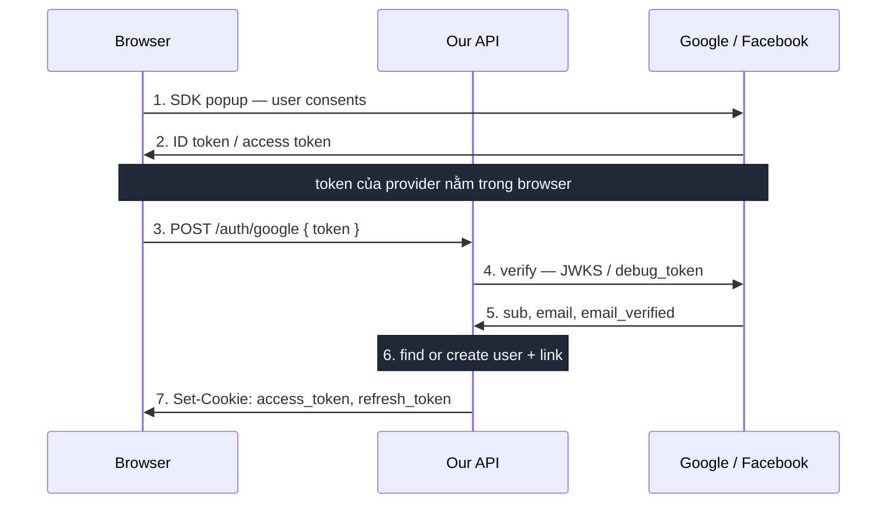
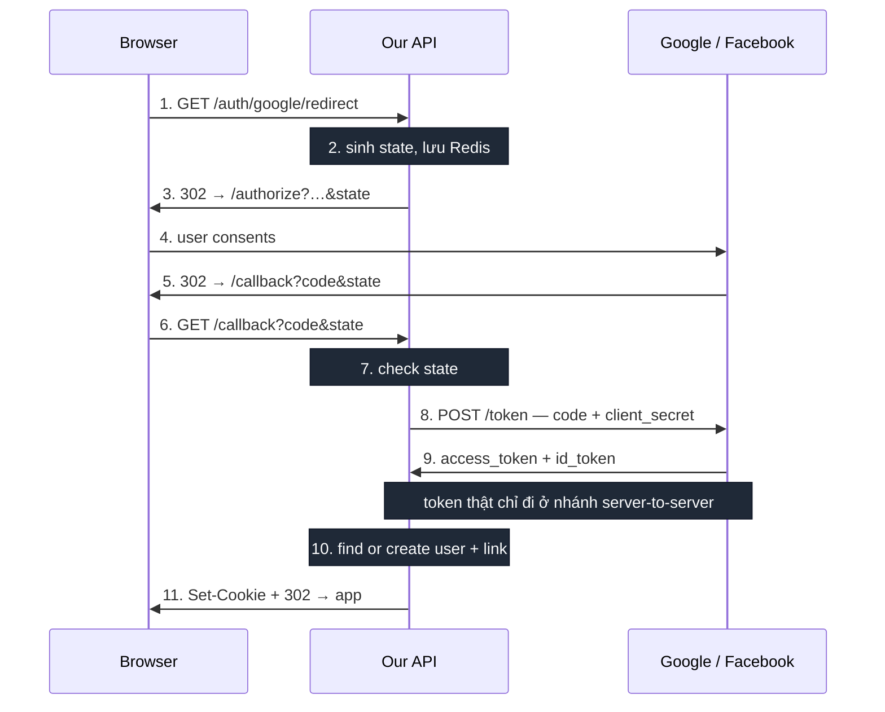
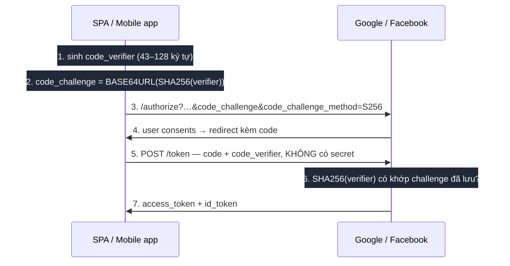
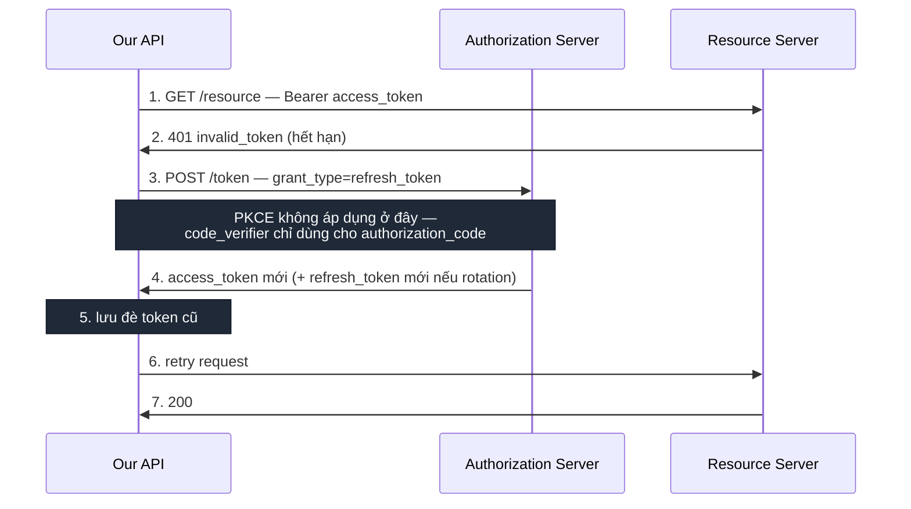

# Đăng nhập OAuth với Google và Facebook

---

## 1. Bối cảnh

### Các bên tham gia

| Trong tài liệu này             | Theo spec OAuth 2.0                     | Vai trò                                                        |
| ------------------------------ | --------------------------------------- | -------------------------------------------------------------- |
| **User**                       | Resource Owner                          | Người sở hữu tài khoản, là người bấm đồng ý                     |
| **Browser**                    | User-Agent                              | Nơi user bấm nút và nơi user thực sự đồng ý cấp quyền           |
| **Backend của mình**           | Client                                  | Nơi cần biết chắc "người này là ai" để tạo session              |
| **Provider** (Google/Facebook) | Authorization Server + Resource Server  | Bên duy nhất biết user là ai và chứng thực được điều đó         |

Authorization Server và Resource Server thường là hai host khác nhau dù cùng một provider — `accounts.google.com` cấp token, `www.googleapis.com` nhận token. Phân biệt này quan trọng khi đọc tài liệu của provider.

### Bài toán

Backend cần một **bằng chứng danh tính đáng tin từ provider**, rồi từ đó tạo session của riêng mình (ở project này là cookie `access_token` / `refresh_token`).

Backend **không được tin** thông tin do browser tự khai. Browser nằm trong tay user, ai cũng sửa được request. Bằng chứng phải là thứ backend tự xác minh được với provider.

Ba luồng dưới đây khác nhau ở đúng hai chỗ: **bằng chứng đi tới backend bằng đường nào**, và **ai giữ bí mật để đổi được nó**.

### Loại client quyết định luồng

| Loại client                             | Giữ được `client_secret`? | Luồng dùng được                                        |
| --------------------------------------- | ------------------------- | ------------------------------------------------------ |
| Confidential — backend, server-side web | Có                        | Token flow, Authorization code (+ PKCE tuỳ chọn)        |
| Public — SPA, mobile, desktop, CLI      | Không                     | Authorization code + PKCE — bắt buộc                    |

---

## 2. Token flow

### Ý tưởng

Provider phát token trực tiếp cho **browser**. Browser gửi token đó lên backend. Backend mang token đi hỏi provider "token này có thật không, có phải phát cho app của tôi không".

Bằng chứng ở đây là **token của provider**, và nó đi xuyên qua browser.

### Luồng



1. User bấm nút. SDK của provider (Google Identity Services / Facebook JS SDK) mở popup.
2. User đồng ý. Provider trả token về cho JS trong browser:
   - **Google** trả `id_token` — JWT có chữ ký, chứa sẵn `sub`, `email`, `email_verified`
   - **Facebook** trả `access_token` — chuỗi đục, không đọc được nội dung, phải hỏi lại Facebook
3. Browser POST token lên backend.
4. Backend xác minh:
   - **Google**: verify chữ ký JWT bằng public key của Google (thư viện cache key nên gần như không cần gọi mạng), check `aud` đúng `client_id` của mình
   - **Facebook**: gọi `GET /debug_token` để hỏi token có hợp lệ không, rồi `GET /me` để lấy profile
5. Provider trả về danh tính.
6. Backend tìm hoặc tạo user, gắn liên kết provider.
7. Backend set cookie session của mình.

### Chỗ dễ sai nhất

Ở bước 4, nếu chỉ kiểm "token này có hợp lệ với provider không" mà **không** kiểm "token này có phát cho app của tôi không" thì hổng nghiêm trọng: kẻ tấn công lấy token từ một app Google/Facebook bất kỳ mà họ kiểm soát rồi gửi lên, và login được vào hệ thống của bạn.

| Provider | Phải check                                        |
| -------- | ------------------------------------------------- |
| Google   | `aud` == `client_id` của mình                     |
| Facebook | `debug_token` trả về `app_id` == app id của mình  |

### Không phải implicit grant

Luồng này **không phải** _implicit grant_ — loại đã bị OAuth 2.1 khai tử. Google Identity Services trả ID token và Facebook JS SDK trả access token đều là luồng chính thức hai bên khuyến nghị cho mục đích **xác thực** (biết user là ai). Implicit grant là chuyện khác: nó trả _access token để gọi API_ qua URL fragment, và đó mới là thứ bị loại bỏ.

---

## 3. Authorization code flow

### Ý tưởng

Provider **không** phát token cho browser. Nó chỉ phát một `code` dùng một lần. Backend mang `code` đó cùng `client_secret` đi đổi lấy token, trong một request server-to-server mà browser không tham gia.

Bằng chứng vẫn là token, nhưng token **chưa bao giờ đi qua browser**.

### Luồng



1. User bấm một link thường (không cần JS, không cần SDK) trỏ về backend.
2. Backend sinh `state` — chuỗi random — lưu server-side kèm TTL ngắn.
3. Backend redirect browser sang `/authorize` của provider, đính kèm `client_id`, `redirect_uri`, `scope`, `state`.
4. User thấy trang đồng ý **của chính Google/Facebook**, trên domain của họ.
5. Provider redirect browser về `redirect_uri` đã khai báo trước, đính kèm `code` và `state`.
6. Browser tự động gọi vào endpoint callback của backend.
7. Backend so `state` nhận được với cái đã lưu. Không khớp thì dừng.
8. Backend gọi thẳng token endpoint của provider, gửi `code` + `client_id` + `client_secret` + `redirect_uri`. **Request server-to-server, browser không thấy gì.**
9. Provider trả `access_token` và `id_token`. Xin `access_type=offline` (Google) thì có thêm `refresh_token`.
10. Backend tìm hoặc tạo user, gắn liên kết provider — **giống hệt bước 6 của token flow**.
11. Backend set cookie rồi redirect về frontend.

### Ba cơ chế bảo vệ

| Cơ chế          | Chứng minh / chống gì                                                                                   | Yêu cầu                                                        |
| --------------- | ------------------------------------------------------------------------------------------------------- | -------------------------------------------------------------- |
| `client_secret` | "Tôi đúng là app đó" — chỉ backend đổi được `code` lấy token                                             | Chỉ nằm ở backend, không bao giờ ra browser                     |
| `state`         | CSRF — kẻ tấn công dụ victim gọi callback với `code` **của kẻ tấn công**, victim đăng nhập nhầm vào tài khoản của họ | Sinh và lưu server-side, dùng một lần, có TTL       |
| `redirect_uri`  | Kẻ tấn công không đổi hướng `code` sang server của họ được                                               | Khai báo chính xác ở console provider, provider so khớp tuyệt đối |

---

## 4. Authorization code + PKCE

### Ý tưởng

PKCE (Proof Key for Code Exchange, đọc là "pixy") giải bài toán: **làm sao dùng authorization code flow khi không thể giữ `client_secret` bí mật?**

Đó là tình huống của **public client** — SPA, mobile, desktop. Code nằm trong tay user, ai cũng mở DevTools hoặc decompile được, nên nhúng secret vào là coi như công khai.

PKCE thay `client_secret` — bí mật **cố định, dùng mãi** — bằng một cặp bí mật **sinh mới mỗi lần đăng nhập**:

| Giá trị          | Cách sinh                            | Ai thấy                                              |
| ---------------- | ------------------------------------ | ---------------------------------------------------- |
| `code_verifier`  | Chuỗi random 43–128 ký tự            | Chỉ app — giữ trong memory, gửi duy nhất ở bước đổi token |
| `code_challenge` | `BASE64URL(SHA256(code_verifier))`   | Công khai — đi qua URL `/authorize`                   |

### Luồng



1. App sinh `code_verifier` random.
2. Hash ra `code_challenge`. Verifier **không** gửi ở bước này.
3. Redirect sang provider kèm `code_challenge` và `code_challenge_method=S256`. Provider lưu challenge, gắn với request này.
4. User đồng ý, provider redirect về kèm `code`.
5. App đổi `code`, lần này gửi `code_verifier` **gốc** — thứ chưa từng xuất hiện trên đường truyền. Public client thuần không gửi secret; riêng client loại "Desktop app" của Google vẫn có secret và vẫn gửi kèm.
6. Provider tự hash verifier và so với challenge đã lưu. Khớp mới cấp token.
7. Token được cấp.

### Vì sao thay được `client_secret`

Kẻ tấn công chặn được `code` ở bước 4 (qua log, deep link bị đăng ký trùng trên mobile, referrer) vẫn **không đổi được token**, vì không có `code_verifier` — nó chưa bao giờ rời khỏi app.

Khác biệt cốt lõi: secret bị lộ một lần là lộ vĩnh viễn. Verifier chỉ dùng cho **một** lần login, lộ cũng vô dụng.

| `code_challenge_method` | Ý nghĩa                              | Dùng không?                                                        |
| ----------------------- | ------------------------------------ | ------------------------------------------------------------------ |
| `S256`                  | `challenge = BASE64URL(SHA256(verifier))` | Luôn                                                          |
| `plain`                 | `challenge = verifier`               | Không — verifier lộ ngay ở bước 3, chỉ dành cho nền tảng không hash được |

### PKCE không thay thế `state`

Có PKCE rồi **vẫn phải** giữ `state`. Hai cơ chế chống hai hướng tấn công ngược nhau:

| Cơ chế  | Chống gì                                                                          |
| ------- | --------------------------------------------------------------------------------- |
| `state` | CSRF — kẻ tấn công ép nạn nhân dùng `code` **của kẻ tấn công**                      |
| PKCE    | Code interception — kẻ tấn công chiếm `code` **của nạn nhân** để đổi lấy token       |

### Hỗ trợ thực tế ở Google và Facebook

Cả hai đều hỗ trợ, nhưng định vị khác nhau:

|                             | Google                                                                                                                                                                                                                     | Facebook                                                                                                                              |
| --------------------------- | -------------------------------------------------------------------------------------------------------------------------------------------------------------------------------------------------------------------------- | ------------------------------------------------------------------------------------------------------------------------------------- |
| Hỗ trợ                      | Có — [discovery document](https://accounts.google.com/.well-known/openid-configuration) khai `code_challenge_methods_supported: ["plain", "S256"]`                                                                         | Có — qua [OIDC Code Flow with PKCE](https://developers.facebook.com/documentation/facebook-login/guides/advanced/oidc-token)          |
| Document ở đâu              | Trang [iOS & Desktop Apps](https://developers.google.com/identity/protocols/oauth2/native-app). Trang [Web Server Apps](https://developers.google.com/identity/protocols/oauth2/web-server) **không** liệt kê tham số PKCE | Trang OIDC riêng, không có trong [Manual Login Flow](https://developers.facebook.com/docs/facebook-login/guides/advanced/manual-flow) |
| Quan hệ với `client_secret` | Cộng thêm — dùng được **cùng** secret (defense in depth)                                                                                                                                                                   | **Hoặc cái này hoặc cái kia** — gửi `client_secret` **hoặc** `code_verifier`; bỏ secret thì verifier thành bắt buộc                   |

Với Facebook, PKCE là **phương án thay thế** cho `client_secret`, đúng tinh thần gốc. Với Google thì chồng cả hai được.

**PKCE không bị giới hạn cho SPA/mobile.** Cả hai provider đều nhận nó ở luồng authorization code bất kể loại client. Nó _trông_ như chỉ dành cho SPA/mobile vì tài liệu PKCE nằm ở trang riêng cho các loại app đó — nơi PKCE **bắt buộc**. Web app có backend thì PKCE là **tuỳ chọn**.

> Chưa xác minh: Google khai hỗ trợ PKCE ở **cấp authorization server** qua discovery document. OAuth client loại "Web application" có nhận `code_challenge` hay không thì Google không document. Các thư viện phổ biến (Auth.js, Spring Security) vẫn gửi PKCE cho web client và chạy được, nhưng nếu định dựa vào thì nên test thật một lần.

### Khi nào project này cần tới nó

Hiện tại **không cần** — backend giữ được `client_secret`, tức confidential client, authorization code thường đã đủ.

| Tình huống                                              | Cần PKCE? |
| ------------------------------------------------------- | --------- |
| Mobile app gọi trực tiếp provider, không qua backend     | Bắt buộc  |
| SPA thuần, không backend nào giữ secret                  | Bắt buộc  |
| Siết thêm một lớp cho luồng backend hiện có              | Tuỳ chọn — chỉ Google cho chồng |

---

## 5. Refresh token

Áp dụng cho authorization code và PKCE — token flow không có refresh token của provider (xem §6).



| Điểm hay bỏ sót           | Chi tiết                                                                                                                                                            |
| ------------------------- | ------------------------------------------------------------------------------------------------------------------------------------------------------------------- |
| Rotation                  | Nhiều AS trả `refresh_token` **mới** mỗi lần và thu hồi cái cũ. Lưu đè. Nếu AS thấy một refresh token đã dùng bị dùng lại, nó thường thu hồi cả chuỗi — coi là dấu hiệu bị đánh cắp |
| `invalid_grant` là trạng thái cuối | Refresh token bị revoke, hết hạn, user đổi mật khẩu đều ra lỗi này. Retry vô ích — đánh dấu kết nối hỏng, bắt user authorize lại. Chỉ retry với 5xx / lỗi mạng |
| Refresh chủ động          | Cron/scheduler refresh trước khi hết hạn tốt hơn đợi 401 rồi retry — lỗi không lộ ra người dùng                                                                       |

---

## 6. So sánh

### Bảng đối chiếu

|                                  | Token flow                                                                                                  | Authorization code                                              | Auth code + PKCE                                              |
| -------------------------------- | ----------------------------------------------------------------------------------------------------------- | --------------------------------------------------------------- | ------------------------------------------------------------- |
| Token provider trong browser     | Có — XSS lấy được                                                                                           | Không, chỉ `code` dùng 1 lần — XSS không lấy được               | Có (app chính là client)                                      |
| Bí mật để đổi / verify token     | Không có — backend tự verify `aud` / `app_id`                                                               | `client_secret` cố định                                         | `code_verifier` sinh mới mỗi lần login                        |
| Cần `client_secret`              | Google: không. Facebook: cho `debug_token`                                                                  | Bắt buộc cả hai                                                 | Không                                                         |
| SDK provider trong browser       | Bắt buộc                                                                                                    | Không                                                           | Không                                                         |
| Bị ad blocker chặn               | Có — `connect.facebook.net` nằm trong hầu hết blocklist, SDK không load thì nút **im lặng không làm gì**    | Không                                                           | Không                                                         |
| JS bên thứ ba / CSP              | CSP phải lỏng hơn, thêm bề mặt tracking                                                                     | Không load gì từ Google/Meta, CSP siết được                     | Như authorization code                                        |
| Redirect                         | Không — popup, SPA không mất state                                                                          | Full-page, 2 vòng — SPA phải tự lưu/phục hồi state              | Full-page, 2 vòng                                             |
| Chống CSRF                       | SDK tự xử lý                                                                                                | Tự làm: `state`                                                 | Tự làm: `state`                                               |
| Refresh token của provider       | Không. Google chỉ trả `id_token`, không gọi được API. Facebook đổi được sang [long-lived ~60 ngày](https://developers.facebook.com/docs/facebook-login/guides/access-tokens/get-long-lived) qua `fb_exchange_token` (cần app secret), hết hạn phải login lại | Có, với `access_type=offline` — gọi được API provider về sau | Có                                     |
| Endpoint backend cần thêm        | 0                                                                                                           | +2 mỗi provider                                                 | 0 nếu app gọi thẳng provider                                  |
| Chỗ dễ làm sai                   | Quên verify `aud` / `app_id` — hổng nghiêm trọng, không có gì nhắc                                          | `state` làm sai thành lỗ bảo mật; `redirect_uri` phải khai cho **từng** môi trường, preview deploy domain động khá mệt | Verifier không đủ random, mất qua vòng redirect, hash sai; Facebook phải chuyển sang luồng OIDC riêng; tài liệu cả hai provider nằm lệch trang chính |
| Vị thế trong chuẩn               | Luồng xác thực chính thức của hai provider, không phải implicit grant                                        | Chuẩn chung, dùng lại được cho mobile/native                    | OAuth 2.1 khuyến nghị mặc định cho public client              |
| **Cần thiết** cho                | Web có backend                                                                                              | Web có backend                                                  | SPA / mobile không giữ được secret                            |

### Chọn cái nào

Câu hỏi quyết định không phải "cái nào an toàn hơn" mà là "có chỗ nào an toàn để giữ `client_secret` không". Có thì dùng secret, không thì dùng PKCE.

| Tình huống                                                        | Chọn                        |
| ----------------------------------------------------------------- | --------------------------- |
| Chỉ cần đăng nhập, muốn UX popup gọn, không gọi API provider về sau | Token flow                  |
| Cần gọi API provider thay mặt user (cần refresh token)             | Authorization code          |
| Không muốn nhúng JS bên thứ ba, hoặc cần CSP chặt                  | Authorization code          |
| Lo ad blocker chặn Facebook SDK                                    | Authorization code          |
| Không có backend nào giữ được secret — mobile, SPA thuần           | Authorization code + PKCE   |

**Các luồng không loại trừ nhau.** Phần xử lý sau khi có danh tính giống nhau hoàn toàn, nên thêm luồng thứ hai về sau không phải viết lại — ví dụ web dùng authorization code, mobile dùng PKCE, chung một backend.

> Project này hiện đang dùng **token flow**. Contract cho frontend nằm ở [frontend-social-login-integration.md](./frontend-social-login-integration.md).

---

## 7. Setup nếu triển khai authorization code

### Google

- _Clients → web client → Authorized redirect URIs_: thêm `http://localhost:3000/api/auth/google/callback` và bản production.
- Client secret giờ **bắt buộc** trong env backend.

```
authorize  https://accounts.google.com/o/oauth2/v2/auth
token      https://oauth2.googleapis.com/token
```

### Facebook

- _Trường hợp sử dụng → Tùy chỉnh → Cài đặt → URI chuyển hướng OAuth hợp lệ_: thêm callback URL.
- App secret đã có. Toggle "Đăng nhập bằng SDK JavaScript" không cần nữa.

```
dialog  https://www.facebook.com/v26.0/dialog/oauth
token   https://graph.facebook.com/v26.0/oauth/access_token
```

> `v26.0` lấy từ URL dialog quan sát được (`facebook.com/v26.0/dialog/oauth`) — version SDK bên FE đang dùng. Vẫn nên đối chiếu _Cài đặt → Nâng cao → Nâng cấp phiên bản API_ để đặt `FACEBOOK_GRAPH_VERSION` cho đúng.

### Backend

Hai endpoint mỗi provider:

```
GET /api/auth/google/redirect
  sinh state random
  lưu Redis, TTL ngắn
  302 tới authorize URL

GET /api/auth/google/callback?code&state
  verify state với Redis, xoá ngay sau khi dùng
  POST token endpoint kèm code + client_id + client_secret + redirect_uri
  verify id_token trả về
  → linkAndIssueTokens(...)     // không đổi
  302 về frontend
```

Toàn bộ phần dưới **dùng lại nguyên vẹn**: bảng `user_social_accounts`, logic find-or-create, nhánh email + OTP cho provider không trả email verified, xử lý cookie.

### Frontend

SDK, callback, và bước POST token đều biến mất:

```html
<a href="/api/auth/google/redirect">Sign in with Google</a>
```

Hai màn email + OTP **vẫn phải giữ**: đổi luồng không làm Facebook trả email nếu app chưa qua App Review. Chỉ khác là API mang state đó qua redirect về app thay vì trả trong JSON response.

---

## 8. Tham chiếu tham số

Dùng chung cho mọi provider. Cột **Auth code** là luồng dùng `client_secret`, cột **+ PKCE** là luồng có `code_verifier`.

### `GET /authorize`

| Tham số                 | Auth code  | + PKCE     | Mô tả                                         |
| ----------------------- | ---------- | ---------- | --------------------------------------------- |
| `response_type`         | ✅         | ✅         | Luôn là `code`                                 |
| `client_id`             | ✅         | ✅         | Định danh client do AS cấp                     |
| `redirect_uri`          | ✅         | ✅         | Phải khớp chính xác URI đã đăng ký             |
| `scope`                 | Tuỳ AS     | Tuỳ AS     | Danh sách quyền, phân tách bằng space          |
| `state`                 | ✅ thực tế | ✅ thực tế | Chuỗi random chống CSRF, verify khi callback   |
| `code_challenge`        | —          | ✅         | `BASE64URL(SHA256(code_verifier))`             |
| `code_challenge_method` | —          | ✅         | `S256`                                         |

### `POST /token` — `grant_type=authorization_code`

`Content-Type: application/x-www-form-urlencoded`

| Tham số         | Auth code | + PKCE   | Mô tả                                                          |
| --------------- | --------- | -------- | -------------------------------------------------------------- |
| `grant_type`    | ✅        | ✅       | `authorization_code`                                            |
| `code`          | ✅        | ✅       | Code nhận ở callback — one-time, TTL ngắn                        |
| `redirect_uri`  | ✅        | ✅       | Phải trùng giá trị đã gửi ở `/authorize`                         |
| `client_id`     | ✅        | ✅       |                                                                  |
| `client_secret` | ✅        | Tuỳ AS   | Public client không có. Confidential client dùng PKCE thì tuỳ AS chấp nhận cả hai hay thay thế nhau |
| `code_verifier` | —         | ✅       | Chuỗi gốc, chưa từng xuất hiện trên đường truyền trước bước này   |

### `POST /token` — `grant_type=refresh_token`

| Tham số         | Auth code | + PKCE   | Mô tả                                                  |
| --------------- | --------- | -------- | ------------------------------------------------------ |
| `grant_type`    | ✅        | ✅       | `refresh_token`                                         |
| `refresh_token` | ✅        | ✅       | Token nhận ở lần đổi code trước                         |
| `client_id`     | ✅        | ✅       |                                                         |
| `client_secret` | ✅        | Tuỳ AS   | Như trên                                                |
| `scope`         | Tuỳ chọn  | Tuỳ chọn | Chỉ để **thu hẹp** scope, không mở rộng được            |
| `code_verifier` | —         | —        | Không dùng — PKCE chỉ áp dụng cho `authorization_code`  |

### Vị trí của client credentials

| Cách gửi                                               | Ghi chú                                            |
| ------------------------------------------------------ | -------------------------------------------------- |
| `Authorization: Basic BASE64(client_id:client_secret)` | Cách spec khuyến nghị                               |
| `client_id` + `client_secret` trong form body          | Nhiều AS chấp nhận, một số chỉ chấp nhận cách này   |

Đọc tài liệu của từng provider, đừng giả định.

### Response

| Field           | Luôn có | Mô tả                                               |
| --------------- | ------- | --------------------------------------------------- |
| `access_token`  | ✅      | Token gọi Resource Server                            |
| `token_type`    | ✅      | Thường là `Bearer`                                   |
| `expires_in`    | Tuỳ AS  | Số giây còn hiệu lực                                 |
| `refresh_token` | Tuỳ AS  | Chỉ có nếu xin đúng scope / tham số offline          |
| `scope`         | Tuỳ AS  | Scope thực sự được cấp, có thể hẹp hơn scope đã xin  |

```json
{
  "access_token": "2YotnFZFEjr1zCsicMWpAA",
  "token_type": "Bearer",
  "expires_in": 3600,
  "refresh_token": "tGzv3JOkF0XG5Qx2TlKWIA",
  "scope": "read write"
}
```

### Lỗi thường gặp

| Error                   | Nguyên nhân điển hình                                                  |
| ----------------------- | ---------------------------------------------------------------------- |
| `invalid_grant`         | Code đã dùng / hết hạn, `code_verifier` sai, refresh token bị thu hồi   |
| `invalid_client`        | Sai `client_id` / `client_secret`, hoặc sai cách gửi credentials        |
| `redirect_uri_mismatch` | `redirect_uri` khác lúc đăng ký, hoặc khác lúc gọi `/authorize`         |
| `invalid_scope`         | Scope không tồn tại hoặc client chưa được cấp                           |
| `access_denied`         | User bấm từ chối ở màn hình consent                                     |

---

## 9. Spec tham chiếu

| Spec              | Nội dung                                                          |
| ----------------- | ----------------------------------------------------------------- |
| RFC 6749          | OAuth 2.0 Authorization Framework                                 |
| RFC 7636          | PKCE                                                              |
| RFC 6819          | OAuth 2.0 Threat Model and Security Considerations                |
| RFC 9700          | Best Current Practice for OAuth 2.0 Security                      |
| OAuth 2.1 (draft) | Gộp PKCE thành bắt buộc, loại bỏ implicit grant và password grant  |
