# Các mô hình giao tiếp Real-time: Short Polling, Long Polling, SSE, WebSocket

Tài liệu lý thuyết ngắn gọn về bốn kỹ thuật đưa dữ liệu từ server đến client (hoặc consumer). Mỗi phần gồm: cơ chế → các bước diễn ra → ví dụ Node.js tối giản → ví dụ thực tế trong nollie-api → khi nào nên dùng. Mục tiêu: rút ra bài học chọn đúng kỹ thuật cho từng bài toán ở các dự án sau.

Các đoạn code chỉ để minh hoạ cơ chế, đã lược bỏ xử lý lỗi và bảo mật; đừng copy thẳng vào production.

**Mô hình tư duy chung:** HTTP nguyên bản là request/response — client hỏi, server trả lời rồi đóng. Bốn kỹ thuật dưới đây là bốn mức "lách" khác nhau để server có thể chủ động đẩy dữ liệu, đánh đổi giữa độ trễ, tài nguyên giữ kết nối, và độ phức tạp hạ tầng.

Nhìn tổng thể, khác biệt nằm ở **ai mở kết nối, giữ bao lâu, và đẩy được mấy chiều**:

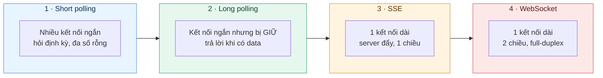

Đi từ trái sang phải: độ trễ giảm dần, nhưng chi phí giữ kết nối và độ phức tạp hạ tầng tăng dần.

---

## 1. Short Polling

**Cơ chế:** Client gọi API lặp lại theo chu kỳ cố định (`setInterval` 5s chẳng hạn). Server trả lời ngay lập tức dù có dữ liệu mới hay không.

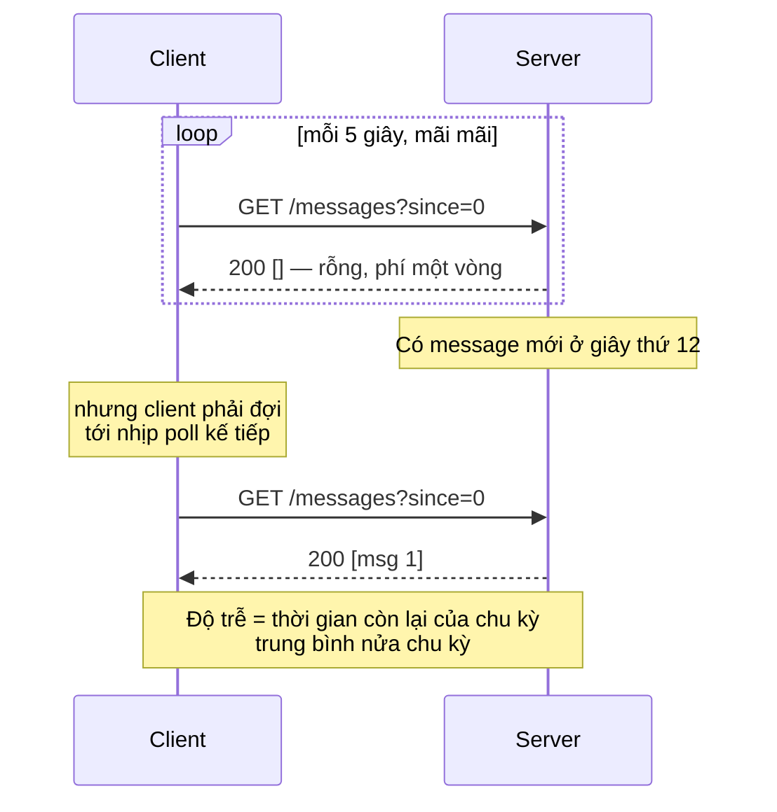

**Các bước:**
1. Client đặt timer chu kỳ cố định (ví dụ 5s).
2. Đến hạn, client gửi request bình thường (thường kèm mốc lần cuối: `?since=<timestamp|id>`).
3. Server query dữ liệu, **trả lời ngay** — có gì trả nấy, không có thì trả rỗng.
4. Client xử lý response, cập nhật mốc `since`, quay lại bước 1.

**Ví dụ tối giản (Node.js):**

```js
// server.js — express
app.get('/messages', (req, res) => {
  const since = Number(req.query.since) || 0;
  res.json(messages.filter((m) => m.id > since)); // trả ngay, kể cả mảng rỗng
});

// client.js
let since = 0;
setInterval(async () => {
  const items = await fetch(`/messages?since=${since}`).then((r) => r.json());
  if (items.length) since = items.at(-1).id;
  items.forEach(render);
}, 5000);
```

**Ưu:** Đơn giản nhất, không cần hạ tầng gì đặc biệt, stateless, hoạt động qua mọi proxy/LB.
**Nhược:** Độ trễ trung bình = nửa chu kỳ poll; phần lớn request là lãng phí (trả về rỗng); tăng tải DB tuyến tính theo số client.

**Trong dự án:** Không dùng cho client, nhưng mô hình tương đương ở tầng backend là các scheduler quét DB theo chu kỳ — ví dụ [reservation-automation.scheduler.ts](src/modules/reservation/scheduling/reservation-automation.scheduler.ts) dùng `@Cron` quét các job đến hạn (`dueAt <= now`) rồi bắn event. Bản chất là short polling trên bảng DB thay vì trên HTTP.

**Dùng khi:** Dữ liệu đổi chậm, số client ít, độ trễ vài giây chấp nhận được (trạng thái import, progress bar).

---

## 2. Long Polling

**Cơ chế:** Client gửi request, server **giữ kết nối mở** cho đến khi có dữ liệu mới hoặc hết timeout mới trả lời. Client nhận xong lập tức gửi request tiếp theo.

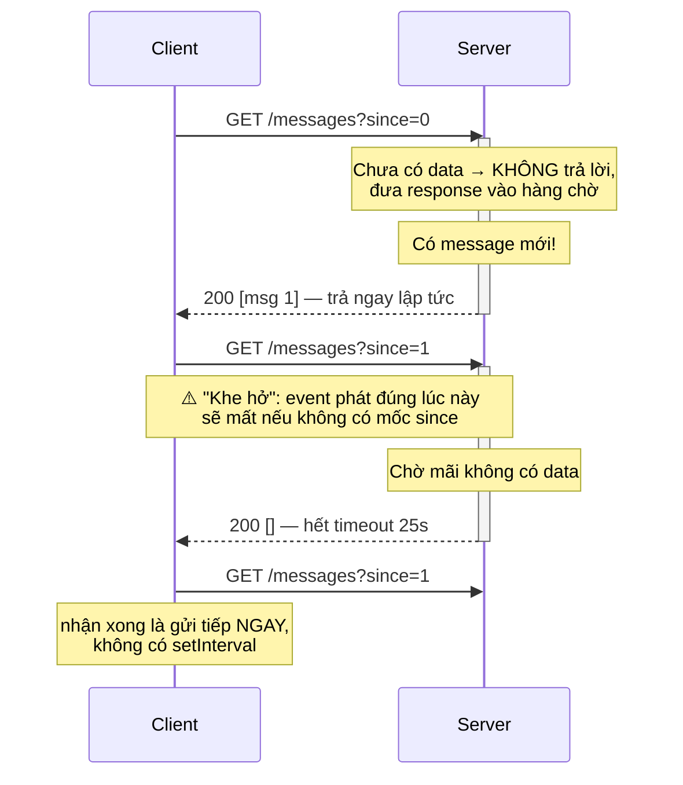

**Các bước:**
1. Client gửi request, **không** đặt timer.
2. Server kiểm tra: có dữ liệu mới → trả ngay (bước 5).
3. Không có → server **không trả lời**, đăng ký client vào danh sách chờ (in-memory, event emitter, hoặc Redis pub/sub).
4. Khi có dữ liệu mới → server đánh thức các request đang chờ và trả lời. Nếu quá timeout (15–30s) mà vẫn không có → trả rỗng (`204`/mảng rỗng) để tránh proxy cắt kết nối.
5. Client nhận response, xử lý, rồi **gửi request tiếp theo ngay lập tức**.

Điểm cần lưu ý: khoảng thời gian giữa lúc nhận response và lúc request mới tới server là "khe hở" — sự kiện phát trong khe đó sẽ mất nếu server không lưu lại. Vì thế client luôn gửi kèm mốc `since` để server trả bù phần bị lỡ.

**Ví dụ tối giản (Node.js):**

```js
// server.js — express
const waiting = []; // các response đang bị giữ

app.get('/messages', (req, res) => {
  const since = Number(req.query.since) || 0;
  const items = messages.filter((m) => m.id > since);
  if (items.length) return res.json(items); // có sẵn → trả ngay

  const client = { since, res };
  waiting.push(client); // chưa có → GIỮ kết nối, chưa gọi res

  setTimeout(() => {                       // hết giờ chờ → trả rỗng
    const i = waiting.indexOf(client);
    if (i !== -1) { waiting.splice(i, 1); res.json([]); }
  }, 25000);
});

function publish(msg) {                    // gọi khi có dữ liệu mới
  messages.push(msg);
  waiting.splice(0).forEach(({ since, res }) =>
    res.json(messages.filter((m) => m.id > since)),
  );
}

// client.js — vòng lặp vô hạn, không có setInterval
let since = 0;
(async function loop() {
  for (;;) {
    const items = await fetch(`/messages?since=${since}`).then((r) => r.json());
    if (items.length) { since = items.at(-1).id; items.forEach(render); }
  }
})();
```

**Ưu:** Độ trễ gần như tức thời, loại bỏ các request rỗng của short polling, vẫn là HTTP thuần.
**Nhược:** Mỗi client chiếm một kết nối treo trên server; timeout của proxy/LB có thể cắt kết nối giữa chừng; vẫn có overhead tái lập request liên tục.

**Trong dự án:** SQS chính là long polling chuẩn mực. [sqs-listener.consumer.ts](src/modules/sqs/sqs-listener.consumer.ts#L84-L107) dùng thư viện `sqs-consumer`, bên dưới gọi `ReceiveMessage` với `WaitTimeSeconds` — mỗi lần poll, AWS giữ request tới 20 giây và trả về ngay khi queue có message. Nhờ đó worker nhận message gần như tức thời mà không spam API. Đây là lý do tài liệu AWS luôn khuyến nghị bật long polling thay vì short polling (mặc định `WaitTimeSeconds=0`) để giảm chi phí và empty response.

Viết trần không dùng thư viện thì vòng lặp consumer trông đúng như long polling ở trên — AWS đóng vai server giữ kết nối:

```js
const sqs = new SQS({ region: 'ap-southeast-2' });

for (;;) {
  const { Messages = [] } = await sqs.receiveMessage({
    QueueUrl: url,
    WaitTimeSeconds: 20,   // ← long polling: AWS giữ tới 20s, trả ngay khi có message
    MaxNumberOfMessages: 10,
  });

  for (const msg of Messages) {
    await handle(msg);
    await sqs.deleteMessage({ QueueUrl: url, ReceiptHandle: msg.ReceiptHandle }); // ack
  }
}
```

Khác biệt so với long polling HTTP: message **không mất** khi chưa ack — không xoá thì sau `VisibilityTimeout` nó quay lại queue để thử lại. Đó là lý do queue đáng tin hơn kênh real-time thuần.

**Dùng khi:** Cần độ trễ thấp mà không thể/không muốn dựng WebSocket; consumer là backend (queue worker) chứ không phải trình duyệt.

---

## 3. Server-Sent Events (SSE)

**Cơ chế:** Client mở **một** kết nối HTTP (`Accept: text/event-stream`), server giữ mở vĩnh viễn và đẩy từng event dạng text xuống. **Một chiều**: chỉ server → client; client muốn gửi gì thì dùng HTTP request thường.

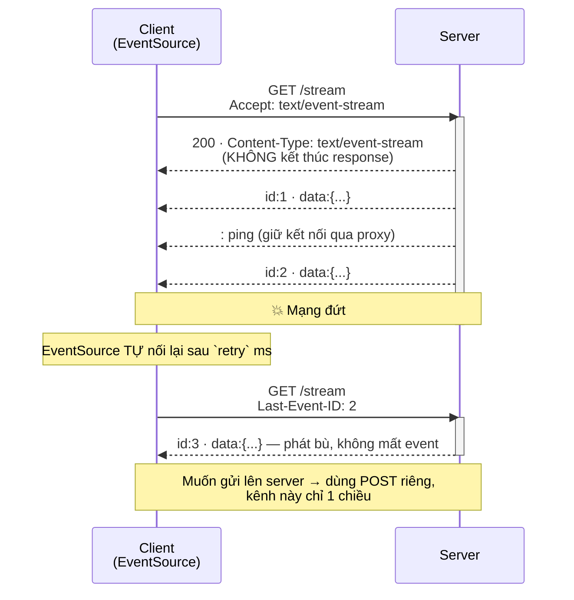

**Các bước:**
1. Client mở `new EventSource('/stream')` — thực chất là một GET thường với `Accept: text/event-stream`.
2. Server trả header `Content-Type: text/event-stream`, `Cache-Control: no-cache`, `Connection: keep-alive` rồi **không kết thúc response**.
3. Mỗi khi có sự kiện, server ghi thêm một khối text vào response đang mở, theo định dạng cố định: `id: …`, `event: …`, `data: …`, kết thúc bằng **một dòng trống**.
4. Client nhận qua `onmessage` / `addEventListener('<tên event>')`. Server nên gửi comment `: ping` định kỳ để giữ kết nối sống qua proxy.
5. Mất kết nối → trình duyệt **tự nối lại** sau `retry` ms và gửi header `Last-Event-ID` = `id` cuối cùng nhận được; server dựa vào đó phát bù các event bị lỡ. Đây là điểm SSE hơn hẳn WebSocket về mặt "không mất event".
6. Muốn gửi ngược lên server: dùng một `POST` HTTP thường, không qua kênh SSE.

**Ví dụ tối giản (Node.js):**

```js
// server.js — express
app.get('/stream', (req, res) => {
  res.set({
    'Content-Type': 'text/event-stream',
    'Cache-Control': 'no-cache',
    Connection: 'keep-alive',
  });
  res.flushHeaders();
  res.write('retry: 3000\n\n'); // client nối lại sau 3s nếu đứt

  const lastId = Number(req.headers['last-event-id']) || 0;
  messages.filter((m) => m.id > lastId).forEach(send); // phát bù phần bị lỡ

  function send(msg) {
    res.write(`id: ${msg.id}\n`);
    res.write(`event: message\n`);
    res.write(`data: ${JSON.stringify(msg)}\n\n`); // BẮT BUỘC 2 xuống dòng
  }

  const ping = setInterval(() => res.write(': ping\n\n'), 15000); // giữ kết nối
  bus.on('message', send);
  req.on('close', () => { clearInterval(ping); bus.off('message', send); }); // dọn dẹp
});

// client.js
const es = new EventSource('/stream');
es.addEventListener('message', (e) => render(JSON.parse(e.data)));
// không cần tự viết reconnect — EventSource tự làm, kèm Last-Event-ID
```

**Ưu:** Nhẹ hơn WebSocket rất nhiều — vẫn là HTTP nên đi qua proxy/LB/firewall dễ; trình duyệt có sẵn `EventSource` với **auto-reconnect + Last-Event-ID** (tự nối lại và không mất event); NestJS hỗ trợ sẵn qua decorator `@Sse()`.
**Nhược:** Một chiều; chỉ truyền text (thường là JSON); giới hạn ~6 kết nối/domain trên HTTP/1.1 (HTTP/2 giải quyết được).

**Trong dự án:** Chưa dùng. Đây là điểm đáng lưu ý: các luồng thuần một-chiều như notification bell, tiến độ chat pipeline, trạng thái sync — về lý thuyết SSE là đủ và rẻ hơn socket.io. Dự án chọn WebSocket cho tất cả vì đã có sẵn hạ tầng gateway + Redis adapter, thêm một kênh SSE riêng không đáng chi phí vận hành thứ hai.

**Dùng khi:** Server đẩy một chiều là đủ — live feed, notification, tiến độ AI streaming (đây là chuẩn de-facto của các API LLM streaming).

---

## 4. WebSocket

**Cơ chế:** Bắt đầu bằng HTTP handshake (`Upgrade: websocket`) rồi **chuyển hẳn giao thức** — một kết nối TCP hai chiều, song công (full-duplex), tồn tại lâu dài. Hai bên đẩy message cho nhau bất kỳ lúc nào.

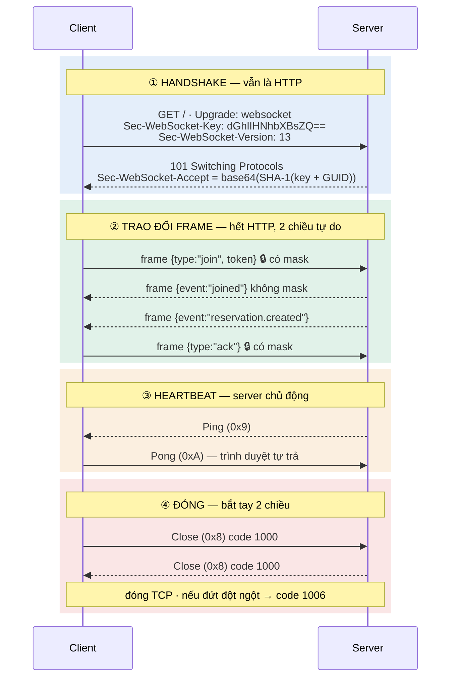

Phần dưới tách làm ba tầng, vì cái hay bị nhầm là gán mọi thứ cho "chuẩn WebSocket" trong khi phần lớn thao tác hằng ngày (room, reconnect, xác thực) không nằm trong chuẩn.

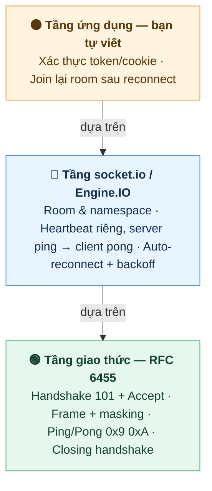

### 4.1. Giao thức WebSocket (RFC 6455)

1. **Handshake:** client gửi GET kèm `Upgrade: websocket`, `Connection: Upgrade`, `Sec-WebSocket-Key` (16 byte ngẫu nhiên, base64), `Sec-WebSocket-Version: 13`, `Host`; trình duyệt tự thêm `Origin`. Thiếu `Sec-WebSocket-Version` thì server trả `426 Upgrade Required`.
2. **Server chấp nhận:** trả `101 Switching Protocols` kèm `Sec-WebSocket-Accept` — **không phải token ngẫu nhiên** mà tính tất định: `base64(SHA-1(Sec-WebSocket-Key + "258EAFA5-E914-47DA-95CA-C5AB0DC85B11"))`, với GUID cố định ghi trong RFC. Mục đích: chứng minh đầu bên kia thực sự hiểu WebSocket, không phải proxy/cache vô tình trả `101`.
3. **Chuyển giao thức:** cùng TCP socket đó chuyển sang khung WebSocket (frame), hết header HTTP cho mỗi message. *Chỉ đúng với HTTP/1.1 — trên HTTP/2 dùng extended CONNECT (RFC 8441), không có `101`.*
4. **Trao đổi frame:** hai bên gửi tự do, bất kỳ lúc nào. Frame text (`0x1`) / binary (`0x2`), xen kẽ control frame khi cần. **Quy tắc masking bất đối xứng:** frame client → server **bắt buộc mask** bằng khoá 4 byte ngẫu nhiên, server nhận frame không mask thì phải đóng kết nối; ngược lại server → client **cấm mask**. Quy tắc này sinh ra để chống cache poisoning qua proxy cũ, và là lỗi kinh điển khi tự viết server.
5. **Ping/Pong** (`0x9`/`0xA`): phát hiện kết nối chết. Lưu ý: **JS trong trình duyệt không gửi được ping** — API `WebSocket` không expose; trình duyệt chỉ tự trả Pong ở tầng dưới. Nên heartbeat thực tế luôn do server chủ động.
6. **Closing handshake:** một bên gửi Close frame (`0x8`) kèm status code, bên kia trả Close frame rồi mới đóng TCP. Phân biệt `1000` (đóng sạch) với `1006` (đứt bất thường) chính là căn cứ quyết định có nên reconnect hay không.

> **Sáu bước trên là cái xảy ra trên đường truyền, không phải cái bạn phải code.** Đọc xong danh sách này rất dễ tưởng phải tự implement từng bước — không phải. Thư viện lo hết, xem ngay mục dưới.

### 4.1b. Thư viện lo tới đâu, bạn lo từ đâu

Với `ws` (thư viện WebSocket phổ biến nhất cho Node), **toàn bộ §4.1 là tự động**:

| Việc | Ai làm |
|---|---|
| Kiểm tra header handshake, trả `101` + `Sec-WebSocket-Accept` | `ws` |
| Mask/unmask frame đúng chiều | `ws` |
| Cắt/ghép frame, fragmentation | `ws` |
| Trả Pong khi nhận Ping | `ws` — mặc định `autoPong: true` |
| Closing handshake (nhận Close → echo lại → đóng) | `ws` |
| Xác thực, room, serialize JSON | **bạn** |
| **Phát hiện kết nối chết** | **bạn** — `ws` cho `ws.ping()` và event `'pong'` nhưng không tự phát hiện |
| Reconnect phía client | **bạn** |

Có đúng **một bước RFC bạn chen vào được**, và nó hữu ích: handshake. Đây là chỗ xác thực bằng cookie/token **trước khi** chấp nhận kết nối, thay vì xác thực sau khi đã connect:

```js
const wss = new WebSocketServer({ noServer: true }); // ws không tự nghe HTTP

server.on('upgrade', (req, socket, head) => {
  const user = verifyCookie(req.headers.cookie);     // cookie CÓ đi kèm handshake
  if (!user) {
    socket.write('HTTP/1.1 401 Unauthorized\r\n\r\n'); // từ chối trước khi lên 101
    return socket.destroy();
  }
  wss.handleUpgrade(req, socket, head, (ws) => {
    ws.user = user;                                  // đã xác thực ngay từ handshake
    wss.emit('connection', ws, req);
  });
});
```

Lên socket.io thì **không còn chen vào tầng đó được nữa** — nó cao hơn một bậc, thay bằng middleware `io.use((socket, next) => ...)`. Đây cũng chính là lý do dự án phải xác thực sau khi connect qua event `user-socket`.

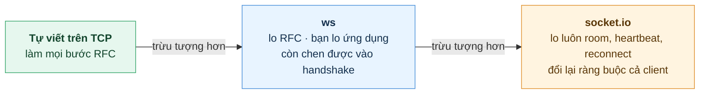

### 4.2. socket.io — "wrapper" là cách hiểu gần đúng nhưng thiếu một ý quan trọng

Gọi socket.io là wrapper của WebSocket thì đúng về tinh thần — nó bọc lại và thêm tiện ích. Nhưng chỗ lệch đáng nói: **socket.io là một giao thức riêng chạy *trên* WebSocket, không phải một lớp bọc mỏng.** Hệ quả kiểm chứng được ngay:

> Một client `new WebSocket(...)` thuần **không thể** nói chuyện với server socket.io, và ngược lại. Nếu chỉ là wrapper thì chúng phải tương thích.

Lý do: socket.io thêm **hai tầng giao thức** với format packet riêng.

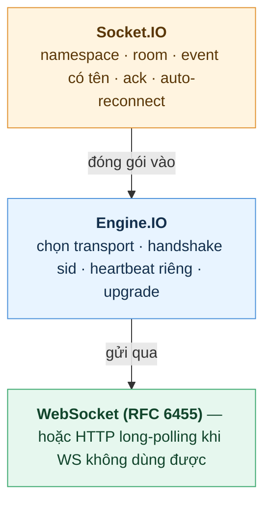

Chú ý tầng dưới cùng: với socket.io, **WebSocket chỉ là một trong hai transport**. Mặc định Engine.IO mở bằng HTTP long-polling trước rồi mới nâng cấp lên WebSocket — tức là nó dùng cả kỹ thuật ở mục 2 của tài liệu này.

**Các bước thêm vào so với WebSocket thuần** (đúng như bạn đoán — có thật, và nhiều hơn một):

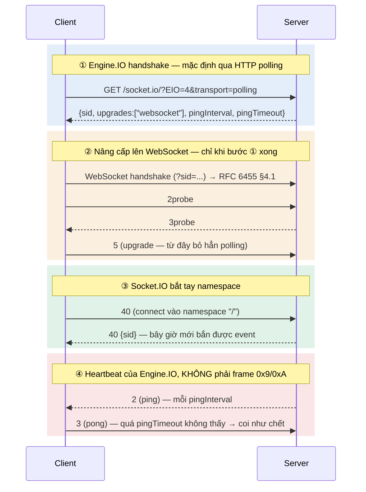

Dự án **cắt bỏ bước ①–②**: gateway đặt `transports: ['websocket']`, `allowUpgrades: false` ([socket.gateway.ts:36-37](src/modules/socket/socket.gateway.ts#L36-L37)) nên client đi thẳng vào WebSocket. Đổi lại, **client bắt buộc phải cấu hình `transports: ['websocket']` tương ứng** — để mặc định thì client thử polling trước và kết nối hỏng ngay từ bước ①.

**Tóm lại socket.io thêm gì:**

- **Room / namespace** — RFC hoàn toàn không có khái niệm này.
- **Heartbeat riêng ở tầng Engine.IO**, không dùng control frame `0x9`/`0xA`. Ở Engine.IO v4 (socket.io 4.x, bản dự án dùng): **server ping, client trả pong** — ngược chiều so với v3. Nên `pingInterval: 25000` / `pingTimeout: 60000` là tham số Engine.IO: *server ping mỗi 25s, chờ pong tối đa 60s*.
- **Auto-reconnect** kèm backoff, **acknowledgement** cho từng message, và **fallback** sang long-polling khi mạng chặn WebSocket.

Cái giá phải trả: khoá vào hệ sinh thái socket.io (client cũng phải dùng thư viện socket.io), thêm vài vòng khứ hồi lúc kết nối, và payload mỗi message có thêm phần đầu của hai tầng trên.

### 4.3. Những gì ứng dụng phải tự lo

- **Xác thực.** RFC để ngỏ, cho phép dùng mọi cơ chế HTTP thường ngay tại handshake — **cookie vẫn được gửi kèm handshake** và dự án dựa vào đúng điều đó (`credentials: true` để giữ cookie AWSALB). Thứ trình duyệt chặn là **custom header** (không set được `Authorization`), nên token thường đi qua: message đầu tiên sau khi connect (cách dự án đang làm với event `user-socket`), query string, hoặc mượn header `Sec-WebSocket-Protocol`.
- **Join lại kênh sau reconnect.** socket.io cấp `socket.id` mới mỗi lần nối lại và **không tự khôi phục room** — không join lại thì client "vẫn kết nối" mà im lặng vĩnh viễn. Từ socket.io 4.6 có tuỳ chọn `connectionStateRecovery` khôi phục room + packet bị lỡ trong một cửa sổ ngắn (dự án hiện chưa bật).

### 4.4. Ví dụ tối giản (socket.io)

socket.io lo hết handshake, masking, frame, heartbeat, room và reconnect. Phần còn lại của mình đúng bằng §4.3: **xác thực** và **join room**.

```js
// server.js
import { Server } from 'socket.io';

const io = new Server(3000, {
  transports: ['websocket'],  // bỏ qua bước ①–② ở §4.2, vào thẳng WebSocket
  allowUpgrades: false,
  pingInterval: 25000,        // server ping mỗi 25s — phải < idle timeout của LB
  pingTimeout: 60000,
});

// nhiều instance → BẮT BUỘC có adapter, nếu không emit chỉ tới client cùng instance
io.adapter(createAdapter(pubClient, subClient));

io.on('connection', (socket) => {
  socket.on('join', ({ token, venueId }, ack) => {   // ack = callback trả về client
    if (!verifyToken(token)) return ack({ ok: false });
    socket.join(`venue-${venueId}`);                 // room: khái niệm của socket.io
    ack({ ok: true });
  });

  socket.on('disconnect', (reason) => console.log('rời:', reason)); // tự dọn room
});

export function emitToVenue(venueId, event, data) {
  io.to(`venue-${venueId}`).emit(event, data);
}
```

```js
// client.js
import { io } from 'socket.io-client';

const socket = io('wss://api.example.com', {
  transports: ['websocket'], // phải khớp server, nếu không client thử polling và hỏng
});

// reconnect là tự động, NHƯNG room thì không — nên join lại trong 'connect'
socket.on('connect', () => {
  socket.emit('join', { token, venueId: 12 }, (res) => {
    if (!res.ok) socket.disconnect();
  });
});

socket.on('reservation.created', render);
```

Điểm đáng chú ý: `socket.on('connect')` chạy lại **sau mỗi lần reconnect**, nên đặt lệnh join ở đó là cách xử lý gọn cho cái bẫy "reconnect xong nhưng im lặng" ở §4.3.

Trong NestJS thì cùng cơ chế đó nhưng viết bằng decorator, đúng như [socket.gateway.ts](src/modules/socket/socket.gateway.ts):

```ts
@WebSocketGateway({ namespace: 'events', transports: ['websocket'], pingInterval: 25000 })
export class SocketGateway {
  @WebSocketServer() server: Server;

  @SubscribeMessage('user-socket')            // tương đương socket.on('user-socket')
  async handleAddUser(@MessageBody() data: UserSocketDto, @ConnectedSocket() client: Socket) {
    const user = await this.authService.checkToken(data.token); // auth: việc của mình
    client.join(`venue-${user.venueId}`);                       // join room: việc của mình
    return { success: true };                                   // giá trị trả về = ack
  }
}
```

**Ưu:** Hai chiều, độ trễ thấp nhất, overhead mỗi message rất nhỏ.
**Nhược:** Stateful — đây là nguồn gốc của mọi phức tạp: scale ngang phải giải quyết "client kết nối vào instance A, event phát từ instance B"; LB phải hỗ trợ kết nối dài (timeout, sticky session); không cache/CDN được.

**Trong dự án:** dùng đầy đủ và là ví dụ tốt về các bẫy vận hành:

- [socket.gateway.ts](src/modules/socket/socket.gateway.ts#L30-L40) — gateway socket.io với hai cấu hình đúc kết từ thực chiến:
  - `pingInterval: 25000` phải **nhỏ hơn idle timeout 60s của AWS ALB** — nếu không, ALB coi kết nối là idle và cắt. Đây là bài học tổng quát: *heartbeat của WebSocket phải ngắn hơn timeout của mọi tầng trung gian.*
  - `transports: ['websocket']`, `allowUpgrades: false` — tắt hẳn fallback long-polling của socket.io, vì polling qua nhiều instance ECS đòi hỏi sticky session, dễ lỗi hơn là ép websocket thuần.
- [socket-redis.adapter.ts](src/modules/socket/socket-redis.adapter.ts) — Redis pub/sub adapter giải bài toán scale ngang: emit trên instance nào cũng được fan-out tới client đang nối vào instance khác. *Không có adapter, WebSocket chỉ đúng khi chạy 1 instance.*
- Mô hình room theo tenant: client join `venue-{venueId}` ([socket.gateway.ts:98](src/modules/socket/socket.gateway.ts#L98)), backend chỉ cần `emitToVenue(venueId, event, data)` — cách ly dữ liệu giữa các venue ngay ở tầng transport.

Đây là bài toán mà Redis adapter giải, và cũng là lý do WebSocket "chạy ngon ở local, hỏng trên production":

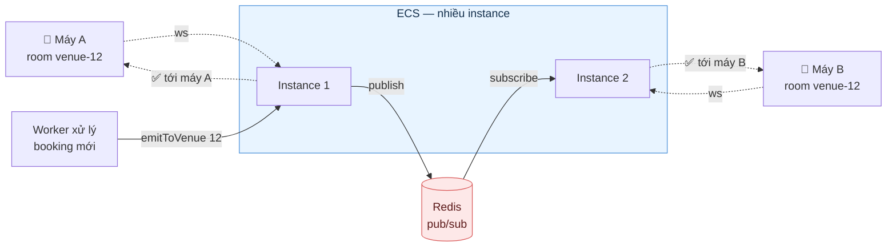

Không có Redis ở giữa, event phát từ Instance 1 chỉ tới được máy A — máy B im lặng, và bug này **không tái hiện được ở local vì local chỉ chạy một instance**.

**Dùng khi:** Cần hai chiều thật sự hoặc tần suất cao cả hai phía — chat, collaborative editing, dashboard vận hành live (bảng đặt bàn theo thời gian thực như ở đây).

---

## Chọn kỹ thuật nào?

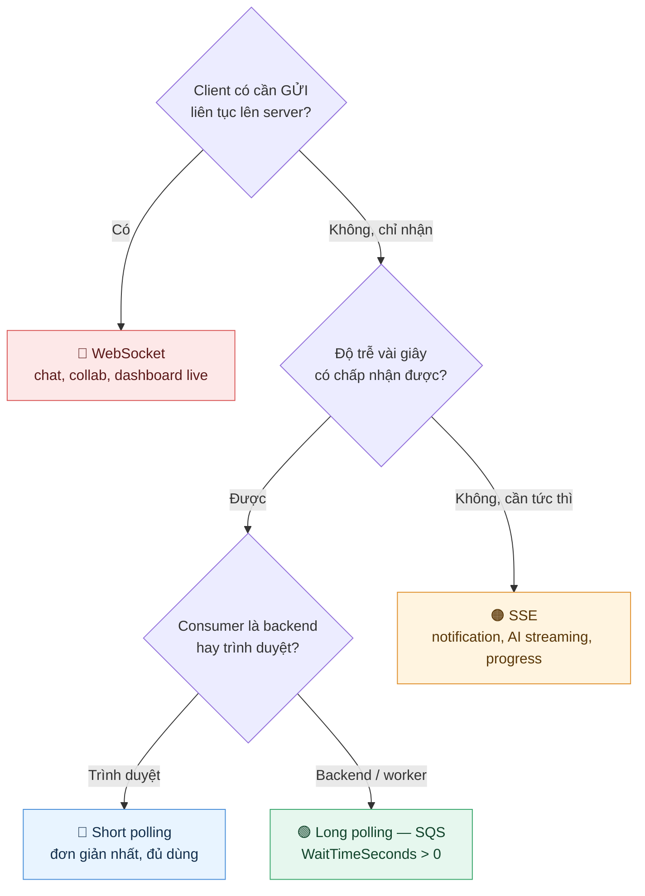

Một lưu ý thực tế: nếu dự án **đã có sẵn** hạ tầng WebSocket (gateway + Redis adapter) thì việc nhánh trên chỉ ra "SSE là đủ" chưa chắc đáng để dựng thêm kênh thứ hai — đúng lựa chọn của dự án này. Cây quyết định áp dụng cho dự án mới, hoặc khi cân nhắc thêm một kênh mới.

---

## Bảng so sánh nhanh

| Tiêu chí | Short polling | Long polling | SSE | WebSocket |
|---|---|---|---|---|
| Chiều dữ liệu | client kéo | client kéo (giữ chờ) | server đẩy (1 chiều) | 2 chiều |
| Độ trễ | ~nửa chu kỳ poll | gần tức thời | tức thời | tức thời |
| Giao thức | HTTP thường | HTTP thường | HTTP giữ mở | TCP riêng sau upgrade |
| Server state | không | connection treo | connection treo | connection treo + session |
| Scale ngang | dễ nhất | dễ | trung bình | khó nhất (cần pub/sub adapter) |
| Reconnect | không cần | tự nhiên (lặp request) | có sẵn (`EventSource`) | tự cài (socket.io có sẵn) |
| Chi phí hạ tầng | thấp | thấp | thấp | cao (LB timeout, sticky, Redis) |

---

## Bài học rút ra

1. **Chọn kỹ thuật yếu nhất còn đáp ứng được yêu cầu.** Thang leo: short polling → long polling → SSE → WebSocket. Mỗi bậc tăng độ phức tạp vận hành đáng kể; đừng trả giá WebSocket cho bài toán mà SSE hoặc polling 10s là đủ.
2. **WebSocket khi scale ngang bắt buộc cần lớp pub/sub** (Redis adapter hoặc tương đương). Thiếu nó, hệ thống chạy đúng ở local 1 instance và lỗi âm thầm trên production nhiều instance — loại bug khó tái hiện nhất.
3. **Mọi kết nối dài phải tính đến timeout của tầng trung gian** (ALB/nginx/proxy). Quy tắc: heartbeat interval < idle timeout của tầng ngắn nhất trên đường đi.
4. **Long polling là mặc định đúng cho backend consumer.** Với queue (SQS), luôn bật `WaitTimeSeconds > 0` — độ trễ như push mà chi phí và độ phức tạp như pull.
5. **SSE là lựa chọn bị bỏ quên nhiều nhất.** Nếu luồng chỉ có server → client (notification, streaming AI, progress), SSE cho trải nghiệm gần bằng WebSocket với chi phí hạ tầng gần bằng HTTP thường.
6. **Reconnect chưa phải là khôi phục.** Nối lại được không có nghĩa là nhận lại đúng dữ liệu — phải làm lại đủ auth + join room (WebSocket) hoặc phát bù theo `Last-Event-ID`/`since` (SSE, polling). Thiếu bước này, client "vẫn kết nối" mà im lặng vĩnh viễn.
7. **Phân biệt cái gì là chuẩn, cái gì là thư viện.** socket.io không phải lớp bọc mỏng của WebSocket mà là **giao thức riêng chạy trên nó** — bằng chứng: client WebSocket thuần không nói chuyện được với server socket.io. Room, auto-reconnect, heartbeat đều là của thư viện, không có trong RFC 6455. Đọc nhầm tầng thì tra sai tài liệu lúc debug, và chọn thư viện đồng nghĩa với việc **ràng buộc luôn cả phía client** — cân nhắc trước khi bên thứ ba cần tích hợp.
8. **Kênh real-time chỉ nên là kênh thông báo, không phải nguồn sự thật.** Message qua socket/queue nên mang reference ID, client/consumer tự fetch dữ liệu đầy đủ — tránh phình payload và tránh lệch trạng thái khi mất message (dự án áp dụng nhất quán: SQS payload chỉ chứa `venueId` + `reservationId`).
