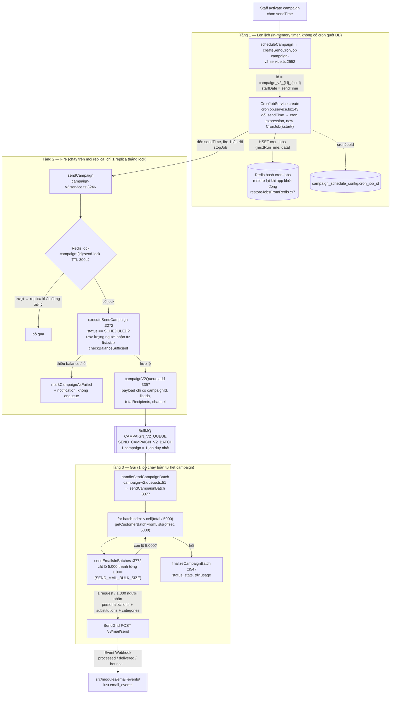
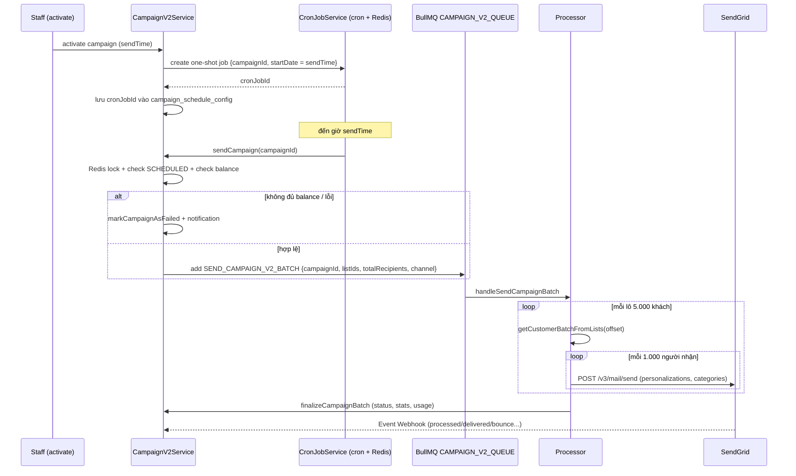

# SendGrid — Lý thuyết cơ bản

## 1. SendGrid là gì

SendGrid là một dịch vụ gửi email trên cloud (Email Service Provider): thay vì tự vận hành mail server, ứng dụng gọi HTTP API của SendGrid, SendGrid chịu trách nhiệm phần khó nhất — đưa email vào inbox (deliverability), theo dõi trạng thái, và quản lý danh sách bị chặn.

Mô hình hoạt động:

```
App ──(HTTPS API + API key)──▶ SendGrid ──(SMTP tới Gmail/Outlook...)──▶ Người nhận
                                   │
                                   └──(Event Webhook: delivered/bounce/open...)──▶ App
```

Ứng dụng chỉ làm hai việc: **gửi request** và **nhận webhook** báo kết quả.

## 2. Ưu điểm so với SMTP tự vận hành

| Vấn đề               | SMTP tự vận hành                                                 | SendGrid                                                                      |
| -------------------- | ---------------------------------------------------------------- | ----------------------------------------------------------------------------- |
| Reputation IP        | Phải tự "warm up" IP, dễ bị Gmail đưa vào spam                   | IP pool có sẵn reputation, hoặc dedicated IP được quản lý                     |
| SPF / DKIM / DMARC   | Tự cấu hình DNS, tự ký DKIM                                      | Domain Authentication tạo sẵn bản ghi DNS, tự ký                              |
| Bounce / spam report | Phải tự parse mail trả về (NDR) để biết địa chỉ chết             | Suppression list tự động: đã bounce thì lần sau không gửi nữa                 |
| Theo dõi trạng thái  | SMTP chỉ trả về "server đã nhận", không biết delivered hay không | Event Webhook đẩy từng sự kiện (processed, delivered, bounce, open, click...) |
| Gửi số lượng lớn     | Kết nối SMTP tuần tự, chậm, dễ bị rate-limit                     | 1 HTTP request gửi tới 1.000 người nhận (batch qua `personalizations`)        |
| Retry / hàng đợi     | Tự xây                                                           | SendGrid tự retry deferred trong ~72h                                         |

Điểm cần lưu ý ngược lại: phụ thuộc bên thứ ba, tính phí theo volume, và reputation dùng chung (shared IP) có thể bị ảnh hưởng bởi khách hàng khác — vì vậy mới có khái niệm **subuser** và **dedicated IP** để cô lập.

## 3. Các khái niệm chính

- **API key** — chuỗi `SG.xxx`, xác thực mọi request; cấp quyền theo scope (chỉ gửi mail, hay cả quản trị).
- **Domain Authentication** — chứng minh quyền sở hữu domain gửi qua bản ghi DNS (CNAME → SPF + DKIM). Bắt buộc nếu muốn deliverability tốt.
- **Subuser** — tài khoản con dưới account chính, có API key, thống kê, suppression list và reputation **riêng biệt**. Dùng để cô lập từng loại traffic (vd: marketing tách khỏi transactional — dự án này tách `system` / `marketing` / `booking`).
- **Category** — nhãn gắn vào mỗi email để nhóm thống kê (`/v3/categories/stats`).
- **Suppression list** — danh sách SendGrid **tự động từ chối gửi**: bounces, invalid_emails, spam_reports, unsubscribes. Gửi tới địa chỉ trong list → sự kiện `dropped`, không tốn lượt gửi thật.
- **Tracking** — open tracking (chèn pixel 1x1) và click tracking (rewrite link). Bật/tắt được ở mức account hoặc override theo từng message qua `trackingSettings`.

## 4. Setup (tổng quát)

1. Tạo account / subuser trên SendGrid.
2. **Domain Authentication**: thêm các bản ghi CNAME SendGrid sinh ra vào DNS của domain gửi → SendGrid verify → email được ký DKIM đúng domain.
3. Tạo **API key** với scope phù hợp (tối thiểu `mail.send` cho key chỉ gửi).
4. Lưu key vào biến môi trường (không bao giờ commit).
5. Cấu hình **Event Webhook**: URL công khai của app + chọn các event cần nhận + bật _Signed Event Webhook_ → lấy public key để verify chữ ký.
6. (Batch/marketing) cân nhắc dedicated IP và warm-up nếu volume lớn.

Trong dự án này: mỗi key nằm trong `src/configs/env-config.ts` (`sendGridConfig`), tách 3 client trong `email.service.ts`; webhook booking chỉ đăng ký 4 event (Processed, Delivered, Bounced, Spam Reports) và tắt global tracking — override theo từng message khi cần.

## 5. SDK Node.js

Ba package (dự án dùng cả ba):

### `@sendgrid/mail` — gửi email (wrapper của `POST /v3/mail/send`)

```typescript
import { MailService } from '@sendgrid/mail';
const sgMail = new MailService();
sgMail.setApiKey(process.env.SENDGRID_API_KEY);
await sgMail.send(msg);
```

Các tham số chính của `msg` (`MailDataRequired`):

| Tham số                              | Ý nghĩa                                                                                                                           |
| ------------------------------------ | --------------------------------------------------------------------------------------------------------------------------------- |
| `to`, `cc`, `bcc`                    | Người nhận — string hoặc `{ email, name }`                                                                                        |
| `from`                               | Người gửi — **phải thuộc domain/sender đã verify**                                                                                |
| `replyTo`                            | Địa chỉ nhận reply                                                                                                                |
| `subject`                            | Tiêu đề                                                                                                                           |
| `text` / `html`                      | Nội dung thuần / HTML                                                                                                             |
| `templateId` + `dynamicTemplateData` | Dùng template lưu trên SendGrid (Handlebars) thay vì tự render HTML                                                               |
| `personalizations`                   | Mảng người nhận cho **batch send** — xem mục 6                                                                                    |
| `substitutions`                      | Thay thế shortcode trong nội dung theo từng người nhận (dùng cùng `substitutionWrappers`)                                         |
| `categories`                         | Nhãn thống kê (tối đa 10/email)                                                                                                   |
| `customArgs`                         | Key-value tuỳ ý, SendGrid **trả nguyên lại trong webhook event** — dùng để map event về entity nội bộ (campaignId, customerId...) |
| `sendAt`                             | Unix timestamp — hẹn giờ gửi (tối đa 72h)                                                                                         |
| `batchId`                            | Gắn nhóm để có thể **hủy/pause** lô đã hẹn giờ                                                                                    |
| `trackingSettings`                   | Override open/click tracking cho message này                                                                                      |
| `asm`                                | Nhóm unsubscribe (`groupId`)                                                                                                      |
| `attachments`                        | File đính kèm (base64)                                                                                                            |
| `mailSettings`                       | vd `sandboxMode` — validate request nhưng không gửi thật                                                                          |

`send()` trả về `[ClientResponse, {}]`; lỗi nằm ở `error.response.body.errors[]` (mảng `{ message, field }`) — message gốc ở đó chứ không phải `error.message` (xem cách flatten trong `email.service.ts`).

### `@sendgrid/client` — gọi raw API v3

Cho mọi endpoint ngoài gửi mail: stats, suppression, subuser, domain...

```typescript
const [response] = await client.request({
  url: '/v3/suppression/bounces',
  method: 'GET',
  qs: { limit: 500, offset: 0 },
});
```

Dự án dùng cho: `/v3/categories/stats`, `/v3/suppression/{type}`, tạo subuser/API key/domain (`sendgrid.service.ts`).

### `@sendgrid/eventwebhook` — verify chữ ký webhook

```typescript
const ew = new EventWebhook();
const key = ew.convertPublicKeyToECDSA(publicKeyFromSendGrid);
const valid = ew.verifySignature(key, rawBody, signature, timestamp);
```

Chữ ký ECDSA nằm trong header `X-Twilio-Email-Event-Webhook-Signature` + `...-Timestamp`. **Phải verify trên raw body** (body đã parse lại thành JSON sẽ sai chữ ký).

## 6. Batch email — `personalizations`

Ví dụ cụ thể: cần gửi cùng một nội dung tới `email1@gmail.com` và `email2@gmail.com`. Có 3 cách viết, kết quả khác nhau:

**Cách 1 — `to` là mảng (2 người thấy nhau):**

```typescript
await sgMail.send({
  from: 'venue@example.com',
  subject: 'Ưu đãi tháng này',
  html: '<p>Xin chào!</p>',
  to: ['email1@gmail.com', 'email2@gmail.com'],
});
```

→ SendGrid tạo **một** email có header `To: email1@gmail.com, email2@gmail.com`. Cả hai người nhận **nhìn thấy địa chỉ của nhau** (giống CC). Chỉ phù hợp email nội bộ, không bao giờ dùng cho khách hàng.

**Cách 2 — `sendMultiple` / `isMultiple: true` (2 email riêng, nội dung giống hệt):**

```typescript
await sgMail.sendMultiple({
  from: 'venue@example.com',
  subject: 'Ưu đãi tháng này',
  html: '<p>Xin chào!</p>',
  to: ['email1@gmail.com', 'email2@gmail.com'],
});
```

→ SDK tự tách mỗi địa chỉ thành một personalization: mỗi người nhận **một email riêng**, không thấy nhau. Đủ dùng khi nội dung giống hệt nhau 100%.

**Cách 3 — `personalizations` tường minh (2 email riêng, biến riêng từng người — pattern chuẩn cho campaign):**

```typescript
await sgMail.send({
  from: 'venue@example.com',
  subject: 'Ưu đãi tháng này',
  html: '<p>Xin chào -firstName-!</p>',
  substitutionWrappers: ['-', '-'],
  personalizations: [
    { to: 'email1@gmail.com', substitutions: { firstName: 'An' } },
    { to: 'email2@gmail.com', substitutions: { firstName: 'Bình' } },
  ],
});
```

→ Vẫn chỉ **một HTTP request**, nhưng: email1 nhận "Xin chào An!", email2 nhận "Xin chào Bình!", và không ai thấy địa chỉ của ai.

Tóm tắt: `to: [mảng]` = một email chung lộ danh sách; `personalizations` = N email riêng biệt trong một request. Một request chứa tối đa **1.000 personalizations**; mỗi phần tử là một "email logic" riêng với người nhận và biến thay thế riêng, dùng chung `subject`/`html`/`from` ở mức message. Pattern campaign-v2 của dự án dùng cách 3:

```typescript
await sgMail.send({
  from: 'venue@example.com',
  subject: 'Ưu đãi tháng này',
  html: htmlTemplate, // chứa shortcode -firstName-
  personalizations: recipients.map((c) => ({
    to: c.email,
    substitutions: { firstName: c.firstName, unsubscribeLink: link(c.id) },
  })),
  categories: ['campaign-123'],
});
```

Giới hạn chung: tổng request ≤ 20MB, tổng số địa chỉ (to+cc+bcc) ≤ 1.000/request.

## 7. Event Webhook

SendGrid POST một **mảng JSON các event** (gộp nhiều event trong một request, thường mỗi ~30s hoặc khi đủ batch) tới URL đã đăng ký.

Các event chính:

| Nhóm       | Event                              | Ý nghĩa                                                         |
| ---------- | ---------------------------------- | --------------------------------------------------------------- |
| Delivery   | `processed`                        | SendGrid đã nhận và chuẩn bị gửi                                |
|            | `delivered`                        | Server người nhận đã accept                                     |
|            | `deferred`                         | Bị hoãn tạm thời, SendGrid sẽ retry (~72h)                      |
|            | `bounce`                           | Từ chối vĩnh viễn (hard) hoặc bị block (soft) — vào suppression |
|            | `dropped`                          | SendGrid không gửi (địa chỉ đã nằm trong suppression)           |
| Engagement | `open`, `click`                    | Cần bật tracking                                                |
|            | `spamreport`                       | Người nhận bấm "spam" — vào suppression                         |
|            | `unsubscribe`, `group_unsubscribe` | Hủy đăng ký                                                     |

Mỗi event mang: `email`, `event`, `timestamp`, `sg_event_id` (unique — dùng làm **idempotency key**), `sg_message_id`, `category`, và toàn bộ `customArgs` đã gửi kèm.

Nguyên tắc xử lý handler (đúng như webhook rule của dự án):

1. Verify chữ ký ECDSA trên raw body.
2. Check idempotency theo `sg_event_id` (SendGrid **có thể gửi trùng** — at-least-once).
3. ACK nhanh (< 2s), việc nặng đẩy vào queue — SendGrid coi non-2xx/timeout là fail và sẽ gửi lại cả batch.

Trong dự án: handler ở `src/modules/email-events/`, event enum ở `src/constants/enums/email-event.enum.ts`, lưu vào bảng `email_events`; ngoài webhook còn có endpoint backfill kéo suppression list qua `/v3/suppression/{type}` để đồng bộ lại khi lỡ event.

## 8. IP cho subuser & warm-up

### Shared hay dedicated IP

- **Shared IP** (mặc định): reputation dùng chung với khách hàng khác của SendGrid. Phù hợp volume nhỏ hoặc không đều — SendGrid tự duy trì reputation của pool.
- **Dedicated IP**: chỉ nên dùng khi volume **đủ lớn và đều đặn** — ngưỡng thực tế khoảng ≥100k email/tháng (vài nghìn/ngày ổn định). Dưới ngưỡng đó, dedicated IP còn tệ hơn shared: ISP (Gmail, Outlook) không đủ dữ liệu để xây reputation, và gửi ngắt quãng làm reputation không giữ được.

### Gán IP cho subuser như thế nào

Nguyên tắc: **tách IP theo loại traffic, không phải theo subuser**. Một dedicated IP gán được cho nhiều subuser cùng lúc.

- Traffic **transactional** (booking confirmation, reset password...) và **marketing** (campaign) phải đi IP khác nhau — spam report từ campaign không được phép kéo tụt deliverability của email giao dịch.
- Áp vào mô hình 3 subuser của dự án: `marketing` dùng IP riêng; `booking` + `system` có thể chung một IP transactional.
- **IP Pool**: nhóm nhiều IP thành pool đặt tên, chọn pool theo từng message qua tham số `ipPoolName` trong `mail/send` — hữu ích khi một subuser gửi nhiều loại traffic hoặc muốn dự phòng nhiều IP.

### Warm-up: tự động hay thủ công

IP mới chưa có lịch sử gửi → ISP mặc định nghi ngờ; phải tăng volume dần để xây reputation.

- **Automated warmup** (khuyến nghị mặc định): bật trên IP mới trong SendGrid, hệ thống tự giới hạn số email/giờ đi qua IP đó theo lịch tăng dần (~30 ngày); phần vượt hạn mức được route qua các IP đã warm khác trong account (hoặc shared pool). Không phải làm gì thêm ngoài bật cờ _auto warmup_ khi thêm IP.
- **Thủ công**: tự kiểm soát volume — bắt đầu ~50–200 email/ngày gửi tới nhóm người nhận **engagement cao nhất** (mở/click gần đây), tăng khoảng gấp đôi mỗi 1–3 ngày, kéo dài 2–6 tuần tuỳ volume đích. Chọn cách này khi cần kiểm soát _ai_ nhận email trong giai đoạn warm-up — auto warmup chỉ giới hạn số lượng, không chọn được người nhận.

### Quy tắc giữ reputation sau warm-up

- Giữ volume **đều** — dedicated IP "sống" bằng traffic ổn định; gửi burst rồi im lặng làm reputation tụt.
- IP để nguội quá ~30 ngày không gửi → coi như IP mới, phải warm lại.
- Theo dõi liên tục: bounce rate nên < 2–5%, spam report < 0.1%; vượt ngưỡng thì dừng tăng volume và làm sạch danh sách trước.

## 9. Luồng hẹn giờ và gửi batch campaign trong dự án (campaign-v2)

Dự án **không** dùng `sendAt` / `batchId` của SendGrid để hẹn giờ. Việc lên lịch và chia lô nằm hoàn toàn phía app, gồm ba tầng:



| Tầng        | Cơ chế                                                                                               | Code                                                                     |
| ----------- | ---------------------------------------------------------------------------------------------------- | ------------------------------------------------------------------------ |
| Lên lịch    | Cron job **one-shot** (thư viện `cron`), `startDate` = giờ gửi; id lưu ở `campaign_schedule_config.cron_job_id`, job persist trong Redis và restore khi app khởi động | `CronJobService` (`src/modules/cronjob/`), `scheduleCampaign` / `rescheduleCampaign` |
| Fire        | Handler cron gọi `sendCampaign` → lấy Redis lock `campaign:{id}:send-lock` (TTL 300s) → kiểm tra status `SCHEDULED`, ước lượng người nhận, check balance venue → **một** job BullMQ `SEND_CAMPAIGN_V2_BATCH` | `campaign-v2.service.ts` (`sendCampaign`, `executeSendCampaign`)         |
| Gửi         | Processor chạy `sendCampaignBatch`: kéo khách theo lô **5.000** từ customer lists, mỗi lô cắt tiếp thành **1.000** (`SEND_MAIL_BULK_SIZE`) = một request `personalizations`; xong toàn bộ mới `finalizeCampaignBatch` | `src/services/bull/campaign-v2.queue.ts`, `sendEmailsInBatches`          |

Ba điểm dễ hiểu nhầm:

1. **Job hẹn giờ được tạo ngay lúc activate**, không phải lúc đến giờ gửi. Không có cron định kỳ nào quét DB tìm campaign đến hạn; mỗi campaign hẹn giờ là một timer riêng, sống liên tục từ lúc activate cho tới `sendTime`.
2. **Timer đó tồn tại ở hai nơi**: object `CronJob` trong RAM của tiến trình Node (thứ thực sự đếm giờ) và một entry trong Redis hash `cron-jobs` (chỉ để tạo lại timer khi app khởi động). Chi tiết ở tiểu mục "Độ bền của job hẹn giờ" bên dưới.
3. **1 campaign = 1 job BullMQ**, không phải mỗi khách hàng một job. Khi timer fire, app enqueue đúng một job; processor tự lặp qua toàn bộ danh sách khách theo lô 5.000 rồi 1.000 bên trong job đó.

Lưu ý:

- Queue là **BullMQ** (`QUEUE.CAMPAIGN_V2_QUEUE`), thuộc nhóm legacy — được duy trì, không mở rộng thêm queue mới.
- Payload job chỉ chứa reference (`campaignId`, `listIds`, `totalRecipients`, `channel`), không chứa danh sách khách.
- Reschedule = stop cron job cũ + tạo job mới; activate thất bại thì rollback transaction và gỡ cron job vừa tạo.
- Campaign thường không có cron định kỳ. Cron định kỳ duy nhất là `@Cron(EVERY_HOUR)` cho automation sinh nhật, chạy theo timezone của venue khi giờ local = 0h.
- Không đủ balance hoặc lỗi trong lúc fire → `markCampaignAsFailed` + notification, không enqueue.



### Độ bền của job hẹn giờ

Job hẹn giờ tồn tại ở hai lớp với vai trò khác nhau:

- **RAM của tiến trình Node** — object `CronJob` (thư viện `cron`) trong `Map this.jobs` của `CronJobService`. Đây là thứ thực sự đếm giờ và gọi handler.
- **Redis hash `cron-jobs`** — một entry JSON `{ id, type, nextRunTime, data }` cho mỗi job. Redis không đếm giờ; entry chỉ dùng để `restoreJobsFromRedis` tạo lại timer khi app khởi động.

Sau khi fire, `stopJob` xoá job ở cả hai lớp (`Map.delete` + `HDEL`). Không có bước nào đọc lại từ DB (`campaign_schedule_config.send_time` / `cron_job_id`) để tạo lại job.

| Sự cố                                        | Hành vi hiện tại                                                                                                                                                     |
| -------------------------------------------- | -------------------------------------------------------------------------------------------------------------------------------------------------------------------- |
| App restart / crash, chưa tới `sendTime`     | Restore từ Redis, gửi đúng giờ.                                                                                                                                       |
| App down **qua** `sendTime`                  | Restore vẫn tạo timer, nhưng cron expression không có năm nên chờ tới ngày giờ đó của năm sau. Campaign kẹt ở `SCHEDULED`, không log, không notification.            |
| Redis sập tạm thời khi app đang chạy         | Timer trong RAM vẫn fire; `acquireAtomicLock` hoặc `campaignV2Queue.add` (BullMQ cũng trên Redis) fail → `markCampaignAsFailed`, campaign `FAILED`, có notification. |
| Redis mất dữ liệu (flush, mất persistence)   | Entry mất, không có nguồn phục hồi thứ hai. Campaign kẹt ở `SCHEDULED` với `cron_job_id` trỏ tới job không tồn tại, không notification.                              |
| Nhiều replica                                | Mỗi replica restore và giữ timer riêng cho cùng campaign; chống gửi trùng dựa vào Redis lock `campaign:{id}:send-lock` trong `sendCampaign`, không phải cơ chế cron. |

Lớp bảo vệ hiện tại nằm ở hạ tầng (ElastiCache có persistence). Về thiết kế, Redis đang là nguồn sự thật duy nhất cho job hẹn giờ, trong khi DB đã có đủ dữ liệu để phục hồi. Hướng vá rẻ nhất nếu cần: một bước restore từ DB lúc khởi động, quét campaign `SCHEDULED` không có entry tương ứng trong `cron-jobs`, tạo lại job cho `sendTime` tương lai và fire ngay hoặc mark failed cho `sendTime` đã qua.
