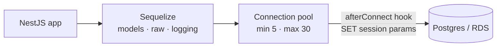
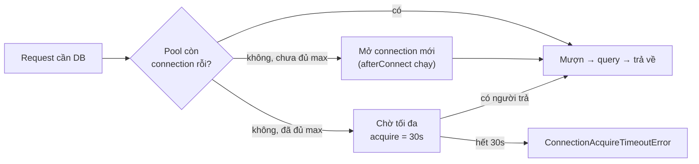

# Sequelize connection config — từng thông số nghĩa là gì

Giải thích khối `SequelizeModule.forRootAsync` trong `src/database/postgresql.module.ts`: mỗi tuỳ chọn làm gì, giá trị hiện tại, và hệ quả nếu đặt sai. Giá trị đọc từ env nằm ở `postgresql` và `sslConfig` trong `src/configs/`.

---

## 1. Bức tranh tổng thể



Ba lớp cấu hình, mỗi lớp trả lời một câu hỏi khác nhau:

| Lớp | Câu hỏi | Tuỳ chọn |
|---|---|---|
| Sequelize | Model nào, trả về dạng gì, log gì | `autoLoadModels`, `models`, `query.raw`, `logging` |
| Pool | Mở bao nhiêu connection, giữ bao lâu, chờ bao lâu | `pool.*` |
| Session | Mỗi connection Postgres được phép chạy đến đâu | `hooks.afterConnect` + `sessionConfig` |

---

## 2. Cấu hình rút gọn

```typescript
SequelizeModule.forRootAsync({
  useFactory: () => ({
    dialect: 'postgres',
    // dùng đúng danh sách models bên dưới, không tự gom từ forFeature()
    autoLoadModels: false,
    models: Object.values(models),
    // không echo SQL — PII UK sẽ lọt vào CloudWatch
    logging: false,
    // trả object thuần, không phải model instance
    query: { raw: true },
    pool: { max: 30, min: 5, acquire: 30000, idle: 30000, evict: 60000 },
    // bắt buộc TLS tới RDS khi không phải local
    dialectOptions: {
      ...(application.environment != 'local' ? sslConfig : {}),
    },
    hooks: {
      // chạy 1 lần / connection vật lý mới, không phải mỗi query
      afterConnect: async (conn) => {
        await conn.query(`SET statement_timeout = ${statementTimeout}`);
        await conn.query(`SET idle_in_transaction_session_timeout = ${idleInTransactionSessionTimeout}`);
        await conn.query(`SET lock_timeout = ${lockTimeout}`);
      },
    },
    // host, port, credential — ghi đè key trùng tên phía trên
    ...postgresql,
  }),
})
```

---

## 3. Lớp Sequelize

| Tuỳ chọn | Giá trị | Nghĩa là | Hiểu nhầm hay gặp |
|---|---|---|---|
| `autoLoadModels` | `false` | Không tự gom model từ `forFeature()` của từng module; chỉ dùng `models` khai báo tường minh | Không liên quan tạo bảng. Tự tạo bảng là `synchronize`, ở đây không bật — schema do migration quản |
| `models` | `Object.values(models)` | Toàn bộ entity trong `src/database/entities` được đăng ký vào connection gốc | Thêm entity mới phải export từ `entities/index.ts`, không thì query báo model chưa init |
| `logging` | `false` | Tắt echo SQL ở mọi môi trường | Sequelize inline giá trị WHERE vào SQL log → email/phone UK ra CloudWatch. Bật lại phải gate bằng env var |
| `query.raw` | `true` | Mặc định mọi query trả về object JSON thuần thay vì instance model | Không phải "cho phép raw SQL". Mất `.save()`, getter/setter; đổi lại tiết kiệm CPU/memory khi trả hàng nghìn dòng |
| `dialectOptions.ssl` | bật khi không phải `local` | `require: true` — bắt buộc TLS tới RDS; `rejectUnauthorized: false` — không xác thực chứng chỉ | Kết nối vẫn mã hoá, nhưng không chống man-in-the-middle. Siết lại cần bundle CA của RDS |

Khi cần instance model cho một query cụ thể:

```typescript
// Mặc định raw: true → plain object
const rows = await Customer.findAll({ where: { venueId }, limit: 100 });

// Cần .save() / getter → tắt raw cho riêng query này
const customer = await Customer.findOne({ where: { id, venueId }, raw: false });
await customer.save();
```

---

## 4. Lớp pool

Pool là kho connection dùng lại. Mỗi request mượn một connection, chạy query, trả về. Đơn vị các thông số thời gian là ms.



| Thông số | Giá trị | Nghĩa là | Hệ quả nếu sai |
|---|---|---|---|
| `max` | 30 | Tối đa 30 connection **mỗi process** | API task + worker task, nhân số task ECS, mới ra số connection thật lên Postgres. Vượt `max_connections` của RDS là lỗi kết nối toàn cục |
| `min` | 5 | Luôn giữ sẵn 5 connection dù rỗi | Quá thấp → request đầu sau lúc vắng phải trả phí mở connection |
| `acquire` | 30000 | Chờ tối đa 30s để mượn được connection, quá thì throw | Thấy lỗi này nghĩa là 30 connection đang bị query chậm giữ hết — bottleneck là **query**, không phải pool. Tăng `max` chỉ dời lỗi sang RDS |
| `idle` | 30000 | Connection rỗi quá 30s thì đủ điều kiện bị đóng (không xuống dưới `min`) | Quá thấp → đóng mở liên tục lúc traffic dao động |
| `evict` | 60000 | Cứ 60s pool quét một lượt để đóng connection idle quá hạn | Không có thì connection idle không bao giờ thật sự được dọn |

> `idle` là *điều kiện*, `evict` là *nhịp kiểm tra*. Connection rỗi 30s chưa bị đóng ngay — nó bị đóng ở lượt quét kế tiếp, tức tối đa ~90s sau lần dùng cuối.

---

## 5. Lớp session — `hooks.afterConnect`

`hooks` là các callback Sequelize gọi tại mốc trong vòng đời của nó. Có hook mức model (`beforeCreate`, `afterUpdate`, …) và hook mức connection. `afterConnect` chạy **một lần cho mỗi connection vật lý mới** pool mở ra — không phải mỗi query — nên là chỗ đúng để đặt tham số phiên.

| Tham số Postgres | Env var | Mặc định | Bảo vệ khỏi |
|---|---|---|---|
| `statement_timeout` | `POSTGRES_STATEMENT_TIMEOUT` | 120s | Một query chạy mãi giữ connection, kéo cả pool cạn |
| `idle_in_transaction_session_timeout` | `POSTGRES_IDLE_TIMEOUT` | 180s | Transaction mở rồi quên commit, giữ lock và connection vô hạn |
| `lock_timeout` | `POSTGRES_LOCK_TIMEOUT` | 60s | Chờ lock mãi khi migration hay update lớn đang chạy |

```typescript
afterConnect: async (connection: unknown) => {
  const conn = connection as { query: (sql: string) => Promise<unknown> };
  try {
    await conn.query(`SET statement_timeout = ${config.statementTimeout}`);
    await conn.query(`SET idle_in_transaction_session_timeout = ${config.idleInTransactionSessionTimeout}`);
    await conn.query(`SET lock_timeout = ${config.lockTimeout}`);
  } catch (error) {
    // Không throw: connection vẫn dùng được, chỉ mất lớp bảo vệ
    console.error('[DB] Failed to set session parameters:', error);
  }
},
```

Ba timeout này là lớp phòng thủ cho pool: một query hỏng chết một mình sau 120s, không kéo 29 connection còn lại chết theo. Xem thêm `BOTTLENECK-DIAGNOSIS.md` → "Connection pool Postgres".

---

## 6. Nếu là MySQL thì sao?

Lớp Sequelize và lớp pool giống hệt — chỉ đổi `dialect: 'mysql'`. Khác biệt nằm ở tham số phiên và vài chi tiết dialect.

| Postgres | MySQL tương đương | Ghi chú |
|---|---|---|
| `statement_timeout` (ms) | `max_execution_time` (ms) | MySQL chỉ áp cho `SELECT`, không giới hạn `UPDATE`/`DELETE` chạy lâu |
| `lock_timeout` (ms) | `innodb_lock_wait_timeout` (**giây**) | Đơn vị khác — truyền ms vào là chờ lock hàng chục giờ |
| `idle_in_transaction_session_timeout` | Không có tương đương | Chỉ có `wait_timeout` áp cho mọi connection rỗi, không phân biệt đang trong transaction |

```typescript
afterConnect: async (conn) => {
  // ms, chỉ áp cho SELECT
  await conn.query(`SET SESSION max_execution_time = ${statementTimeoutMs}`);
  // giây, không phải ms
  await conn.query(`SET SESSION innodb_lock_wait_timeout = ${lockTimeoutSec}`);
  // giây, mọi connection rỗi
  await conn.query(`SET SESSION wait_timeout = ${idleTimeoutSec}`);
},
```

| Chi tiết dialect | MySQL cần thêm |
|---|---|
| SSL tới RDS | `dialectOptions.ssl: 'Amazon RDS'` tải sẵn CA bundle, an toàn hơn `rejectUnauthorized: false` |
| Kiểu `DECIMAL` | `dialectOptions.decimalNumbers: true`, mặc định `mysql2` trả về string |
| Timezone | `timezone: '+00:00'` ở Sequelize, vì `DATETIME` không lưu offset. Postgres `TIMESTAMPTZ` không có vấn đề này |

---

## 7. Postgres có lợi thế gì hơn MySQL?

Lợi thế chung của Postgres nằm ở chỗ **đẩy được logic xuống DB** — kiểu dữ liệu, index, constraint — thay vì phải viết trong application code.

| Nhóm | Postgres | MySQL |
|---|---|---|
| **Kiểu dữ liệu** | Mảng (`text[]`, `int[]`), `JSONB` có index, `UUID`, `INET`, `TIMESTAMPTZ`, `INTERVAL`, range type, enum thật, kiểu tự định nghĩa | `JSON` không index trực tiếp (phải qua generated column), không có mảng, `DATETIME` không lưu offset, enum gắn vào từng cột |
| **Loại index** | B-tree, **GIN** (mảng, JSONB, full-text, trigram), GiST (khoảng, không gian), BRIN (bảng rất lớn theo thời gian), Hash, **partial index**, **expression index**, `CREATE INDEX CONCURRENTLY` | Chủ yếu B-tree; full-text và spatial giới hạn; không có partial index; index trên biểu thức chỉ qua generated column; online DDL tuỳ phiên bản |
| **Full-text và fuzzy search** | `tsvector`/`tsquery` có stemming và ranking, `pg_trgm` cho `ILIKE '%term%'` và `similarity()` | `FULLTEXT` cơ bản, không trigram, không fuzzy |
| **Toàn vẹn dữ liệu** | `CHECK` constraint đầy đủ, `EXCLUDE` constraint (chống trùng khoảng thời gian), deferrable constraint, **DDL trong transaction** nên migration hỏng giữa chừng rollback sạch | `CHECK` chỉ thực thi từ 8.0.16, không có `EXCLUDE`, DDL tự commit nên migration hỏng để lại schema dở |
| **Mở rộng bằng extension** | `pg_trgm`, `pgvector`, `PostGIS`, `pg_stat_statements`, `pgcrypto`, `uuid-ossp`, `pg_partman` | Không có cơ chế extension tương đương |
| **Concurrency** | MVCC không khoá đọc, `SELECT ... FOR UPDATE SKIP LOCKED` cho hàng đợi trong DB, `INSERT ... ON CONFLICT` theo bất kỳ constraint nào | MVCC trên InnoDB, `SKIP LOCKED` từ 8.0, `ON DUPLICATE KEY` chỉ theo unique key |
| **Query nâng cao** | CTE đệ quy, window function, `LATERAL` join, `FILTER` trong aggregate, `RETURNING`, `DISTINCT ON` | CTE và window từ 8.0; `LATERAL` giới hạn, không có `FILTER`, không có `RETURNING` |
| **Quan sát và chẩn đoán** | `EXPLAIN (ANALYZE, BUFFERS)` chi tiết đến buffer I/O, `pg_stat_statements`, `pg_stat_activity` | `EXPLAIN ANALYZE` từ 8.0.18, ít chi tiết I/O hơn |
| **Tuân thủ chuẩn SQL** | Bám sát SQL:2016 ở phần lớn tính năng chính; hành vi mặc định nghiêm: `GROUP BY` bắt buộc liệt kê mọi cột không aggregate, chia cho 0 báo lỗi, chuỗi quá độ dài báo lỗi, `''` và `NULL` phân biệt, `"identifier"` đúng chuẩn, `FULL OUTER JOIN`, `INTERSECT`/`EXCEPT`, `CHECK` thực thi từ đầu | Nhiều điểm lệch chuẩn giữ lại vì tương thích ngược: `GROUP BY` từng cho chọn cột không aggregate (siết từ 5.7 qua `ONLY_FULL_GROUP_BY`), chia cho 0 trả `NULL`, chuỗi quá dài bị cắt lặng nếu không bật strict mode, `'0000-00-00'` là ngày hợp lệ, dùng backtick thay dấu nháy đôi, không có `FULL OUTER JOIN`, `INTERSECT`/`EXCEPT` chỉ từ 8.0.31, `CHECK` bị parse rồi bỏ qua trước 8.0.16 |

**MySQL không kém ở mọi mặt.** Nó thắng ở replication đơn giản và trưởng thành hơn, đọc theo primary key nhanh nhờ clustered index, đội vận hành phổ biến hơn, và footprint nhỏ hơn cho workload đơn giản kiểu key-value. Chọn Postgres khi dữ liệu bán cấu trúc, cần search phức tạp, hay ràng buộc nhiều ở tầng DB; chọn MySQL khi workload chủ yếu là đọc ghi theo khoá và ưu tiên vận hành quen tay.
