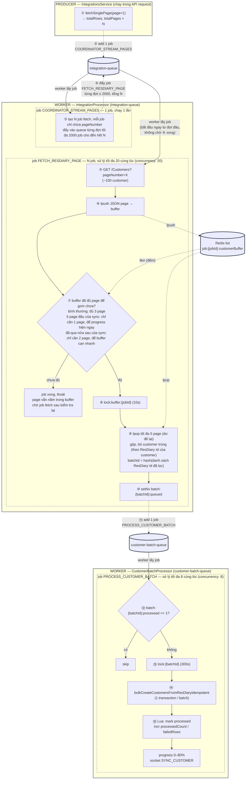
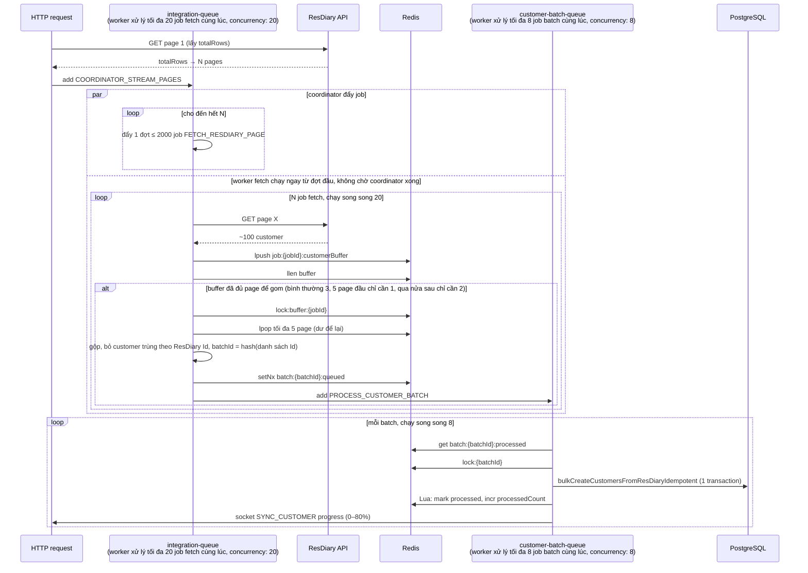

# ResDiary Customer Sync — Kiến trúc streaming fan-out

Sync customer từ ResDiary chạy trên 2 Bull queue: `integration-queue` (fetch API) và `customer-batch-queue` (ghi DB), nối với nhau qua một Redis list làm buffer.

---

## 1. Bài toán và ý tưởng cốt lõi

Bài toán gốc rất đơn giản: ResDiary trả dữ liệu theo trang, mỗi trang 100 khách, và cần đưa toàn bộ về DB. Một venue có thể có từ vài chục nghìn đến hơn 1 triệu khách. Cách làm tự nhiên nhất là một vòng lặp: lấy một trang, ghi vào DB, lấy trang kế tiếp — giống một nhân viên duy nhất lần lượt bê từng thùng hàng từ kho về, xếp xong thùng này mới quay lại lấy thùng sau.

Kiến trúc này chuyển từ "một người làm tất cả theo thứ tự" sang **một dây chuyền ba công đoạn độc lập**:

1. **Người điều phối** hỏi kho ngay từ đầu "tổng cộng có bao nhiêu thùng?" — nhờ đó biết trước toàn bộ khối lượng và chia được việc.
2. **Một đội nhiều người bê hàng** (20 người) đi lấy các thùng *đồng thời*, ai xong thùng nào đặt lên **băng chuyền trung gian** rồi đi lấy thùng khác — không ai chờ ai, và người bê hàng không phải xếp kho.
3. **Một đội xếp kho riêng** (8 người) lấy hàng từ băng chuyền, gom nhiều thùng xếp một lượt cho đỡ tốn công mở cửa kho nhiều lần.

Ba hệ quả then chốt:

- **Tốc độ**: thời gian tổng không còn là tổng thời gian của mọi chuyến đi cộng dồn, mà xấp xỉ bằng tổng chia cho số người bê hàng.
- **Chịu lỗi**: một thùng bị rơi không làm cả đoàn dừng lại — thùng đó được ghi sổ và cử người quay lại lấy riêng, những thùng khác vẫn về kho bình thường.
- **Cái giá phải trả**: khi nhiều người cùng làm và ai cũng có thể phải làm lại việc của mình, mọi thao tác phải được thiết kế sao cho *làm hai lần cũng vô hại* (idempotent). Đây là toàn bộ phần phức tạp tăng thêm, và là chi phí bắt buộc chứ không phải khuyết điểm.

Tóm trong một câu: **điều phối (fan-out) → thu thập song song → xử lý theo lô (fan-in)**, nối bằng buffer trung gian, sao cho tốc độ fetch API và tốc độ ghi DB không ràng buộc lẫn nhau.

---

## 2. Sơ đồ tổng quan

Quy ước: hình trụ = queue (nằm trong Redis). Mũi tên **đứt** đi vào queue = **producer** đẩy job. Mũi tên **liền** đi ra khỏi queue = **worker** lấy job ra xử lý.

Thứ tự đọc: ① → ② → ③ tuần tự, chạy 1 lần. ④ đẩy job theo từng đợt; ngay khi đợt đầu vào queue, ⑤ đã bắt đầu — coordinator và fetch chạy chồng lên nhau, không chờ nhau. Từ ⑤ đến ⑮ lặp lại cho từng page / từng lô, chạy song song (⑤–⑩ tối đa 20 job cùng lúc, ⑫–⑮ tối đa 8 job cùng lúc).

Điểm cần nói rõ: **worker của `integration-queue` đồng thời là producer**. Job coordinator chạy trong worker nhưng lại đẩy N job fetch vào chính queue đó; job fetch chạy trong worker nhưng lại đẩy job batch sang `customer-batch-queue`. Chỉ có `CustomerBatchProcessor` là worker thuần, không đẩy job đi đâu nữa.

Một job kết thúc **ngay khi hàm xử lý của nó return** — không job nào đứng chờ job khác hay chờ DB. Handler `throw` nghĩa là "chưa xong, thử lại"; riêng job fetch ở lần thử cuối **cố tình return thay vì throw** (ghi trang hỏng vào sổ) để một trang lỗi không chặn cả phiên.

---

## 3. Sơ đồ tuần tự

---

## 4. Tham số chính

| Thành phần | Giá trị | Nguồn |
|---|---|---|
| Page size ResDiary | 100 | `integrations.service.ts` |
| Số job fetch đẩy vào queue mỗi đợt | tối đa 2000, nghỉ 2s giữa các đợt nếu tổng > 5000 page | `integration.queue.ts` `coordinatorStreamPages` |
| Worker fetch xử lý tối đa cùng lúc | 20 job `FETCH_RESDIARY_PAGE` | env `FETCH_RESDIARY_PAGE_CONCURRENCY` |
| Số page tối thiểu trong buffer để bắt đầu gom | bình thường 3; 5 page đầu của sync chỉ cần 1 (progress hiện ngay); đã qua nửa sau của sync chỉ cần 2 (buffer cạn nhanh) | `fetchResDiaryPage` |
| Số page tối đa mỗi lô | 5, phần dư để lại buffer | `queueBatchProcessing` |
| Worker batch xử lý tối đa cùng lúc | 8 job `PROCESS_CUSTOMER_BATCH` | env `CUSTOMER_BATCH_CONCURRENCY` |
| Lock buffer | `lock:buffer:{jobId}` TTL 10s | `queueBatchProcessing` |
| Lock batch | `lock:{batchId}` TTL 300s | `processCustomerBatch` |
| Idempotency batch | `batch:{batchId}:queued` (setNx) + `batch:{batchId}:processed` | cả 2 queue |
| Retry job fetch | 2 lần, cách 3s; lần cuối lỗi thì ghi trang vào sổ `failedPages` và return | `coordinatorStreamPages` |
| Retry job batch | 3 lần, exponential 2s/4s/8s | `queueBatchProcessing` |
| Điều kiện chuyển phase | `processedCount ≥ 95% totalRows` | `processCustomerBatch` |

---

## 5. Các kỹ thuật cần hiểu

### 5.1. Đẩy job theo đợt, không đẩy hết một lần

Biết trước tổng số trang (từ `TotalRows` của trang 1) cho phép tạo tất cả job fetch ngay từ đầu. Nhưng với venue hàng triệu khách (hàng chục nghìn trang), đẩy một lệnh 10.000 job sẽ làm Redis bận lâu và các job khác đang chờ cũng chậm theo. Giải pháp: đẩy từng đợt tối đa 2000 job, nghỉ 2 giây giữa các đợt khi tổng lớn. Đây là điểm cân bằng giữa "biết trước toàn bộ khối lượng" và "không nhồi toàn bộ khối lượng đó vào Redis cùng lúc".

Lưu ý đợt 2000 chỉ là cách *đẩy vào* cho êm. Cả N job vẫn nằm hết trong queue chờ; worker vẫn chỉ *lấy ra* 20 job một lúc.

### 5.2. Buffer tách rời fetch và ghi

Job fetch mỗi lần chỉ lấy được 100 khách (1 trang), nhưng ghi DB muốn ghi lô lớn 300–500 khách cho hiệu quả. Hai bên không khớp cỡ. Buffer là chỗ chung để đổi cỡ: vào lẻ 100, ra gộp 300–500. Mỗi job fetch xong thì ném trang của mình vào rồi xong việc, không cần biết ai khác đang làm gì; ai đó nhìn buffer thấy đủ thì vớt ra gom thành lô.

Lợi ích:

- Tốc độ fetch không bị ghìm bởi tốc độ ghi DB, và DB không bị dồn ép khi API trả nhanh.
- Kích thước lô ghi DB độc lập với kích thước trang API — chi phí transaction được khấu hao tốt hơn.
- Ngưỡng gom thích ứng: đầu sync vớt sớm cho user thấy progress chạy, giữa sync gom to cho hiệu quả, cuối sync vớt sớm cho xong nhanh.

### 5.3. Idempotency ở mọi tầng — điều kiện bắt buộc của xử lý song song

Song song hóa đồng nghĩa với retry, trùng lặp và race. Pipeline xử lý bằng bốn lớp:

1. **Marker theo trang**: key Redis `job:{jobId}:page:{n}:fetched` (TTL 24h) — job fetch bị retry sẽ không fetch lại trang đã xong.
2. **batchId theo nội dung**: id của lô là hash của danh sách ResDiary Id đã sắp xếp — cùng một bộ khách không bao giờ tạo hai lô, kết hợp `setNx` chống đẩy trùng vào queue.
3. **Upsert phân xử bằng unique constraint**: danh tính khách do ràng buộc duy nhất trên bảng mapping quyết định (`uniq_cim_legacy_external` trên `integration_type, venue_id, external_customer_id`) — không dựa vào logic "kiểm tra tồn tại rồi mới insert" phía ứng dụng, vốn thua race.
4. **Bộ đếm atomic bằng Lua script**: "đánh dấu lô đã xử lý + tăng bộ đếm tiến độ" gói trong một script Redis, để một lô bị giao lại không bị đếm hai lần.

Nguyên tắc rút ra: trong pipeline song song, tính đúng đắn không được phép phụ thuộc vào việc "mỗi job chỉ chạy một lần" — phải giả định mọi job đều có thể chạy lại.

### 5.4. Hoàn thành theo ngưỡng, không theo đẳng thức

Điều kiện chuyển phase là `processed ≥ 95% total`, không phải `processed == total`. Với API bên thứ ba luôn có một tỷ lệ trang hỏng không đáng để chặn toàn bộ tiến trình. Trang hỏng được ghi vào một Redis set riêng (kèm chi tiết lỗi, TTL 24h) và có endpoint quản trị `POST /resdiary/resync-failed-pages/:venueId` để chạy lại đúng những trang đó — thiếu sót được ghi nhận và khắc phục được, nhưng không giữ con tin cả pipeline.

### 5.5. Cơ chế phòng vệ tài nguyên

- Circuit breaker: `customer-batch-queue` tồn quá 1000 job → job batch tự delay 10 giây.
- Kiểm tra heap trước mỗi lô (ngưỡng 768MB → delay 15 giây) — **chỉ có hiệu lực khi `NODE_ENV === 'staging'`**. Gọi `global.gc()` sau mỗi lô nếu process bật `--expose-gc`.
- Delay ngẫu nhiên 0–5 giây khi đẩy job batch vào queue để tránh thundering herd lên DB.
- Watchdog độc lập với pipeline (`import-watchdog.service.ts`, cron 10 phút): import ở trạng thái chạy quá 45 phút không có tín hiệu sống sẽ bị chuyển sang FAILED, tối đa 90 phút nếu còn lock — tầng bảo hiểm cuối cùng khi mọi cơ chế bên trong đều hỏng.

### 5.6. Tiến độ là một mối quan tâm hạng nhất

Tiến độ chia thành các dải cố định theo phase (0–80% customer, 81–90% booking, 91–99% merge, 100% hoàn tất), có kiểm tra đơn điệu tăng (không bao giờ lùi) và throttle cập nhật (chênh ≥ 1% hoặc ≥ 2 giây). Với tác vụ chạy nhiều phút trước mặt người dùng, "thanh tiến độ luôn tiến về trạng thái kết thúc" là một bất biến phải thiết kế chủ động — phần lớn các job phụ ở mục 6 tồn tại để bảo vệ bất biến này.

---

## 6. Các job phụ không nằm trong sơ đồ

Sơ đồ ở mục 2 chỉ giữ đường chính để customer vào được DB. Các job sau chạy quanh đường chính đó:

| Job | Ở queue | Làm gì |
|---|---|---|
| `FINAL_BUFFER_CLEANUP` (×1) | integration-queue | Coordinator hẹn giờ chạy sau 30 giây: vét những trang còn sót trong buffer (do ngưỡng gom chưa đạt hoặc lock bị trượt), gom thành lô cuối, rồi đặt `FORCE_COMPLETE_IMPORT`. Retry 5 lần, cách 60s. |
| `FORCE_COMPLETE_IMPORT` | customer-batch-queue | Nếu chưa lô nào chạm 95%: chấp nhận hoàn thành khi phần thiếu < 1000 khách **và** < 5%, thay vì treo vô hạn chờ đủ 100%. |
| `TRIGGER_BOOKING_SYNC_PHASE` / `TRIGGER_MERGE_PHASE` | integration-queue | Chuyển phase. Lô nào thấy đủ 95% thì lấy lock và kích booking sync; booking xong thì kích merge. |
| `SEND_INTEGRATION_REPORT` | email-queue | Gửi báo cáo tổng kết phiên sync. |
| `CLEANUP_INTEGRATION_QUEUES` (×1) | integration-queue | 2 giờ sau khi sync xong: quét sạch job completed còn sót trên các queue liên quan. |

Dọn job trong Redis có hai tầng: tầng một là `removeOnComplete` / `removeOnFail` trên từng job (job fetch được đặt tuổi ngắn — xong giữ 30 phút, tối đa 100 job — vì một phiên lớn sinh hàng chục nghìn job; các job khác xong giữ 2h); tầng hai là `CLEANUP_INTEGRATION_QUEUES` quét tổng sau phiên, đề phòng tầng một bỏ sót. Job **hỏng** luôn được giữ lâu hơn job xong (24h) — đó là dấu vết để debug.

Đường cũ `fetchCustomersFromResDiary` → `SYNC_CUSTOMER_FROM_RESDIARY` (đẩy thẳng mảng customer vào `integration-queue`, không qua buffer) vẫn còn trong code nhưng không còn caller.

---

## 7. Trạng thái nằm ở đâu

- **Redis**: `venue:{id}:resdiary:*` (processedCount, failedRows, lastProgress, completedBatches, bookingSyncLock, …) và `job:{jobId}:*` (customerBuffer, page:n:fetched, coordinatorFinished, totalPages).
- **DB**: `venues.importStatus`, `venues.importProgress`, `venues.importMeta` (phase, recordCount, failedPages).
- **Socket**: `SYNC_CUSTOMER` cho FE hiển thị thanh tiến độ.

Muốn biết "sync đang ở đâu" thì phải xem Redis, không đọc được từ code. Đây là một trong những lý do luồng này khó hiểu với người không trực tiếp làm.

---

## 8. So sánh với mô hình tuần tự

Nhánh sync booking trong cùng hệ thống vẫn dùng mô hình cũ: fetch một trang, xử lý, lấy `NextUrl` từ response, fetch trang kế — mỗi thời điểm chỉ có đúng một request đang bay. Đây là đối chứng trực tiếp.

| Tiêu chí | Tuần tự (NextUrl chain) | Streaming fan-out |
|---|---|---|
| Số request đồng thời | 1 | 20 |
| Thời gian fetch bị chi phối bởi | Tổng độ trễ của *mọi* request cộng dồn | Độ trễ của request chậm nhất trong mỗi lượt |
| Fetch và ghi DB | Xen kẽ, chặn lẫn nhau | Tách rời qua buffer, chạy song song |
| Kích thước lô ghi DB | = kích thước trang (100) | Gom nhiều trang (300–500) |
| Một trang lỗi | Đứt chuỗi tại chỗ, các trang sau bị chặn | Cô lập: chỉ trang đó fail, ghi sổ, chạy lại riêng |
| Điều kiện hoàn thành | Đi hết chuỗi | Ngưỡng 95% + force-complete |
| Biết trước khối lượng | Không (chỉ biết khi hết `NextUrl`) | Có (`TotalRows` từ trang 1) → tiến độ chính xác |
| Độ phức tạp | Thấp | Cao: idempotency, lock, bộ đếm atomic, cleanup |

**Vì sao tuần tự không sống nổi ở quy mô lớn.** Ví dụ 1.000.000 khách = 10.000 trang, 500ms/request (số giả định để thấy xu hướng):

- Tuần tự: 10.000 × 0,5s ≈ **83 phút chỉ riêng fetch**, chưa tính ghi DB xen kẽ.
- Fan-out 20: ≈ 10.000 / 20 × 0,5s ≈ **4–5 phút fetch**, ghi DB chạy song song trên queue riêng.

Quan trọng không kém là **đặc tính lỗi**: tuần tự 10.000 trang, kể cả tỷ lệ lỗi 0,1%/request cũng gần như chắc chắn đứt ít nhất một lần, và mỗi lần đứt là toàn bộ phần còn lại phải chờ. Fan-out biến lỗi từ sự kiện chặn toàn cục thành sự kiện cục bộ có sổ sách.

**Khi nào tuần tự vẫn đúng:**

- API chỉ cấp cursor (`NextUrl` do server trả, không đoán trước được) — không thể fan-out. Đây chính là ràng buộc của nhánh booking.
- Cần thứ tự xử lý (booking sắp theo ngày) — song song phá thứ tự.
- Khối lượng nhỏ (vài chục trang) — 83 phút thành vài chục giây, độ phức tạp không bõ.
- API nguồn nhạy cảm với tải — một request tại một thời điểm là rate-limit lịch sự nhất.

---

## 9. Cái giá phải trả

1. **Idempotency trở thành bắt buộc.** Toàn bộ mục 5.3 là code không tồn tại trong mô hình tuần tự.
2. **Redis trở thành thành phần chịu tải trạng thái** (buffer, marker, counter, lock, failed-set) — phải quản trị maxmemory và TTL nghiêm túc; mất Redis giữa chừng là mất trạng thái pipeline.
3. **"Hoàn thành" trở thành khái niệm xác suất** (95%, force-complete) — cần sổ sách trang lỗi và công cụ chạy lại.
4. **Cần watchdog độc lập**, vì pipeline nhiều tầng có nhiều điểm treo hơn một vòng lặp.
5. **Khó đọc hơn đáng kể**: logic trải trên nhiều processor và nhiều key Redis. Tài liệu này là một phần của chi phí kiến trúc.

Tiền đề cần nêu: pipeline hiện chạy trên **một process worker** (`RUN_QUEUE=true`). "20" và "8" là số job chạy xen kẽ trong cùng process, không phải nhiều process cạnh tranh. Các lớp lock, `setNx` và kiểm tra trùng job được thiết kế cho kịch bản nhiều worker; ở cấu hình hiện tại chúng chủ yếu bảo vệ trước retry của chính Bull và trước việc cùng một venue bị resync chồng. Nếu sau này chạy nhiều process, các lớp này trở thành bắt buộc.

---

## 10. Điểm kiến trúc cần cân nhắc

**Tách fetch / ghi DB là đúng** — hai việc có giới hạn khác nhau (rate limit API vs pool connection DB), tách queue để mỗi bên tự điều tốc. Đây là quyết định quan trọng nhất và nó đúng.

**Fetch chưa được cách ly khỏi job điều khiển.** `integration-queue` đang chứa cả hàng nghìn job fetch (nhiều, chịu chờ) lẫn job điều khiển (coordinator của venue khác, chuyển phase, đẩy ngược lên ResDiary — ít, cần chạy ngay). Xếp chung một hàng thì loại nhiều nuốt loại ít: một venue 1 triệu khách bắt đầu sync là coordinator của venue khác nằm sau 10.000 job fetch, venue đó **chưa được bắt đầu** chứ không chỉ chậm. Thêm nữa, Bull gộp slot xử lý của mọi loại job trong một queue (29 slot dùng chung, không phải 20 riêng cho fetch), nên con số concurrency đặt cho từng loại job không được đảm bảo.

Bước tiếp theo hợp lý: đưa `FETCH_RESDIARY_PAGE` ra queue riêng. `integration-queue` chỉ còn job điều khiển (coordinator ở lại đây — không tạo queue theo tên job, tạo theo hình dạng tải), queue fetch mới chịu tốc độ theo rate limit ResDiary, `customer-batch-queue` giữ nguyên. Theo quy ước repo, queue mới phải là SQS.

**Cốt lõi vs chi phí phụ.** Cốt lõi thật sự chỉ gồm: biết có N trang, fetch từng trang, upsert theo ResDiary Id. Buffer, lock, setNx, Lua counter và phần lớn key Redis tồn tại để gộp 100 khách/trang thành 300–500 khách/transaction và để biết khi nào "xong" mà không cần hỏi DB. Nếu job fetch upsert luôn 100 row rồi đánh dấu trang done trong DB, phần lớn tầng điều phối không cần tồn tại — đổi lại là 5× số transaction. Đây là điểm cần cân nhắc khi quyết định giữ hay rút gọn, đối chiếu với điều kiện áp dụng ở mục 8.

---

## File liên quan

- `src/modules/integrations/integrations.service.ts` — entry point, fetch page 1, add coordinator job
- `src/services/bull/integration.queue.ts` — `coordinatorStreamPages`, `fetchResDiaryPage`, `queueBatchProcessing`, `FINAL_BUFFER_CLEANUP`, `TRIGGER_*`
- `src/services/bull/customer-batch.queue.ts` — `processCustomerBatch`, `FORCE_COMPLETE_IMPORT`
- `src/modules/customers/customer.service.ts` — `bulkCreateCustomersFromResDiaryIdempotent`
- `src/modules/integrations-v2/import-watchdog.service.ts` — watchdog
- `src/modules/integrations/integrations.controller.ts` — `POST /resdiary/resync-failed-pages/:venueId`
