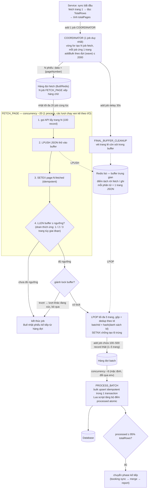
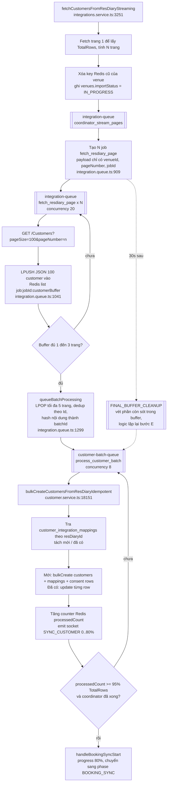

# Kiến trúc Streaming Fan-out cho đồng bộ dữ liệu khối lượng lớn

Tài liệu đúc kết các nguyên lý kiến trúc từ một pipeline đồng bộ dữ liệu khách hàng quy mô lớn (hàng triệu bản ghi, nguồn là API bên thứ ba có phân trang), được khái quát hóa thành một mẫu thiết kế áp dụng cho bài toán tổng quát: nhập khối lượng dữ liệu lớn từ hệ thống ngoài một cách nhanh, chịu lỗi và không trùng lặp. Phạm vi tài liệu giới hạn ở các thành phần đã được kiểm chứng qua vận hành thực tế; phần cuối phân tích định lượng lợi ích so với mô hình tuần tự trang-nối-trang và điều kiện áp dụng của từng mô hình.

---

## 1. Ý tưởng cốt lõi

Bài toán gốc rất đơn giản: API nguồn trả dữ liệu theo trang, mỗi trang 100 bản ghi, và cần đưa toàn bộ về cơ sở dữ liệu. Cách làm tự nhiên nhất là một vòng lặp: lấy một trang, ghi vào DB, lấy trang kế tiếp — giống như một nhân viên duy nhất lần lượt bê từng thùng hàng từ kho về, xếp xong thùng này mới quay lại lấy thùng sau.

Ý tưởng của kiến trúc này là chuyển từ "một người làm tất cả theo thứ tự" sang **một dây chuyền ba công đoạn độc lập**:

1. **Người điều phối** hỏi kho ngay từ đầu "tổng cộng có bao nhiêu thùng?" — nhờ đó biết trước toàn bộ khối lượng công việc và chia được việc.
2. **Một đội nhiều người bê hàng** (20 người) đi lấy các thùng *đồng thời*, mỗi người một thùng, ai xong thùng nào đặt lên **băng chuyền trung gian** rồi đi lấy thùng khác — không ai phải chờ ai, và người bê hàng không phải xếp kho.
3. **Một đội xếp kho riêng** lấy hàng từ băng chuyền, gom nhiều thùng xếp một lượt cho đỡ tốn công mở cửa kho nhiều lần.

Ba hệ quả then chốt của cách tổ chức này:

- **Tốc độ**: thời gian tổng không còn là tổng thời gian của mọi chuyến đi cộng dồn, mà xấp xỉ bằng tổng chia cho số người bê hàng.
- **Chịu lỗi**: một thùng bị rơi không làm cả đoàn dừng lại — thùng đó được ghi sổ và cử người quay lại lấy riêng, những thùng khác vẫn về kho bình thường.
- **Cái giá phải trả**: khi nhiều người cùng làm và ai cũng có thể phải làm lại việc của mình, mọi thao tác phải được thiết kế sao cho *làm hai lần cũng vô hại* (idempotent) — đây là toàn bộ phần phức tạp tăng thêm của kiến trúc, và là chi phí bắt buộc chứ không phải khuyết điểm.

Toàn bộ phần còn lại của tài liệu là hiện thực hóa kỹ thuật của ba công đoạn và ba hệ quả nêu trên.

---

## 2. Mô hình tổng quát trong một câu

Thay vì một vòng lặp tuần tự "fetch trang → ghi DB → fetch trang tiếp theo", pipeline tách thành ba tầng độc lập — **điều phối (fan-out) → thu thập song song → xử lý theo lô (fan-in)** — nối với nhau bằng buffer trung gian (Redis list) và bộ đếm tiến độ atomic, sao cho tốc độ fetch API và tốc độ ghi DB không còn ràng buộc lẫn nhau.

Hai job "chốt sổ" bảo đảm pipeline luôn kết thúc được:

- **FINAL_BUFFER_CLEANUP** (delay 30 giây, retry nhiều lần): vét những trang còn sót trong buffer sau khi mọi job fetch đã xong.
- **FORCE_COMPLETE_IMPORT**: chấp nhận hoàn thành khi phần thiếu hụt nhỏ hơn cả ngưỡng tuyệt đối (< 1000 record) lẫn ngưỡng tương đối (< 5%), thay vì treo vô hạn để chờ đủ 100%.

### 2.1. Danh mục job và vòng đời

Nguyên tắc chung: một job kết thúc **ngay khi hàm xử lý của nó return** — không job nào đứng chờ job khác hay chờ DB. Handler `throw` nghĩa là "chưa xong, thử lại"; riêng job fetch ở lần thử cuối **cố tình return thay vì throw** (ghi trang hỏng vào sổ) để một trang lỗi không chặn cả phiên. Job đã xong/đã hỏng không bị xóa ngay — Bull giữ lại trong Redis một thời gian để tra cứu, rồi tự dọn theo tuổi hoặc số lượng.

| Job | Nhiệm vụ | Kết thúc khi | Dọn khỏi Redis |
|---|---|---|---|
| `COORDINATOR` (×1) | Đọc tổng số trang, phát N phiếu fetch theo wave, hẹn giờ job vét buffer | Phát hết phiếu | Mặc định: xong giữ 2h, hỏng giữ 24h |
| `FETCH_PAGE` (×N) | Fetch 1 trang → đẩy vào buffer → kiểm tra ngưỡng | Return sau khi push (và có thể xúc buffer); retry 2 lần, lần cuối lỗi thì return + ghi sổ trang hỏng | Ngắn hơn hẳn: xong giữ 30 phút / tối đa 100 job (vì số lượng cực lớn), hỏng giữ 24h |
| `PROCESS_BATCH` | Bulk upsert 100–500 record (1–5 trang, tùy buffer lúc gom) trong 1 transaction, tăng bộ đếm atomic, tự kiểm tra ngưỡng 95% | Commit + tăng đếm xong; lỗi thì throw, retry 3 lần (2s/4s/8s) | Xong giữ 2h, hỏng giữ 24h |
| `FINAL_BUFFER_CLEANUP` (×1) | 30 giây sau khi phát hết phiếu: vét trang lẻ còn trong buffer | Buffer sạch hoặc kích hoạt force-complete; retry 5 lần, cách nhau 60s | Xong giữ 2h |
| `FORCE_COMPLETE_IMPORT` | Đóng phiên khi phần thiếu < 1000 record và < 5% | Cập nhật trạng thái hoàn tất | **Xóa ngay khi xong** (`removeOnComplete: true`) |
| `TRIGGER_BOOKING_SYNC_PHASE` / `TRIGGER_MERGE_PHASE` | Chuyển phase (ưu tiên cao, nhảy hàng) | Kích hoạt phase xong; throw để retry nếu lỗi | Mặc định 2h / 24h |
| `SEND_INTEGRATION_REPORT` | Gửi báo cáo tổng kết phiên sync | Gửi xong | Mặc định 2h / 24h |
| `CLEANUP_INTEGRATION_QUEUES` (×1) | 2 giờ sau khi sync xong: quét sạch mọi job completed còn sót trên cả các queue liên quan | Quét xong | — (chính nó là chốt dọn dẹp cuối) |

Hai tầng dọn dẹp bổ trợ nhau: tầng thứ nhất là cấu hình `removeOnComplete`/`removeOnFail` trên từng job (tự hết hạn theo tuổi/số lượng — job fetch được đặt tuổi ngắn vì một phiên lớn sinh hàng chục nghìn job); tầng thứ hai là job cleanup hẹn giờ quét tổng sau phiên, đề phòng cấu hình tầng một bỏ sót. Job **hỏng** luôn được giữ lâu hơn job xong (24h so với 2h/30 phút) — đó là dấu vết để debug.

---

## 3. Các kỹ thuật thành phần đáng tái sử dụng

### 3.1. Fan-out theo đợt (wave) thay vì enqueue toàn bộ

Biết trước tổng số trang (từ `TotalRows` của trang 1) cho phép enqueue tất cả job fetch ngay từ đầu. Tuy nhiên với tập dữ liệu hàng triệu record (hàng chục nghìn trang), enqueue một lần sẽ làm phình Redis và bộ nhớ worker. Giải pháp: chia thành từng đợt ≤ 2000 trang, nghỉ ngắn giữa các đợt khi tổng số trang lớn. Đây là điểm cân bằng giữa "biết trước toàn bộ khối lượng công việc" và "không giữ toàn bộ khối lượng đó trong hàng đợi cùng lúc".

### 3.2. Buffer trung gian tách rời fetch và ghi

Job fetch chỉ đẩy JSON thô vào Redis list rồi kết thúc — không chạm vào DB. Việc ghi DB do một hàng đợi khác đảm nhận, gom nhiều trang thành một lô. Lợi ích:

- Tốc độ fetch không bị ghìm bởi tốc độ ghi DB (và ngược lại, DB không bị dồn ép khi API trả nhanh).
- Kích thước lô ghi DB (100–500 record/transaction, tùy số trang có trong buffer lúc gom) độc lập với kích thước trang API (100 record) — chi phí transaction được khấu hao tốt hơn.
- Drain thích ứng: các trang đầu tiên được xử lý ngay từng trang một (người dùng thấy tiến độ sớm), về sau gom lô lớn hơn để tối ưu throughput.

### 3.3. Idempotency ở mọi tầng — điều kiện bắt buộc của xử lý song song

Song song hóa đồng nghĩa với retry, trùng lặp và race. Pipeline xử lý bằng bốn lớp:

1. **Marker theo trang**: khóa Redis `page:{n}:fetched` (TTL 24h) — job fetch bị retry sẽ không fetch lại trang đã xong.
2. **JobId theo nội dung**: id của batch job là hash của danh sách record id đã sắp xếp — cùng một lô dữ liệu không bao giờ tạo hai job, kết hợp `SETNX` chống enqueue trùng.
3. **Upsert phân xử bằng unique constraint**: danh tính record do ràng buộc duy nhất trên bảng mapping quyết định — partial index `uniq_cim_legacy_external` trên (`integration_type, venue_id, external_customer_id`) với điều kiện `provider_account_id IS NULL` — không dựa vào logic kiểm tra tồn tại phía ứng dụng (vốn thua race).
4. **Bộ đếm atomic bằng Lua script**: "đánh dấu lô đã xử lý + tăng bộ đếm tiến độ" gói trong một script Redis, để một lô bị giao lại không bị đếm hai lần.

Nguyên tắc rút ra: trong pipeline song song, tính đúng đắn không được phép phụ thuộc vào việc "mỗi job chỉ chạy một lần" — phải giả định mọi job đều có thể chạy lại.

### 3.4. Hoàn thành theo ngưỡng, không theo đẳng thức

Điều kiện chuyển phase là `processed ≥ 95% total`, không phải `processed == total`. Với API bên thứ ba, luôn có một tỷ lệ trang hỏng không đáng để chặn toàn bộ tiến trình. Trang hỏng được ghi vào một Redis set riêng (kèm chi tiết lỗi, TTL 24h) và có endpoint quản trị để chạy lại đúng những trang đó — thiếu sót được ghi nhận và khắc phục được, nhưng không giữ con tin cả pipeline.

### 3.5. Cơ chế phòng vệ tài nguyên

- Kiểm tra heap trước mỗi lô (ngưỡng mềm 768MB → tự delay 15 giây) — **chỉ có hiệu lực khi `NODE_ENV === 'staging'`**, production không chạy nhánh này. Gọi `global.gc()` sau mỗi lô nếu process được bật flag `--expose-gc`.
- Circuit breaker: hàng đợi tồn quá 1000 job → giãn nhịp xử lý.
- Delay ngẫu nhiên 0–5 giây khi enqueue batch để tránh thundering herd lên DB.
- Watchdog định kỳ độc lập với pipeline (`import-watchdog.service.ts`, cron 10 phút một lần): import ở trạng thái chạy quá 45 phút không có tín hiệu sống sẽ bị chuyển sang FAILED, tối đa 90 phút nếu còn lock — tầng bảo hiểm cuối cùng khi mọi cơ chế bên trong đều hỏng.

### 3.6. Tiến độ là một mối quan tâm hạng nhất

Tiến độ được chia thành các dải cố định theo phase (0–80% fetch, 81–90% booking, 91–99% merge, 100% hoàn tất), có kiểm tra đơn điệu tăng và throttle cập nhật (chênh ≥ 1% hoặc ≥ 2 giây). Bài học: với tác vụ chạy nhiều phút trước mặt người dùng, "thanh tiến độ luôn tiến về trạng thái kết thúc" là một bất biến phải thiết kế chủ động — phần lớn các job phụ trợ (trigger phase, force complete, cleanup) tồn tại để bảo vệ bất biến này.

---

## 4. So sánh với mô hình tuần tự page-by-page

Nhánh đồng bộ booking trong cùng hệ thống vẫn dùng mô hình cũ: fetch một trang, xử lý, lấy `NextUrl` từ response, fetch trang kế — mỗi thời điểm chỉ có đúng một request đang bay. Đây là đối chứng trực tiếp để thấy giá trị của fan-out.

### 4.1. Bảng so sánh

| Tiêu chí | Tuần tự (NextUrl chain) | Streaming fan-out |
|---|---|---|
| Số request đồng thời | 1 | ~20 (tùy chỉnh qua env) |
| Thời gian fetch bị chi phối bởi | Tổng độ trễ của *mọi* request cộng dồn | Độ trễ của request chậm nhất trong mỗi lượt |
| Fetch và ghi DB | Xen kẽ, chặn lẫn nhau | Tách rời qua buffer, chạy song song |
| Kích thước lô ghi DB | = kích thước trang (100) | Gom nhiều trang (~500), khấu hao transaction |
| Một trang lỗi | Đứt chuỗi tại chỗ; các trang sau bị chặn cho tới khi retry thành công (giảm nhẹ bằng lưu `lastSyncedUrl` để resume) | Cô lập: chỉ trang đó fail, được ghi sổ và chạy lại riêng; các trang khác không ảnh hưởng |
| Điều kiện hoàn thành | Đi hết chuỗi | Ngưỡng 95% + cơ chế force-complete |
| Biết trước khối lượng | Không (chỉ biết khi hết `NextUrl`) | Có (`TotalRows` ngay từ trang 1) → tiến độ chính xác |
| Độ phức tạp cài đặt | Thấp | Cao: bắt buộc idempotency, lock, bộ đếm atomic, cleanup |

### 4.2. Lợi ích định lượng — vì sao tuần tự không sống nổi ở quy mô lớn

Lấy ví dụ minh họa 1.000.000 customer = 10.000 trang, độ trễ trung bình 500ms/request (con số giả định để thấy xu hướng, không phải quy mô venue thực tế đang vận hành):

- **Tuần tự**: 10.000 × 0,5s ≈ **83 phút chỉ riêng phần fetch**, chưa tính thời gian ghi DB xen kẽ giữa các request. Độ trễ mạng của từng request cộng dồn tuyến tính vào tổng thời gian.
- **Fan-out concurrency 20**: ≈ 10.000 / 20 × 0,5s ≈ **4–5 phút fetch**, và phần ghi DB chạy song song trên hàng đợi riêng thay vì cộng thêm vào.

Khoảng cách này giãn tuyến tính theo kích thước dữ liệu: tập dữ liệu càng lớn, mô hình tuần tự càng tụt lại, trong khi fan-out chỉ cần tăng concurrency (trong giới hạn rate limit của API nguồn).

Quan trọng không kém tốc độ là **đặc tính lỗi**: ở mô hình tuần tự, xác suất đi hết chuỗi không lỗi giảm theo hàm mũ của số trang — với 10.000 trang, kể cả tỷ lệ lỗi 0,1%/request cũng gần như bảo đảm chuỗi sẽ đứt ít nhất một lần, và mỗi lần đứt là một lần toàn bộ phần còn lại phải chờ. Fan-out biến lỗi từ sự kiện chặn toàn cục thành sự kiện cục bộ có sổ sách.

### 4.3. Khi nào tuần tự vẫn là lựa chọn đúng

Mô hình cũ không sai — nó đúng ở quy mô và ràng buộc khác:

- **API chỉ cấp cursor** (`NextUrl` do server trả về, không đoán trước được trang kế): không thể fan-out vì không biết trước danh sách URL. Đây chính là ràng buộc của nhánh booking.
- **Cần thứ tự xử lý** (ví dụ booking sắp theo `VisitDate`): song song hóa phá vỡ thứ tự, chi phí sắp xếp lại có thể vượt lợi ích.
- **Khối lượng nhỏ** (vài chục trang): 83 phút ở ví dụ trên trở thành vài chục giây — độ phức tạp của fan-out không bõ.
- **API nguồn nhạy cảm với tải**: một request tại một thời điểm là hình thức rate-limit tự nhiên, lịch sự nhất.

Ngưỡng chuyển đổi hợp lý: khi biết trước được tổng khối lượng (offset pagination), khối lượng đủ lớn để thời gian tuần tự tính bằng chục phút, và API nguồn chịu được vài chục request đồng thời — lúc đó chi phí cài đặt fan-out (idempotency, buffer, cleanup) mới được hoàn vốn.

---

## 5. Cái giá phải trả — nhìn thẳng vào trade-off

Fan-out không miễn phí. Những chi phí sau là tất yếu, không phải khuyết điểm cài đặt:

1. **Idempotency trở thành bắt buộc, không phải tùy chọn.** Toàn bộ mục 3.3 là code không tồn tại trong mô hình tuần tự.
2. **Redis trở thành thành phần chịu tải trạng thái** (buffer, marker, counter, lock, failed-set) — phải quản trị maxmemory và TTL nghiêm túc, và mất Redis giữa chừng đồng nghĩa mất trạng thái pipeline.
3. **"Hoàn thành" trở thành khái niệm xác suất** (ngưỡng 95%, force-complete) — cần sổ sách trang lỗi và công cụ chạy lại, thay vì niềm tin "đi hết chuỗi là đủ".
4. **Cần tầng watchdog độc lập**, vì pipeline nhiều tầng có nhiều điểm có thể treo hơn một vòng lặp đơn.
5. **Khó đọc hơn đáng kể**: logic trải trên nhiều queue processor và nhiều khóa Redis thay vì một vòng lặp. Tài liệu hóa (như tài liệu này) là một phần của chi phí kiến trúc.

Một tiền đề cần nêu rõ khi đọc các mục trên: pipeline hiện chạy trên **một process worker duy nhất** (`RUN_QUEUE=true`, ECS `hive-worker-prod` desired count 1). "Concurrency 20" và "concurrency 8" là số job chạy xen kẽ trong cùng process, không phải nhiều process cạnh tranh. Các lớp lock phân tán, SETNX và kiểm tra trùng job trong Bull được thiết kế cho kịch bản nhiều worker; ở cấu hình hiện tại chúng chủ yếu bảo vệ trước retry của chính Bull và trước việc cùng một venue bị resync chồng, chứ chưa phải trước race giữa các process. Nếu sau này tăng desired count, các lớp này trở thành bắt buộc; nếu không, chúng là chi phí trả trước cho một quy mô chưa tới.

Kết luận thực dụng: mặc định bắt đầu bằng tuần tự; chuyển sang streaming fan-out khi và chỉ khi dữ liệu đủ lớn để thời gian và đặc tính lỗi của tuần tự trở thành vấn đề thực tế — và khi chuyển, phải trả đủ cả bốn khoản: idempotency, buffer, ngưỡng hoàn thành, và watchdog.

---

## 6. Luồng cụ thể trong nollie-api: sync customer từ ResDiary (bản rút gọn)

Các mục trên trình bày mẫu thiết kế ở dạng khái quát. Mục này ánh xạ mẫu đó xuống code thực tế, chỉ giữ các bước bắt buộc để customer vào được DB. Các nhánh phụ (retry trang lỗi, force complete, merge phase, report email) được liệt kê riêng ở 6.4.

Toàn bộ pipeline chạy trên **một process worker** (`RUN_QUEUE=true`, ECS `hive-worker-prod` desired count 1). Các con số concurrency là số job chạy song song bên trong process đó, không phải số process.

### 6.1. Sơ đồ

### 6.2. Các bước theo thứ tự

| Bước | Ở đâu | Làm gì | Ghi chú |
|---|---|---|---|
| 1 | `integrations.service.ts:3251` | Fetch trang 1, tính N trang | pageSize cố định 100 |
| 2 | `integrations.service.ts:3360` | Xóa khoảng 18 key Redis của venue, ghi trạng thái import vào bảng `venues` | Không có guard chống chạy chồng |
| 3 | `integration.queue.ts:909` | Coordinator `addBulk` N job fetch, mỗi job chỉ mang số trang | Chia wave 2000 job |
| 4 | `integration.queue.ts:1011` | Worker fetch trang, đẩy nguyên JSON vào Redis list | Trang lỗi sau 2 lần thì ghi vào set `failedPages` |
| 5 | `integration.queue.ts:1299` | Khi buffer đủ 1 đến 3 trang, gộp tối đa 5 trang thành 1 batch, enqueue sang queue khác | Payload batch vẫn là full object |
| 6 | `customer-batch.queue.ts:42` | Xử lý batch: lock theo batchId, upsert, đếm tiến độ bằng Lua script | Đây là bước duy nhất ghi DB |
| 7 | `customer.service.ts:18151` | Tra mapping theo resDiaryId, mới thì bulkCreate, cũ thì update, ghi consent rows | Chỉ match theo resDiaryId, không match email/phone |
| 8 | `customer-batch.queue.ts:196` | Batch nào thấy đủ 95% thì lấy lock và kích booking sync | Phần còn lại tối đa 5% được coi là chấp nhận mất |

Hai điểm ở bước 5 hay gây khó hiểu:

- **Ngưỡng gom buffer** (`integration.queue.ts:1053-1060`) tính theo `pageNumber` của trang vừa fetch: trang 1 đến 5 gom ngay từng trang để FE thấy tiến độ sớm, qua 50% tổng số trang thì gom 2 trang, còn lại gom 3 trang. Vì 20 job fetch song song nên `pageNumber` không phản ánh thứ tự hoàn thành thực tế.
- **LPOP tối đa 5 trang**: `LPOP key count` trả về không quá `count` phần tử, và `LLEN` với `LPOP` là hai lệnh tách rời nên số trang thực nhận có thể ít hơn số đã đếm. Nếu job khác đang giữ `lock:buffer:{jobId}` (TTL 10 giây) thì job này bỏ qua, trang vừa push nằm lại buffer. Đây là lý do cần `FINAL_BUFFER_CLEANUP`.

### 6.3. Trạng thái nằm ở đâu

- **Redis**: `venue:{id}:resdiary:*` (processedCount, failedRows, lastProgress, completedBatches, bookingSyncLock, ...) và `job:{jobId}:*` (customerBuffer, page:n:fetched, coordinatorFinished, totalPages).
- **DB**: `venues.importStatus`, `venues.importProgress`, `venues.importMeta` (phase, recordCount, failedPages).
- **Socket**: `SYNC_CUSTOMER` cho FE hiển thị thanh tiến độ.

### 6.4. Các nhánh phụ không nằm trong sơ đồ

- `FINAL_BUFFER_CLEANUP` (`integration.queue.ts:1789`): chạy sau coordinator 30 giây, vét buffer còn sót, rồi đặt `FORCE_COMPLETE_IMPORT`.
- `FORCE_COMPLETE_IMPORT` (`customer-batch.queue.ts:599`): nếu chưa ai đạt 95% thì tự kích booking sync với dung sai 5%.
- `POST /resdiary/resync-failed-pages/:venueId`: enqueue lại các trang trong set `failedPages`.
- Booking phase, merge phase (91 đến 99%), report email: chạy sau bước 8, không thuộc luồng customer.
- Đường v1 `fetchCustomersFromResDiary` và processor `SYNC_CUSTOMER_FROM_RESDIARY` (`integration.queue.ts:134`) vẫn còn trong code nhưng không còn caller.

### 6.5. Phần nào là cốt lõi, phần nào là chi phí phụ

Cốt lõi thật sự chỉ gồm bước 1, 3, 4 và 7: biết có N trang, fetch từng trang, upsert theo resDiaryId. Các bước 5, 6, 8 cùng toàn bộ key Redis tồn tại để gộp 100 customer/trang thành 300 đến 500 customer/transaction, và để biết khi nào "xong" mà không cần hỏi DB.

Với cấu hình vận hành hiện tại (một process, 20 fetch song song, 8 transaction song song), tầng lock phân tán và kiểm tra trùng job đang bảo vệ cho kịch bản nhiều worker cạnh tranh mà thực tế chưa có. Nếu job fetch ở bước 4 upsert luôn 100 row rồi đánh dấu trang done trong DB, bước 5, 6, 8 và phần lớn key Redis không cần tồn tại. Đây là điểm cần cân nhắc khi quyết định giữ hay rút gọn pipeline, đối chiếu với điều kiện áp dụng ở mục 4.3.
